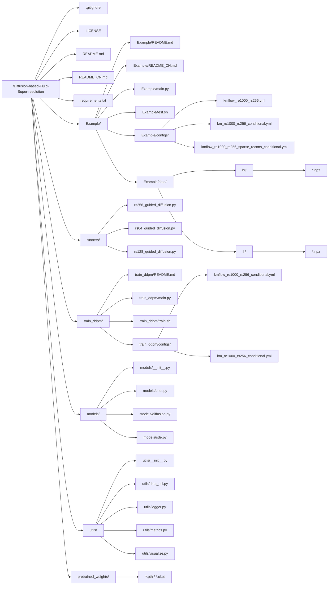

# Diffusion-based-Fluid-Super-resolution
<br>

PyTorch implementation of 

**A Physics-informed Diffusion Model for High-fidelity Flow Field Reconstruction** 

(Links to paper: <a href="https://www.sciencedirect.com/science/article/pii/S0021999123000670">Journal of Computational Physics</a> | <a href="https://arxiv.org/abs/2211.14680">arXiv</a>)

<div style style=”line-height: 25%” align="center">
<h3>Sample 1</h3>

<h3>Sample 2</h3>

</div>

## Overview
Denoising Diffusion Probablistic Models (DDPM) are a strong tool for data super-resolution and reconstruction. Unlike many other deep learning models which require a pair of low-res and high-res data for model training, DDPM is trained only on the high-res data. This feature is especially beneficial to reconstructing high-fidelity CFD data from low-fidelity reference, as it allows the model to be more independent of the low-res data distributions and subsequently more adaptive to various data patterns in different reconstruction tasks.

The structure of the code is:



The following outlines the file/directory structure of this workspace, along with detailed explanations for each module and a suggested sequence for reproduction steps. Refer to the accompanying diagram for an overview of the project layout.

## 1. Root Directory Overview

- `.gitignore`
  Excludes data or log files from version control to avoid redundant submissions.
- `LICENSE`
  The open-source license (MIT) adopted by this project.
- `README.md` / `README_CN.md`
  Project introduction, usage instructions, and dependency requirements in English/Chinese.
- `requirements.txt`
  Lists Python dependencies for easy installation.

> **Reproduction Guide**
> Before starting, read the README (English or Chinese) to understand the project scope and environment requirements. Install dependencies via `pip install -r requirements.txt`.

## 2. Root Directory Contents

- `main.py`
  • The entry script for executing super-resolution reconstruction. Parses command-line arguments, loads configurations (YAML), and invokes `Diffusion.reconstruct()` from `runners/rs256_guided_diffusion.py`.
- `test.sh`
  • Example script for sampling tests, encapsulating common parameters when calling `main.py`.
- `configs/`
  • Stores base configuration files (`.yml`) for super-resolution/reconstruction (e.g., parallel processes, network size, sampling steps).
- `data/`
  - `Example/data/hr/`: High-resolution flow field data (ground truth)
  - `Example/data/lr/`: Corresponding low-resolution inputs
- `train.sh`
  • One-click training script example, calling `main.py` with predefined configurations and output paths.

> **Reproduction Guide**
> 1) Prepare data. Ensure paired flow field data exists in `hr/` and `lr/`.
> 2) For quick start, use pretrained models and run `test.sh` to examine reconstruction results.

## 3. `runners/` (Core Super-Resolution Algorithms)

- `runners/rs256_guided_diffusion.py`
  • Main implementation of Guided Diffusion. The `Diffusion` class contains generation/iterative inference logic from low- to high-resolution.
- `runners/rs128_guided_diffusion.py` / `runners/rs64_guided_diffusion.py`
  • Similar implementations for different resolutions or super-resolution tasks.

> **Reproduction Guide**
> Focus on `rs256_guided_diffusion.py` and its `reconstruct()` function for 256×256 diffusion-based super-resolution.

## 4. `train_ddpm/` (DDPM Training)

- `main.py`
  • Training entry script. Loads configurations (`.yml`) and executes DDPM training.
- `train.sh`
  • One-click training launcher (customizable for `CUDA_VISIBLE_DEVICES`, log paths, etc.).
- `train_ddpm/configs/`
  - `kmflow_re1000_rs256_conditional.yml` / `km_re1000_rs256_conditional.yml`
  • Training hyperparameters (network width, epochs, learning rate, noise schedule).
- `README.md`
  • Training instructions (script overview with example commands).

> **Reproduction Guide**
> 1) For training from scratch, enter `train_ddpm/` and launch training via `train.sh` or `main.py`.
> 2) Save trained weights (`.pth` or `.ckpt`) to `pretrained_weights/` for subsequent sampling or debugging.

## 5. `models/` (Network & Diffusion Implementations)

- `models/unet.py`
  • Defines the U-Net architecture for the diffusion model’s denoising process.
- `models/diffusion.py`
  • Core DDPM logic (forward/reverse diffusion, noise generation, loss functions).
- `models/sde.py`
  • Stochastic differential equation utilities for diffusion analysis.
- `models/__init__.py`
  • Module initialization and import path configuration.

> **Reproduction Guide**
> These files implement core algorithms. Training scripts and `[runners/…]` call their functions. Modify only for custom architectures or diffusion improvements.

## 6. `utils/` (Auxiliary Modules)

- `utils/data_util.py`
  • Data preprocessing (loading `.*npz`, dataset splitting).
- `utils/logger.py`
  • Logging system for training/inference monitoring.
- `utils/metrics.py`
  • Image/flow field metrics (PSNR, SSIM).
- `utils/visualize.py`
  • Visualization tools (e.g., converting `.npy` to images).

> **Reproduction Guide**
> Customize data loading or metrics by modifying `data_util.py` and `metrics.py`.

## 7. `pretrained_weights/` (Model Weights)

- `[*.pth / *.ckpt]`
  • Pretrained model files (official or trained locally).
  • Loaded by `Example/main.py` or `train_ddpm/main.py` for super-resolution inference.

> **Reproduction Guide**
> Place official weights here and run `main.py` for sampling if skipping training.

# Complete Reproduction Workflow (From Scratch)

1. **Install Dependencies**
   ```bash
   pip install -r requirements.txt
   ```

2. **Prepare Data**
   - Download HR/LR data into `Example/data/hr/` and `Example/data/lr/`.
   - Verify data formats match configuration specifications.

3. **Optional: Use Pretrained Models**
   - Place `.pth` files in `pretrained_weights/`.
   - Navigate to `Example/` and run:
     ```bash
     python main.py --config kmflow_re1000_rs256_sparse_recons_conditional.yml --seed 1234 --sample_step 1 --t 240 --r 30
     ```

4. **Full Pipeline: Training + Reconstruction**
   - Under `train_ddpm/`, execute:
     ```bash
     python main.py --config ./kmflow_re1000_rs256_conditional.yml --exp ./experiments/km256/ --doc ./weights/km256/ --ni
     ```
   - Copy trained weights to `pretrained_weights/`.
   - Return to `Example/` and run `test.sh` for validation.

5. **Logging & Visualization**
   - Logs: Training/sampling logs are saved to `log_dir` (configurable via `utils/logger.py`).
   - Metrics: Modify `utils/metrics.py` for custom evaluations (PSNR/SSIM).
   - Visualization: Use `utils/visualize.py` to plot `.npy`/`.npz` reconstruction results.

This breakdown clarifies dependencies between directories/files (see Mermaid diagram). For deeper insights into diffusion processes or flow field reconstruction, study `models/diffusion.py` and `runners/`.

If you intend to rewrite the code, start with the underlying network and diffusion algorithms, then implement the scheduling logic and training entry points, and finally write the main inference function. Follow this sequence:

1. **models/unet.py**  
   First, build the U-Net backbone to ensure the core network structure supports proper forward/backward propagation.  
2. **models/diffusion.py**  
   Implement the forward/reverse diffusion formulas (DDPM) and loss functions.  
3. **models/sde.py**  
   If needed, add stochastic differential equation components.  
4. **runners/rs256_guided_diffusion.py**  
   Develop the inference logic (iterative reconstruction from low to high resolution) using the previously defined network and diffusion algorithms.  
5. **utils/data_util.py** / **utils/metrics.py**  
   Implement data loading, preprocessing, and evaluation metrics.  
6. **train_ddpm/main.py**  
   Encapsulate the training process to generate or load model weights.  
7. **Example/main.py**  
   Read configurations via command-line arguments, invoke `runners` for super-resolution inference, and output the final results.  


## Datasets
Datasets used for model training and sampling can be downloaded via the following links.

- High resolution data (ground truth for the super-resolution task) (<a href="https://figshare.com/ndownloader/files/39181919">link</a>)

- Low resolution data measured from random grid locations (input data for the super-resolution task) (<a href="https://figshare.com/ndownloader/files/39214622">link</a>)


## Running the Experiments
This code has been tested on the following environment:

```
python 3.8
PyTorch 1.7 + CUDA 10.1 + torchvision 0.8.2
TensorBoard 2.11
Numpy 1.22
tqdm 4.59
einops 0.4.1
matplotlib 3.6.2
```

Download the high res and low res data and save the data files to the subdirectory ``./data/``.

<!--
More details about how to run the experiments are coming soon.
-->

<b>Step 1 - Model Training</b>

In the subdirectory ``./train_ddpm/``, run:

``
bash train.sh
``

or 

``
python main.py --config ./km_re1000_rs256_conditional.yml --exp ./experiments/km256/ --doc ./weights/km256/ --ni
``

The checkpoint of the trained model is by default saved at the following trajectory. You can atler the saving directory according to your need by changing the values of ``--exp`` and ``--doc``.

``.../Diffusion-based-Fluid-Super-resolution/train_ddpm/experiments/km256/logs/weights/km256/``

Note: If you prefer not to go through Step 1, we provide the following pretrained checkpoints to directly start from <b>Step 2</b>:
<ol type="1">
  <li>model without physics-informed conditioning input (<a href="https://figshare.com/ndownloader/files/40320733">link</a>)</li>
  <li>model with physics-informed conditioning input (<a href="https://figshare.com/ndownloader/files/39184073">link</a>)</li>
</ol>


<b>Step 2 - Super-resolution</b>

Add the model checkpoint file (e.g., ``baseline_ckpt.pth``) from <b>Step 1</b> to the following directory.

``.../Diffusion-based-Fluid-Super-resolution/pretrained_weights/``


In the main directory of this repo, run:

``
python main.py --config kmflow_re1000_rs256.yml --seed 1234 --sample_step 1 --t 240 --r 30
``


## References
If you find this repository useful for your research, please cite the following work.
```
@article{shu2023physics,
  title={A Physics-informed Diffusion Model for High-fidelity Flow Field Reconstruction},
  author={Shu, Dule and Li, Zijie and Farimani, Amir Barati},
  journal={Journal of Computational Physics},
  pages={111972},
  year={2023},
  publisher={Elsevier}
}
```


This implementation is based on / inspired by:

- [https://github.com/ermongroup/SDEdit](https://github.com/ermongroup/SDEdit) (SDEdit: Guided Image Synthesis and Editing with Stochastic Differential Equations)
- [https://github.com/ermongroup/ddim](https://github.com/ermongroup/ddim) (Denoising Diffusion Implicit Models)