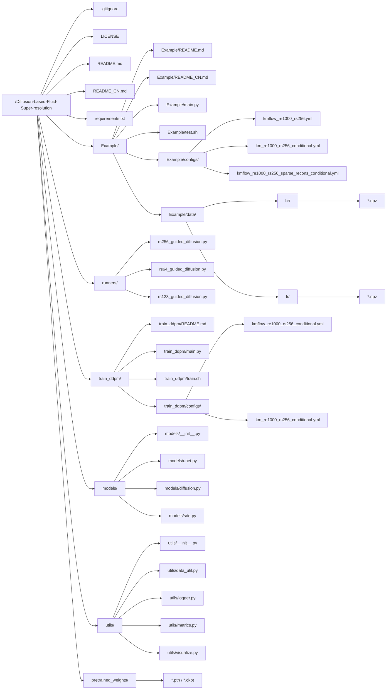

# Diffusion-based Fluid Super-resolution
<br>

> This README documentation constitutes a substantial expansion upon the [original implementation by BaratiLab](https://github.com/BaratiLab/Diffusion-based-Fluid-Super-resolution), incorporating experimental content supplementation with methodological augmentation. Readers are advised to scrutinize potential technical discrepancies that may arise from this extended documentation framework.

PyTorch implementation of the paper:

**A Physics-informed Diffusion Model for High-fidelity Flow Field Reconstruction**

(Paper link: <a href="https://www.sciencedirect.com/science/article/pii/S0021999123000670">Journal of Computational Physics</a> | <a href="https://arxiv.org/abs/2211.14680">arXiv</a>)

<div style="line-height: 25%" align="center">
<h3>Example 1</h3>

<h3>Example 2</h3>

</div>

## Overview
Denoising Diffusion Probabilistic Models (DDPM) are powerful tools for data super-resolution and reconstruction. Unlike many other deep learning models that require paired low-resolution-high-resolution data for training, DDPMs only need high-resolution data for training. This feature is particularly suitable for reconstructing high-fidelity CFD data from low-resolution reference data, as it makes the model more independent of the low-resolution data distribution, thus better adapting to various data patterns in different reconstruction tasks.

This paper proposes a new framework (PhyDiff) that combines physical information with diffusion models for flow field reconstruction. Its main innovations include:

1.  **First integration of physical information into diffusion models**: The authors creatively incorporated physical constraints into the diffusion model framework, enabling the model to learn from data while adhering to physical laws.

2.  **Dual loss function design**: A training strategy combining data-driven loss and physics-informed loss was proposed, enabling the model to satisfy the conservation equations of fluid mechanics during generation.

3.  **Addresses the sparse observation problem**: Capable of reconstructing complete high-quality flow fields from a very small number of measurement points, which is very valuable in practical applications.

4.  **Proposes a probabilistic reconstruction framework**: Unlike traditional deterministic methods, PhyDiff provides probabilistic flow field reconstruction with uncertainty quantification.

### Aspects Researchers Should Focus On

1.  **Physics-information fusion mechanism**: The paper introduces a physics-guided term in the reverse diffusion process, using the Navier-Stokes equations as constraints. This fusion method is worth in-depth study.

2.  **Model performance and generalization ability**: PhyDiff outperforms existing methods in reconstruction accuracy, especially when dealing with flow fields of different Reynolds numbers and cases beyond the training distribution.

3.  **Uncertainty quantification**: Diffusion models naturally provide diverse sampling capabilities, enabling physical field reconstruction with uncertainty quantification, which is important for reliability analysis.

4.  **Computational efficiency issues**: The paper mentions that although the inference time is longer than traditional methods, the reconstruction quality is significantly improved. This trade-off is worth considering.

5.  **Potential for application expansion**: This framework may be extended to the reconstruction of other physical systems, such as electromagnetic fields, thermal fields, etc. Researchers can explore these directions.

6.  **Practical real-world applications**: Although the paper demonstrates applications on CFD data, how to effectively integrate and deploy it in actual engineering remains a challenge. It is evident that, due to the introduction of super-resolution technology, applying high-precision CFD data to real-time simulation and control systems is an important research direction. More colloquially, real-time feedback for simulating wind tunnel experiments or fluid dynamics experiments.

As a researcher, you may also need to pay attention to the implementation details of the model in the paper, hyperparameter selection, and how to optimize and improve it for specific application scenarios. The paper opens up new avenues for applying diffusion models to physics-informed scientific computing, and this direction has great development potential.

## Directory Structure

The code structure is as follows:



The file/directory structure of this workspace is provided below, with a more detailed explanation for each module and a suggested order for reproduction steps. You can refer to this diagram to understand the overall project layout.

### 1. Root Directory Structure Overview

- .gitignore
  Ignores committed data or log files, etc., to prevent redundant files from entering the version control repository.
- LICENSE
  The open-source license adopted by this project (MIT).
- README.md / README_CN.md
  Project introduction, usage methods, dependency instructions, etc., in English/Chinese versions respectively.
- requirements.txt
  Provides a list of Python dependency packages for easy installation of project dependencies.

> **Reproduction Guide**
> Before officially starting, read the README to understand the project's positioning and environmental requirements, and use `pip install -r requirements.txt` to install project dependencies.

### 2. Root Directory

- main.py
  • The entry script for finally executing super-resolution reconstruction. It parses command-line arguments, loads configuration (yaml), and calls `Diffusion.reconstruct()` from `runners/rs256_guided_diffusion.py` to perform reconstruction.
- test.sh
  • An example script that calls main.py for sampling tests, encapsulating commonly used parameters.
- configs
  • Stores basic configuration files (`.yml`) required for super-resolution/reconstruction, such as number of parallel processes, network size, sampling steps, etc.
- data
  - Example/data/hr/: High-resolution flow field data (ground truth)
  - Example/data/lr/: Low-resolution input corresponding to high-resolution
- train.sh
  • Example script for one-click calling of main.py for training (specifying configuration, output path, etc.).

> **Reproduction Guide**
> 1) Prepare data. Ensure that the `hr/` and `lr/` folders contain corresponding flow field data.
> 2) To get started quickly, you can first use the pre-trained model and run `test.sh` to view the reconstruction results.

### 3. runners/ (Core Super-resolution Algorithm)

- runners/rs256_guided_diffusion.py
  • Main implementation of Guided Diffusion. The `Diffusion` class contains the generation/iterative inference logic from low-resolution to high-resolution.
- runners/rs128_guided_diffusion.py / runners/rs64_guided_diffusion.py
  • Similar to the above, but are processing scripts for different resolutions or different super-resolution tasks.

> **Reproduction Guide**
> If you are mainly focusing on `256×256` resolution diffusion super-resolution, you can focus on `rs256_guided_diffusion.py` and check its `reconstruct()` function.

### 4. train_ddpm/ (DDPM Training Related)

- main.py
  • Training entry script, reads the corresponding configuration (`.yml`), and executes the diffusion model (DDPM) training process.
- train.sh
  • One-click script to start training (customizable `CUDA_VISIBLE_DEVICES`, log path, etc.).
- train_ddpm/configs/
  - kmflow_re1000_rs256_conditional.yml / km_re1000_rs256_conditional.yml
  • Hyperparameter configurations for training, such as network width, number of iterations, learning rate, noise schedule, etc.
- README.md
  • Training instructions (introduction to training scripts, including example commands).

> **Reproduction Guide**
> 1) If you need to train the model from scratch, first enter the `train_ddpm/` folder and refer to train.sh or main.py to start training.
> 2) After training is complete, save the obtained weight file (`.pth` or `.ckpt`) to `pretrained_weights/` for the next step of sampling or continued debugging.

### 5. models/ (Network and Diffusion Algorithm Implementation)

- models/unet.py
  • Defines the deep structure of U-Net, used for the denoising process in the diffusion model.
- models/diffusion.py
  • Core logic of DDPM forward/reverse diffusion process, including noise generation, loss function, etc.
- models/sde.py
  • Some stochastic differential equation tools for analysis and implementation of formulas related to the diffusion process.
- models/__init__.py
  • Used for module initialization or import path configuration.

> **Reproduction Guide**
> These files are the underlying structure of the core algorithm. The training scripts and `[runners/…]` will call functions within them; generally, no modification is needed unless you need to customize the network structure or improve the diffusion processing method.

### 6. utils/ (Utility Functions and Auxiliary Modules)

- utils/data_util.py
  • Used for data preprocessing, reading `.*npz` files, splitting datasets, etc.
- utils/logger.py
  • Logging system, records real-time information during training/inference.
- utils/metrics.py
  • Implements common image quality or flow field evaluation metrics (PSNR, SSIM, etc.).
- utils/visualize.py
  • Plots/visualizes reconstruction results (e.g., `.npy` to image) or comparison charts.

> **Reproduction Guide**
> If you need to customize the data loading process or implement additional evaluation metrics, you can directly modify utils/data_util.py and utils/metrics.py.

### 7. pretrained_weights/ (Pre-trained Model Weights)

- `[*.pth / *.ckpt]`
  • Pre-trained model files generated after training or provided officially.
  • For `Example/main.py` or `train_ddpm/main.py` to load and perform super-resolution inference.

> **Reproduction Guide**
> If you don't want to train the model yourself, you can put the officially provided weights into this folder and then run main.py for sampling and reconstruction.

## Complete Reproduction Process From Scratch

1.  **Install Dependencies**
    ```bash
    pip install -r requirements.txt
    ```

2.  **Prepare Data**
    - Download high-resolution/low-resolution data and place them in Example/data/hr/ and Example/data/lr/
    - Ensure data format is consistent with the dimensions/variables described in the configuration file.

3.  **Optional: Directly Use Pre-trained Model**
    - Place the official or pre-trained `.pth` file into pretrained_weights/
    - Enter the Example directory and execute `test.sh` or manually execute:
      ```bash
      python main.py --config kmflow_re1000_rs256_sparse_recons_conditional.yml --seed 1234 --sample_step 1 --t 240 --r 30
      ```

4.  **Complete Process: Train from Scratch + Reconstruction**
    - Enter the train_ddpm/ folder, run `train.sh` or
      ```bash
      python main.py --config ./kmflow_re1000_rs256_conditional.yml --exp ./experiments/km256/ --doc ./weights/km256/ --ni
      ```
    - After training is complete, copy the generated weight file to `pretrained_weights/`
    - Return to the Example directory and execute `test.sh` to verify the reconstruction effect.

5.  **View Logs / Visualization**
    - Logs: Text records of the training process and sampling process will be generated in the specified `log_dir`. You can adjust the format in conjunction with utils/logger.py.
    - Evaluation: If you need to evaluate PSNR/SSIM, you can view the functions in utils/metrics.py or modify them yourself.
    - Visualization: If you want to plot the reconstruction results `.npy`, `.npz`, you can use utils/visualize.py to write your own display script.

Through the above analysis, combined with the Mermaid diagram above to view the upstream and downstream logic of each directory and file, it is convenient to understand, modify, or extend this repository. If you have a deeper need for the principles of the diffusion process or flow field reconstruction, you can further read models/diffusion.py and runners.

And if you want to rewrite the code, first write the underlying network and diffusion algorithm, then implement the scheduling logic and training entry point, and finally write the main inference function. You can proceed in the following order:

1.  **models/unet.py**
    First, build the main U-Net body, ensuring the core network structure can perform forward/backward propagation normally.
2.  **models/diffusion.py**
    Implement the forward/reverse formulas and loss function of the diffusion process (DDPM).
3.  **models/sde.py**
    If SDE is needed, supplement the stochastic differential equation part.
4.  **runners/rs256_guided_diffusion.py**
    Write the inference logic (iterative reconstruction from low-resolution to high-resolution), using the previously defined network and diffusion algorithm.
5.  **utils/data_util.py** / **utils/metrics.py** etc.
    Implement data loading, preprocessing, and evaluation metrics.
6.  **train_ddpm/main.py**
    Encapsulate the training process, generate or load model weights.
7.  **main.py**
    Read configuration through command-line parameters, call `runners` to complete super-resolution inference, and finally output results.

## Dataset
The datasets used for model training and sampling can be downloaded from the following links:

- High-resolution data (ground truth for super-resolution tasks) (<a href="https://figshare.com/ndownloader/files/39181919">Link</a>)

- Low-resolution data measured from random grid locations (input data for super-resolution tasks) (<a href="https://figshare.com/ndownloader/files/39214622">Link</a>)

## Running Experiments
This code has been tested in the following environment:

```
python 3.8
PyTorch 1.7 + CUDA 10.1 + torchvision 0.8.2
TensorBoard 2.11
Numpy 1.22
tqdm 4.59
einops 0.4.1
matplotlib 3.6.2
```

Download the high-resolution and low-resolution data, and save the data files to the subdirectory ``./data/``.

<b>Step 1 - Model Training</b>

In the subdirectory ``./train_ddpm/``, run:

``
bash train.sh
``

or

``
python main.py --config ./km_re1000_rs256_conditional.yml --exp ./experiments/km256/ --doc ./weights/km256/ --ni
``

Trained model checkpoints are saved by default in the following path. You can adjust the save directory by modifying the values of ``--exp`` and ``--doc``.

``.../Diffusion-based-Fluid-Super-resolution/train_ddpm/experiments/km256/logs/weights/km256/``

Note: If you wish to skip Step 1, we provide the following pre-trained checkpoints to start directly with <b>Step 2</b>:
<ol type="1">
  <li>Model without physics-informed conditioning input (<a href="https://figshare.com/ndownloader/files/40320733">Link</a>)</li>
  <li>Model with physics-informed conditioning input (<a href="https://figshare.com/ndownloader/files/39184073">Link</a>)</li>
</ol>

<b>Step 2 - Super-resolution Reconstruction</b>

Add the model checkpoint file obtained in <b>Step 1</b> (e.g., ``baseline_ckpt.pth``) to the following directory:

``.../Diffusion-based-Fluid-Super-resolution/pretrained_weights/``

In the main directory of this repository, run:

``
python main.py --config kmflow_re1000_rs256.yml --seed 1234 --sample_step 1 --t 240 --r 30
``

## Physics Gradient Embedding

In [rs256_guided_diffusion.py] and [losses.py], we will go line by line to sort out how PINN (physics gradient) is integrated into the diffusion process, and the specific uses of key functions in the code. The focus is on how the `voriticity_residual()` function calculates the residual of the vorticity PDE (vorticity equation) and feeds the gradient back into the network or sampling process.

### `voriticity_residual()` and the Core Idea of PINN

Both files implement `voriticity_residual()`, with similar functionality: calculating the PDE residual and gradient based on fundamental fluid dynamics equations (2D vorticity form). The general process is as follows:

1.  Receives the flow field tensor `w` (shape [batch, time, H, W]), where each channel often corresponds to a different time step.
2.  Obtains frequency domain variables through Fourier transform (`torch.fft.fft2`); then, based on the vorticity-stream function relationship, infers the velocity field $(u, v)$ and information such as Laplacian, partial derivatives, etc.
3.  According to the discretized vorticity equation:
    $$w_t + \Bigl(u \cdot \frac{\partial w}{\partial x} + v \cdot \frac{\partial w}{\partial y}\Bigr)
    - \frac{1}{\mathrm{Re}}\,\Delta w + 0.1\,w - f = 0$$
    where $f$ is the external force term, $\mathrm{Re}$ is the Reynolds number, $w_t$ represents the partial derivative with respect to time, and $\Delta w$ represents the Laplacian operation.
4.  The residual = the non-zero part of "the above equation" squared and averaged, which is the `residual_loss`, representing the degree of physics violation.
5.  If gradients need to be calculated, `torch.autograd.grad` is performed on `residual_loss` with respect to `w` to obtain `dw`, i.e., the "physics gradient".
6.  During training or sampling, `dw` can be regarded as a "physics correction force", approximating the true fluid dynamics equations, thus realizing the PINN idea.

In [rs256_guided_diffusion.py], `voriticity_residual()` defaults to returning `(dw, residual_loss)` when `calc_grad=True`, otherwise it only returns `residual_loss`. In [losses.py], it only returns `dw`, which can be minimized together with other loss terms during training.

### Main Structure of [rs256_guided_diffusion.py]

1.  **Import Section**
    - `functions/diffusion_step.py`: Provides diffusion sampling methods, such as `ddpm_steps`, `ddim_steps`, `guided_ddim_steps`, etc.
    - `models/diffusion_new`: Contains `ConditionalModel` / `Model`, i.e., the U-Net based diffusion network.
    - `functions/process_data`: Provides data loading or preprocessing (e.g., `load_recons_data()`).

2.  **Core Class: `Diffusion`**
    - The constructor loads the beta schedule (`get_beta_schedule()`) and initializes logvar.
    - The `reconstruct()` method is the most important core process, used to infer high-resolution results from low-resolution flow fields.

3.  **Integrating PINN in `reconstruct()`**
    - Around line 290, it determines whether a physics gradient is needed based on the model type:
      (a) Conditional Model:
        physical_gradient_func = lambda x: voriticity_residual(scaler.inverse(x))[0] / scaler.scale()
      (b) If `lambda_ > 0`, then `voriticity_residual()` will also be introduced and multiplied by a weighting coefficient.
    - This will be passed to `guided_ddim_steps()` or `ddim_steps()` as `dx_func`. In each reverse diffusion step, `dx_func(x)` is called to obtain the PDE gradient, which is then added to the sampling update formula.
    - Therefore, the diffusion sampling process no longer solely relies on the noise estimation output by the model; it is also "corrected" by the PDE residual gradient, making the generated flow field gradually conform to physical constraints (this is the key to PINN injection).

4.  **Recording Residuals and Gradients During Sampling**
    - Around line 378, `l2_loss_all` and `residual_loss_all` are used to record the L2 error and PDE residual at different iterations for later analysis.
    - After sampling is complete, one can check the "mean l2 loss" and "mean residual loss" to measure how well the final result is both close to the ground truth and conforms to physical laws.

### 3. How Physics Residuals are Used in the Training Phase in [losses.py]

1.  `voriticity_residual(w, re=1000.0, dt=1/32)`
    - Same PDE residual calculation as above, but here it directly returns `dw`. During training, it can be combined with the model's noise prediction error to form the overall loss.
2.  `conditional_noise_estimation_loss()`
    - Regular noise estimation loss + physics residual:
      When flag < p, only the original diffusion model loss is used; otherwise, `dx = voriticity_residual(...)` is additionally calculated and passed to the model `model(x, t.float(), dx)`, so that the network learns the physical constraints.
    - This indicates that when training a "conditional model", the PDE gradient can be perceived by the network, leading to a more "physically consistent" denoising model.

### 4. Comprehensive Summary

1.  **Diffusion Model**: `Model` and `ConditionalModel` provide predictions from noise to clear flow fields.
2.  **PINN Injection**:
    - During training: In `conditional_noise_estimation_loss()`, the gradient `dx` obtained from `voriticity_residual` is passed into the model; the network not only fits the data but also satisfies PDE constraints, becoming a PINN-ified diffusion model.
    - During sampling: In `Diffusion.reconstruct()`, the residual gradient is used as `dx_func` to dynamically correct the diffusion sampling path, making the predicted flow field conform to physics.
3.  **Location of Physics Gradient**:
    - In losses.py: `voriticity_residual()` during training;
    - In rs256_guided_diffusion.py: `voriticity_residual()` during inference;
    - Both analyze vorticity in the Fourier domain and obtain the gradient via `torch.autograd.grad`, injecting it into the network or iterative update process.

Therefore, it can be seen that the entire project utilizes the "residual + gradient" of the vorticity equation to guide the training and inference of the diffusion model, forming a super-resolution method that combines PINN with diffusion generative models.

## Training and Reconstruction

Below, following the key stages in README.md, combined with the project's main code files, we explain its internal logic step by step. The focus is on how the training and reconstruction processes call the diffusion model and the physics gradient (PINN) part.

### Training Script: `train_ddpm/main.py` and `functions/losses.py`

1.  **Entry Point and Configuration**
    - In `train_ddpm/main.py`, the program reads hyperparameters (e.g., from `kmflow_re1000_rs256_conditional.yml`) through `argparse` or `yaml`, including network structure parameters, number of iterations, learning rate, loss type, etc.
    - After reading, it initializes the model (e.g., `Model` or `ConditionalModel` from `models/diffusion.py`) and registers the corresponding loss function, such as `conditional_noise_estimation_loss()`.

2.  **Physics Gradient Injection**
    - In `conditional_noise_estimation_loss()`, based on the set probability `p`, it decides whether to call the `voriticity_residual()` function (in the same file or under `rs256_guided_diffusion.py`) to calculate the residual and gradient of the vorticity equation.
    - Once `dx` (physics gradient) is introduced, it will be input together during the network's forward pass:
      ```python
      model_output = model(x, t.float(), dx=dx)
      ```
      This way, the network not only has to "fit" the training data but also satisfy PDE constraints, becoming a PINN-ified diffusion model.

3.  **Training Process**
    - Each update step includes two parts:
      (a) Regular "noise prediction error" (diffusion loss)
      (b) Physics constraints related to PDE residuals
    - The final gradient updates the U-Net weights via `optimizer.step()`, achieving simultaneous learning of "high-dimensional noise + physical equations".

### 2. Reconstruction Script: `Example/main.py` and `runners/rs256_guided_diffusion.py`

1.  **Super-resolution Entry Point**
    - In main.py, based on the `.yml` file specified by `--config`, it loads the pre-trained model weights (located in `pretrained_weights/`).
    - Then it calls `Diffusion.reconstruct()` (in `rs256_guided_diffusion.py`) to start the step-by-step reverse diffusion sampling from low-resolution (LR) to high-resolution (HR).

2.  **Reconstruction Loop**
    - `reconstruct()` first converts LR data into an initial noise field, then calls `ddim_steps()` or `guided_ddim_steps()` at each time step `t`.
    - If it's in "physics-constrained" mode, it will internally call:
      ```python
      dx_func = lambda x: voriticity_residual(scaler.inverse(x))[0] / scaler.scale()
      ```
      to calculate the physics gradient `dx` and add it to the diffusion update equation, making the sampling result gradually conform to the vorticity equation.

3.  **Physics Loss Recording**
    - After several steps, it calculates `residual_loss` (physics equation residual) and `l2_loss` (error with ground truth) and outputs logs, saved in `log_dir`, to monitor that the network-generated flow field is both close to real data and adheres to PDE laws.

### 3. Network Structure: `models/unet.py` and `models/diffusion.py`

1.  **U-Net Architecture** (`models/unet.py`)
    - Responsible for mapping the input (random noise + conditional information) to the output (predicted noise/flow field correction amount).
    - If it's a `ConditionalModel`, the network will take the low-resolution image or physics gradient as side input, concatenating it in the feature dimension, or passing it into the network's convolutional layers through specific channels.

2.  **Diffusion Core** (`models/diffusion.py`)
    - Defines key formulas for the forward noise addition (q) and reverse denoising (p) processes, encapsulating sampling/prediction steps.
    - During training, it calculates the noise prediction error via `losses.py`.
    - During inference or sampling, it coordinates with `runners/rs256_guided_diffusion.py` to perform iterative generation.

### 4. PINN Implementation: `voriticity_residual()` in `losses.py` and `runners/rs256_guided_diffusion.py`

1.  **Vorticity Residual Formula**
    - Derived from the vorticity form of the 2D Navier-Stokes equations:
      wt + (u·∂w/∂x + v·∂w/∂y) - (1/Re)Δw + 0.1·w = 0 (Example)
    - The function uses `torch.fft.fft2` to calculate gradients and Laplacians, and obtains `residual = PDE(w)` (calculation is more efficient in Fourier space).
    - Finally, the mean squared `residual` (MSE) is the physics violation `residual_loss`, and Autograd can backpropagate the gradient to the input `w`.

2.  **Training vs. Inference**
    - During training: In `conditional_noise_estimation_loss()`, `dx` = `voriticity_residual(w)` → is input to the model as part of the gradient information; or written into the loss for joint backpropagation.
    - During inference: In `Diffusion.reconstruct()`, `dx_func` is set, and PDE correction is added in each generation step, "correcting" the sampling process towards a more physically plausible flow field.

### Summary

- **Training Script (`train_ddpm/main.py` + `functions/losses.py`)**
  Simultaneously learns denoising of the data distribution (diffusion) and physical constraints (vorticity equation), explicitly considering PDEs in the network gradient.
- **Inference Script (`Example/main.py` + `runners/rs256_guided_diffusion.py`)**
  Starts from a low-resolution flow field, reverse diffuses to high-resolution; if PINN is enabled, `voriticity_residual()` is called at each step to obtain a physics gradient to aid generation.
- **Network (`models/unet.py` + `models/diffusion.py`)**
  Provides U-Net structure and diffusion formulas; `ConditionalModel` allows physical information/low-resolution images, etc., as conditional input.
- **Physics Residual (`voriticity_residual()`)**
  Achieves efficient PDE calculation through Fourier transform; usable for both training and sampling, forming the core of PINN.

This provides a fairly complete overview of the entire process from configuration loading, network training, to inference and reconstruction, integrating the ideas and implementation details of "Diffusion Model + PINN". Hopefully, this helps in a deeper understanding and reproduction of the project.

## References
If you find this codebase useful in your research, please cite the following work:
```bibtex
@article{shu2023physics,
  title={A Physics-informed Diffusion Model for High-fidelity Flow Field Reconstruction},
  author={Shu, Dule and Li, Zijie and Farimani, Amir Barati},
  journal={Journal of Computational Physics},
  pages={111972},
  year={2023},
  publisher={Elsevier}
}
```

This implementation is based on/inspired by the following works:

- [https://github.com/ermongroup/SDEdit](https://github.com/ermongroup/SDEdit) (SDEdit: Guided Image Synthesis and Editing with Stochastic Differential Equations)
- [https://github.com/ermongroup/ddim](https://github.com/ermongroup/ddim) (Denoising Diffusion Implicit Models)

Some other works are also good to learn. For researchers engaged in multimodal reconstruction tasks, cross-disciplinary consultation of remote sensing literature may yield methodological insights, as techniques from adjacent domains often demonstrate transferable applicability.:

```bibtex
 @article{Fukami_Fukagata_Taira_2019, title={Super-resolution reconstruction of turbulent flows with machine learning}, volume={870}, rights={https://www.cambridge.org/core/terms}, ISSN={0022-1120, 1469-7645}, DOI={10.1017/jfm.2019.238}, abstractNote={We use machine learning to perform super-resolution analysis of grossly under-resolved turbulent flow field data to reconstruct the high-resolution flow field. Two machine learning models are developed, namely, the convolutional neural network (CNN) and the hybrid downsampled skip-connection/multi-scale (DSC/MS) models. These machine learning models are applied to a two-dimensional cylinder wake as a preliminary test and show remarkable ability to reconstruct laminar flow from low-resolution flow field data. We further assess the performance of these models for two-dimensional homogeneous turbulence. The CNN and DSC/MS models are found to reconstruct turbulent flows from extremely coarse flow field images with remarkable accuracy. For the turbulent flow problem, the machine-leaning-based super-resolution analysis can greatly enhance the spatial resolution with as little as 50 training snapshot data, holding great potential to reveal subgrid-scale physics of complex turbulent flows. With the growing availability of flow field data from high-fidelity simulations and experiments, the present approach motivates the development of effective super-resolution models for a variety of fluid flows.}, note={JCR Ranking: Q1 CAS Ranking (Upgraded Version): Engineering Technology Q2 Impact Factor: 3.6 5-Year Impact Factor: 3.9 EI: Yes NAU High Quality: A}, journal={Journal of Fluid Mechanics}, author={Fukami, Kai and Fukagata, Koji and Taira, Kunihiko}, year={2019}, month=jul, pages={106–120}, language={en} }
 @article{Fukami_Fukagata_Taira_2021, title={Machine-learning-based spatio-temporal super resolution reconstruction of turbulent flows}, volume={909}, ISSN={0022-1120, 1469-7645}, DOI={10.1017/jfm.2020.948}, abstractNote={Abstract, We present a new data reconstruction method with supervised machine learning techniques inspired by super resolution and inbetweening to recover high-resolution turbulent flows from grossly coarse flow data in space and time. For the present machine-learning-based data reconstruction, we use the downsampled skip-connection/multiscale model based on a convolutional neural network, incorporating the multiscale nature of fluid flows into its network structure. As an initial example, the model is applied to the two-dimensional cylinder wake at $Re_D = 100$. The reconstructed flow fields by the present method show great agreement with the reference data obtained by direct numerical simulation. Next, we apply the current model to a two-dimensional decaying homogeneous isotropic turbulence. The machine-learned model is able to track the decaying evolution from spatial and temporal coarse input data. The proposed concept is further applied to a complex turbulent channel flow over a three-dimensional domain at $Re_{tau }=180$. The present model reconstructs high-resolved turbulent flows from very coarse input data in space, and also reproduces the temporal evolution for appropriately chosen time interval. The dependence on the number of training snapshots and duration between the first and last frames based on a temporal two-point correlation coefficient are also assessed to reveal the capability and robustness of spatio-temporal super resolution reconstruction. These results suggest that the present method can perform a range of flow reconstructions in support of computational and experimental efforts.}, note={JCR Ranking: Q1 CAS Ranking (Upgraded Version): Engineering Technology Q2 Impact Factor: 3.6 5-Year Impact Factor: 3.9 EI: Yes NAU High Quality: A}, journal={Journal of Fluid Mechanics}, author={Fukami, Kai and Fukagata, Koji and Taira, Kunihiko}, year={2021}, month=feb, pages={A9}, language={en} }
 @article{Fukami_Fukagata_Taira_2023, title={Super-resolution analysis via machine learning: A survey for fluid flows}, volume={37}, ISSN={0935-4964, 1432-2250}, DOI={10.1007/s00162-023-00663-0}, abstractNote={This paper surveys machine-learning-based super-resolution reconstruction for vortical flows. Super resolution aims to find the high-resolution flow fields from low-resolution data and is generally an approach used in image reconstruction. In addition to surveying a variety of recent super-resolution applications, we provide case studies of super-resolution analysis for an example of two-dimensional decaying isotropic turbulence. We demonstrate that physics-inspired model designs enable successful reconstruction of vortical flows from spatially limited measurements. We also discuss the challenges and outlooks of machine-learning-based superresolution analysis for fluid flow applications. The insights gained from this study can be leveraged for superresolution analysis of numerical and experimental flow data.}, note={JCR Ranking: Q2 CAS Ranking (Upgraded Version): Engineering Technology Q3 Impact Factor: 2.2 5-Year Impact Factor: 2.5 EI: Yes NAU High Quality: B}, number={4}, journal={Theoretical and Computational Fluid Dynamics}, author={Fukami, Kai and Fukagata, Koji and Taira, Kunihiko}, year={2023}, month=aug, pages={421–444}, language={en} }
 @inproceedings{Huang_Ren_Yang_Wang_Wei_2024, address={Vienna, Austria}, series={ICML’24}, title={MFTN: A multi-scale feature transfer network based on imatchformer for hyperspectral image super-resolution}, volume={235}, abstractNote={Hyperspectral image super-resolution (HISR) aims to fuse a low-resolution hyperspectral image (LR-HSI) with a high-resolution multispectral image (HR-MSI) to obtain a high-resolution hyperspectral image (HR-HSI). Due to some existing HISR methods ignoring the significant feature difference between LR-HSI and HR-MSI, the reconstructed HR-HSI typically exhibits spectral distortion and blurring of spatial texture. To solve this issue, we propose a multi-scale feature transfer network (MFTN) for HISR. Firstly, three multi-scale feature extractors are constructed to extract features of different scales from the input images. Then, a multi-scale feature transfer module (MFTM) consisting of three improved feature matching Transformers (IMatchFormers) is designed to learn the detail features of different scales from HR-MSI by establishing the crossmodel feature correlation between LR-HSI and degraded HR-MSI. Finally, a multiscale dynamic aggregation module (MDAM) containing three spectral aware aggregation modules (SAAMs) is constructed to reconstruct the final HR-HSI by gradually aggregating features of different scales. Extensive experimental results on three commonly used datasets demonstrate that the proposed model achieves better performance compared to state- of-the-art (SOTA) methods.}, booktitle={Proceedings of the 41st International Conference on Machine Learning}, publisher={JMLR.org}, author={Huang, Shuying and Ren, Mingyang and Yang, Yong and Wang, Xiaozheng and Wei, Yingzhi}, year={2024}, month=jul, pages={20063–20072}, collection={ICML’24}, language={en-US} }
 @article{Kochkov_Smith_Alieva_Wang_Brenner_Hoyer_2021, title={Machine learning–accelerated computational fluid dynamics}, volume={118}, ISSN={0027-8424, 1091-6490}, DOI={10.1073/pnas.2101784118}, abstractNote={Significance Accurate simulation of fluids is important for many science and engineering problems but is very computationally demanding. In contrast, machine-learning models can approximate physics very quickly but at the cost of accuracy. Here we show that using machine learning inside traditional fluid simulations can improve both accuracy and speed, even on examples very different from the training data. Our approach opens the door to applying machine learning to large-scale physical modeling tasks like airplane design and climate prediction., Numerical simulation of fluids plays an essential role in modeling many physical phenomena, such as weather, climate, aerodynamics, and plasma physics. Fluids are well described by the Navier–Stokes equations, but solving these equations at scale remains daunting, limited by the computational cost of resolving the smallest spatiotemporal features. This leads to unfavorable trade-offs between accuracy and tractability. Here we use end-to-end deep learning to improve approximations inside computational fluid dynamics for modeling two-dimensional turbulent flows. For both direct numerical simulation of turbulence and large-eddy simulation, our results are as accurate as baseline solvers with 8 to 10× finer resolution in each spatial dimension, resulting in 40- to 80-fold computational speedups. Our method remains stable during long simulations and generalizes to forcing functions and Reynolds numbers outside of the flows where it is trained, in contrast to black-box machine-learning approaches. Our approach exemplifies how scientific computing can leverage machine learning and hardware accelerators to improve simulations without sacrificing accuracy or generalization.}, note={JCR Ranking: Q1 CAS Ranking (Upgraded Version): Comprehensive Journals Q1 Impact Factor: 9.4 5-Year Impact Factor: 10.8}, number={21}, journal={Proceedings of the National Academy of Sciences}, author={Kochkov, Dmitrii and Smith, Jamie A. and Alieva, Ayya and Wang, Qing and Brenner, Michael P. and Hoyer, Stephan}, year={2021}, month=may, pages={e2101784118}, language={en} }
 @inproceedings{Noman_Naseer_Cholakkal_Anwar_Khan_Khan_2024, title={Rethinking transformers pre-training for multi-spectral satellite imagery}, ISSN={2575-7075}, url={https://ieeexplore.ieee.org/document/10657832/}, DOI={10.1109/CVPR52733.2024.02627}, abstractNote={Recent advances in unsupervised learning have demonstrated the ability of large vision models to achieve promising results on downstream tasks by pre-training on large amount of unlabelled data. Such pre-training techniques have also been explored recently in the remote sensing domain due to the availability of large amount of unlabelled data. Different from standard natural image datasets, remote sensing data is acquired from various sensor technologies and exhibit diverse range of scale variations as well as modalities. Existing satellite image pre-training methods either ignore the scale information present in the remote sensing imagery or restrict themselves to use only a single type of data modality. In this paper, we re-visit transformers pre-training and leverage multi-scale information that is effectively utilized with multiple modalities. Our proposed approach, named SatMAE++, performs multi-scale pre-training and utilizes convolution based upsampling blocks to reconstruct the image at higher scales making it extensible to include more scales. Compared to existing works, the proposed SatMAE++ with multi-scale pre-training is equally effective for both optical as well as multi-spectral imagery. Extensive experiments on six datasets reveal the merits of proposed contributions, leading to state-of-the-art performance on all datasets. Sat-MAE++ achieves mean average precision (mAP) gain of 2.5% for multi-label classification task on BigEarthNet dataset. Our code and pre-trained models are available at https://github.com/techmn/satmae_pp.}, booktitle={2024 IEEE/CVF Conference on Computer Vision and Pattern Recognition (CVPR)}, author={Noman, Mubashir and Naseer, Muzammal and Cholakkal, Hisham and Anwar, Rao Muhammad and Khan, Salman and Khan, Fahad Shahbaz}, year={2024}, month=jun, pages={27811–27819}, language={en-US} }
 @article{Shu_Li_Barati Farimani_2023, title={A physics-informed diffusion model for high-fidelity flow field reconstruction}, volume={478}, ISSN={00219991}, DOI={10.1016/j.jcp.2023.111972}, note={JCR Ranking: Q1 CAS Ranking (Upgraded Version): Physics and Astrophysics Q2 Impact Factor: 3.8 5-Year Impact Factor: 4.5 EI: Yes NAU High Quality: A}, journal={Journal of Computational Physics}, author={Shu, Dule and Li, Zijie and Barati Farimani, Amir}, year={2023}, month=apr, pages={111972}, language={en} }
 @article{Sofos_Drikakis_2025, title={A review of deep learning for super-resolution in fluid flows}, volume={37}, ISSN={1070-6631}, DOI={10.1063/5.0265738}, abstractNote={Integrating deep learning with fluid dynamics presents a promising path for advancing the comprehension of complex flow phenomena within both theoretical and practical engineering domains. Despite this potential, considerable challenges persist, particularly regarding the calibration and training of deep learning models. This paper conducts an extensive review and analysis of recent developments in deep learning architectures that aim to enhance the accuracy of fluid flow data interpretation. It investigates various applications, architectural designs, and performance evaluation metrics. The analysis covers several models, including convolutional neural networks, generative adversarial networks, physics-informed neural networks, transformer models, diffusion models, and reinforcement learning frameworks, emphasizing components improving reconstruction capabilities. Standard performance metrics are employed to rigorously evaluate the models’ reliability and efficacy in producing high-performance results applicable across spatiotemporal flow data. The findings emphasize the essential role of deep learning in representing fluid flows and address ongoing challenges related to the systems’ high degrees of freedom, precision demands, and resilience to error.}, note={JCR Ranking: Q1 CAS Ranking (Upgraded Version): Engineering Technology Q2 Impact Factor: 4.1 5-Year Impact Factor: 4.1 EI: Yes NAU High Quality: A}, number={4}, journal={Physics of Fluids}, author={Sofos, Filippos (Φίλιππος Σοφός) and Drikakis, Dimitris (Δημήτρης Δρικάκης)}, year={2025}, month=apr, pages={041303} }
 @article{Tang_Li_Zhao_Xiao_Chen_2024, title={Super-resolution reconstruction of wind fields with a swin-transformer-based deep learning framework}, volume={36}, ISSN={1070-6631, 1089-7666}, DOI={10.1063/5.0237112}, abstractNote={Integrating deep learning with fluid dynamics presents a promising path for advancing the comprehension of complex flow phenomena within both theoretical and practical engineering domains. Despite this potential, considerable challenges persist, particularly regarding the calibration and training of deep learning models. This paper conducts an extensive review and analysis of recent developments in deep learning architectures that aim to enhance the accuracy of fluid flow data interpretation. It investigates various applications, architectural designs, and performance evaluation metrics. The analysis covers several models, including convolutional neural networks, generative adversarial networks, physics-informed neural networks, transformer models, diffusion models, and reinforcement learning frameworks, emphasizing components improving reconstruction capabilities. Standard performance metrics are employed to rigorously evaluate the models’ reliability and efficacy in producing high-performance results applicable across spatiotemporal flow data. The findings emphasize the essential role of deep learning in representing fluid flows and address ongoing challenges related to the systems’ high degrees of freedom, precision demands, and resilience to error.}, note={JCR Ranking: Q1 CAS Ranking (Upgraded Version): Engineering Technology Q2 Impact Factor: 4.1 5-Year Impact Factor: 4.1 EI: Yes NAU High Quality: A}, number={12}, journal={Physics of Fluids}, author={Tang, Lingxiao and Li, Chao and Zhao, Zihan and Xiao, Yiqing and Chen, Shenpeng}, year={2024}, month=dec, pages={125110}, language={en} }
 @article{Yang_Yang_Deng_He_2024, title={Moving sampling physics-informed neural networks induced by moving mesh PDE}, url={http://arxiv.org/abs/2311.16167}, DOI={10.48550/arXiv.2311.16167}, abstractNote={In this work, we propose an end-to-end adaptive sampling neural network (MMPDE-Net) based on the moving mesh method, which can adaptively generate new sampling points by solving the moving mesh PDE. This model focuses on improving the quality of sampling points generation. Moreover, we develop an iterative algorithm based on MMPDE-Net, which makes the sampling points more precise and controllable. Since MMPDE-Net is a framework independent of the deep learning solver, we combine it with physics-informed neural networks (PINN) to propose moving sampling PINN (MS-PINN) and demonstrate its effectiveness by error analysis under some assumptions. Finally, we demonstrate the performance improvement of MS-PINN compared to PINN through numerical experiments of four typical examples, which numerically verify the effectiveness of our method.}, note={arXiv:2311.16167 [math]}, number={arXiv:2311.16167}, publisher={arXiv}, author={Yang, Yu and Yang, Qihong and Deng, Yangtao and He, Qiaolin}, year={2024}, month=jun }
 @article{Yousif_Yu_Lim_2021, title={High-fidelity reconstruction of turbulent flow from spatially limited data using enhanced super-resolution generative adversarial network}, volume={33}, ISSN={1070-6631, 1089-7666}, DOI={10.1063/5.0066077}, abstractNote={In this study, a deep learning-based approach is applied with the aim of reconstructing high-resolution turbulent flow fields using minimal flow field data. A multi-scale enhanced super-resolution generative adversarial network with a physics-based loss function is introduced as a model to reconstruct the high-resolution flow fields. The model capability to reconstruct high-resolution laminar flows is examined using direct numerical simulation data of laminar flow around a square cylinder. The results reveal that the model can accurately reproduce the high-resolution flow fields even when limited spatial information is provided. The DNS data of turbulent channel flow at two friction Reynolds numbers Reτ=180 and 550 are used to assess the ability of the model to reconstruct the high-resolution wall-bounded turbulent flow fields. The instantaneous and statistical results obtained from the model agree well with the ground truth data, indicating that the model can successfully learn to map the coarse flow fields to the high-resolution ones. Furthermore, the possibility of performing transfer learning for the case of turbulent channel flow is thoroughly examined. The results indicate that the amount of the training data and the time required for training can be effectively reduced without affecting the performance of the model. The computational cost of the proposed model is also found to be effectively low. These results demonstrate that using high-fidelity training data with physics-guided generative adversarial network-based models can be practically efficient in reconstructing high-resolution turbulent flow fields from extremely coarse data.}, note={JCR Ranking: Q1 CAS Ranking (Upgraded Version): Engineering Technology Q2 Impact Factor: 4.1 5-Year Impact Factor: 4.1 EI: Yes NAU High Quality: A}, number={12}, journal={Physics of Fluids}, author={Yousif, Mustafa Z. and Yu, Linqi and Lim, Hee-Chang}, year={2021}, month=dec, pages={125119}, language={en} }
 @article{Zhang_Lei_Xie_Fang_Li_Du_2023, title={SuperYOLO: Super resolution assisted object detection in multimodal remote sensing imagery}, volume={61}, rights={https://ieeexplore.ieee.org/Xplorehelp/downloads/license-information/IEEE.html}, ISSN={0196-2892, 1558-0644}, DOI={10.1109/TGRS.2023.3258666}, abstractNote={Accurately and timely detecting multiscale small objects that contain tens of pixels from remote sensing images (RSI) remains challenging. Most of the existing solutions primarily design complex deep neural networks to learn strong feature representations for objects separated from the background, which often results in a heavy computation burden. In this article, we propose an accurate yet fast object detection method for RSI, named SuperYOLO, which fuses multimodal data and performs high-resolution (HR) object detection on multiscale objects by utilizing the assisted super resolution (SR) learning and considering both the detection accuracy and computation cost. First, we utilize a symmetric compact multimodal fusion (MF) to extract supplementary information from various data for improving small object detection in RSI. Furthermore, we design a simple and flexible SR branch to learn HR feature representations that can discriminate small objects from vast backgrounds with low-resolution (LR) input, thus further improving the detection accuracy. Moreover, to avoid introducing additional computation, the SR branch is discarded in the inference stage, and the computation of the network model is reduced due to the LR input. Experimental results show that, on the widely used VEDAI RS dataset, SuperYOLO achieves an accuracy of 75.09% (in terms of mAP50), which is more than 10% higher than the SOTA large models, such as YOLOv5l, YOLOv5x, and RS designed YOLOrs. Meanwhile, the parameter size and GFLOPs of SuperYOLO are about 18× and 3.8× less than YOLOv5x. Our proposed model shows a favorable accuracy–speed tradeoff compared to the state-of-theart models. The code will be open-sourced at https://github.com/ icey-zhang/SuperYOLO.}, note={JCR Ranking: Q1 CAS Ranking (Upgraded Version): Earth Sciences Q1 Impact Factor: 7.5 5-Year Impact Factor: 7.6 EI: Yes NAU High Quality: A}, journal={IEEE Transactions on Geoscience and Remote Sensing}, author={Zhang, Jiaqing and Lei, Jie and Xie, Weiying and Fang, Zhenman and Li, Yunsong and Du, Qian}, year={2023}, pages={1–15}, language={en} }
 @inproceedings{Zhu_Park_Isola_Efros_2017, address={Venice}, title={Unpaired image-to-image translation using cycle-consistent adversarial networks}, ISBN={978-1-5386-1032-9}, url={http://ieeexplore.ieee.org/document/8237506/}, DOI={10.1109/ICCV.2017.244}, booktitle={2017 IEEE International Conference on Computer Vision (ICCV)}, publisher={IEEE}, author={Zhu, Jun-Yan and Park, Taesung and Isola, Phillip and Efros, Alexei A.}, year={2017}, month=oct, pages={2242–2251} }
```