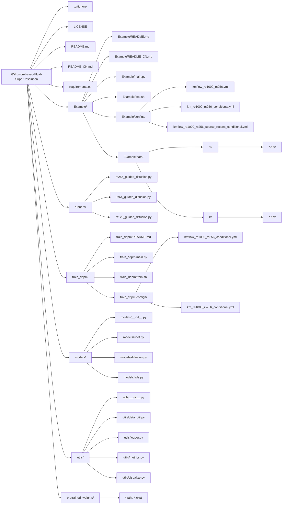

# 基于扩散的流体超分辨率（Diffusion-based Fluid Super-resolution）
<br>

PyTorch实现论文：

**基于物理信息的扩散模型实现高保真流场重建（A Physics-informed Diffusion Model for High-fidelity Flow Field Reconstruction）**

（论文链接：<a href="https://www.sciencedirect.com/science/article/pii/S0021999123000670">计算物理学杂志</a> | <a href="https://arxiv.org/abs/2211.14680">arXiv</a>）

<div style style=”line-height: 25%” align="center">
<h3>示例1</h3>

<h3>示例2</h3>

</div>

## 概述
去噪扩散概率模型（Denoising Diffusion Probabilistic Models, DDPM）是数据超分辨率和重建的强有力工具。与许多需要低分辨率-高分辨率数据配对训练的其他深度学习模型不同，DDPM仅需高分辨率数据进行训练。这一特性尤其适用于从低分辨率参考数据重建高保真CFD数据，因为它使模型更独立于低分辨率数据分布，从而能更好地适应不同重建任务中的各种数据模式。

这篇论文提出了一个将物理信息与扩散模型结合的新框架(PhyDiff)，用于流场重建。其创新点主要包括：

1. **首次将物理信息整合入扩散模型**：作者创造性地在扩散模型框架中融入了物理约束，使模型既能从数据中学习，又能遵循物理定律。

2. **双重损失函数设计**：提出了结合数据驱动损失和物理信息损失的训练策略，使模型在生成过程中满足流体力学的守恒方程。

3. **解决了稀疏观测问题**：能够从极少量的测量点重建完整高质量流场，这在实际应用中非常有价值。

4. **提出了概率性重建框架**：不同于传统确定性方法，PhyDiff提供了具有不确定性量化的概率性流场重建。

### 研究者应重点关注的方面

1. **物理信息融合机制**：论文中通过在反向扩散过程中引入物理引导项，将Navier-Stokes方程作为约束条件，这一融合方式值得深入研究。

2. **模型性能与泛化能力**：PhyDiff在重建准确性上优于现有方法，特别是在处理不同Reynolds数的流场和超出训练分布的情况时表现出色。

3. **不确定性量化**：扩散模型天然提供了多样化采样能力，使物理场重建具有不确定性量化，这对于可靠性分析很重要。

4. **计算效率问题**：论文中提到虽然推理时间比传统方法长，但重建质量大幅提升，这种权衡值得考虑。

5. **应用扩展潜力**：这一框架可能扩展到其他物理系统的重建，如电磁场、热场等，研究者可以探索这些方向。

6. **实际落地应用**：虽然论文中展示了在CFD数据上的应用，但在实际工程中如何有效集成和部署仍然是一个挑战。可见的是，由于超分技术的引入，将高精度CFD数据应用于实时模拟和控制系统中是一个重要的研究方向。更通俗而言，模拟风洞实验或流体动力学实验的实时反馈。

作为研究者，您可能还需要关注论文中模型的实现细节、超参数选择，以及如何针对特定应用场景进行优化和改进。论文为将扩散模型应用于物理信息引导的科学计算开辟了新途径，这一方向有很大的发展潜力。

## 目录结构

代码结构如下：



下面给出该工作区的文件/目录结构，并逐个模块进行更为详细的说明，同时给出复现步骤的建议顺序。可对照该图理解项目整体布局。

### 1. 根目录结构概览

- .gitignore  
  忽略提交的数据或日志文件等，避免冗余文件进入版本库。  
- LICENSE  
  该项目采用的开源协议（MIT）。  
- README.md / README_CN.md  
  项目介绍、使用方法及依赖说明等，分别为英文/中文版本。  
- requirements.txt  
  给出 Python 依赖包列表，便于安装项目依赖。

> **复现指引**  
> 在正式开始前，阅读 README 了解项目定位与环境要求，使用 `pip install -r requirements.txt` 安装项目依赖。

### 2. 根目录

- main.py  
  • 最终执行超分辨率重建的入口脚本，解析命令行参数，加载配置（yaml），并调用 `runners/rs256_guided_diffusion.py` 的 `Diffusion.reconstruct()` 执行重建。  
- test.sh  
  • 调用 main.py 进行采样测试的脚本示例，封装常用参数。  
- configs  
  • 存放超分/重建所需的基础配置文件（`.yml`），如并行数、网络大小、采样步数等。  
- data  
  - Example/data/hr/：高分辨率流场数据（真值）  
  - Example/data/lr/：与高分辨率对应的低分辨率输入  
- train.sh  
  • 示例脚本，用于一键调用 main.py 进行训练（指定配置、输出路径等）。

> **复现指引**  
> 1) 准备数据。保证 `hr/` 与 `lr/` 文件夹中有对应的流场数据。  
> 2) 想要快速上手，可以先使用预训练模型并运行 `test.sh`，查看重建结果。

### 3. runners/ （超分辨率核心算法）

- runners/rs256_guided_diffusion.py  
  • Guided Diffusion 主实现，`Diffusion` 类包含从低分到高分的生成/迭代推断逻辑。  
- runners/rs128_guided_diffusion.py / runners/rs64_guided_diffusion.py  
  • 与上面类似，只是对应不同分辨率或不同超分任务的处理脚本。  

> **复现指引**  
> 如果主要针对于 `256×256` 分辨率扩散超分，可聚焦在 `rs256_guided_diffusion.py` 并查看其 `reconstruct()` 函数。

### 4. train_ddpm/ （DDPM 训练相关）

- main.py  
  • 训练入口脚本，读取对应配置（`.yml`），执行扩散模型（DDPM）训练过程。  
- train.sh  
  • 一键启动训练脚本（可自定义 `CUDA_VISIBLE_DEVICES`、日志路径等）。  
- train_ddpm/configs/  
  - kmflow_re1000_rs256_conditional.yml / km_re1000_rs256_conditional.yml  
  • 用于训练的超参配置，如网络宽度、迭代轮数、学习率、噪声 schedule 等。  
- README.md  
  • 训练说明（训练脚本介绍、包含示例命令）。

> **复现指引**  
> 1) 如需从头开始训练模型，先进入 `train_ddpm/` 文件夹，参考 train.sh 或 main.py 启动训练。  
> 2) 训练完成后，将得到的权重文件（`.pth` 或 `.ckpt`）保存到 `pretrained_weights/` 里，以便下一步的采样或继续调试。

### 5. models/ （网络与扩散算法实现）

- models/unet.py  
  • 定义了 U-Net 的深度结构，用于扩散模型中的去噪过程。  
- models/diffusion.py  
  • DDPM 正向/逆向扩散过程的核心逻辑，含噪声生成、损失函数等。  
- models/sde.py  
  • 一些随机微分方程工具分析与扩散过程相关的公式实现。  
- models/__init__.py  
  • 用于模块初始化或导入路径配置。

> **复现指引**  
> 这些文件是核心算法的底层结构，训练脚本与 `[runners/…]` 会调用其中的函数；一般无需改动，除非需要自定义网络结构或改进扩散处理方式。

### 6. utils/ （工具函数与辅助模块）

- utils/data_util.py  
  • 用于数据预处理、读取 `.*npz` 文件、切分 dataset 等。  
- utils/logger.py  
  • 日志系统，记录训练/推断实时信息。  
- utils/metrics.py  
  • 实现常用图像质量或流场评估指标（PSNR、SSIM 等）。  
- utils/visualize.py  
  • 绘制/可视化重建结果（如 `.npy` 转为图像）或对比图。

> **复现指引**  
> 如果需要定制数据加载流程，或实现额外评估指标，可直接修改 utils/data_util.py 和 utils/metrics.py。

### 7. pretrained_weights/ （预训练模型权重）

- `[*.pth / *.ckpt]`  
  • 训练完成后生成或官方提供的预训练模型文件。  
  • 供 `Example/main.py` 或 `train_ddpm/main.py` 加载并执行超分推断。

> **复现指引**  
> 不想自己训练模型时，可将官方给出的权重放入该文件夹后，再运行 main.py 进行采样与重建。

## 从零开始的完整复现流程

1. **安装依赖**  
   ```bash
   pip install -r requirements.txt
   ```

2. **准备数据**  
   - 下载高分辨率/低分辨率数据，放到 Example/data/hr/ 与 Example/data/lr/  
   - 确保数据格式与配置文件中描述的尺寸/变量一致。

3. **可选：直接使用预训练模型**  
   - 将官方或已训练好的 `.pth` 文件放至 pretrained_weights/  
   - 进入 Example 目录并执行 `test.sh` 或手动执行：  
     ```bash
     python main.py --config kmflow_re1000_rs256_sparse_recons_conditional.yml --seed 1234 --sample_step 1 --t 240 --r 30
     ```

4. **完整流程：从头训练 + 重建**  
   - 进入 train_ddpm/ 文件夹，运行 `train.sh` 或  
     ```bash
     python main.py --config ./kmflow_re1000_rs256_conditional.yml --exp ./experiments/km256/ --doc ./weights/km256/ --ni
     ```  
   - 训练完成后，复制生成的权重文件至 `pretrained_weights/`  
   - 回到 Example 目录执行 `test.sh`，验证重建效果

5. **查看日志 / 可视化**  
   - 日志：训练过程与采样过程会在指定 `log_dir` 中生成文本记录，可以结合 utils/logger.py 调整格式。  
   - 评估：如需评估 PSNR/SSIM，可在 utils/metrics.py 中查看函数或自行改动。  
   - 可视化：若要把重建结果 `.npy`、`.npz` 绘图，可使用 utils/visualize.py 编写自己的显示脚本。

通过以上解析，结合上面的 Mermaid 图查看每个目录与文件的上下游逻辑，便于理解、修改或扩展此仓库。若对扩散过程或流场重建原理有更深入需求，可进一步阅读 models/diffusion.py 与 runners。

而如果想重写代码，先写底层网络和扩散算法，再实现调度逻辑和训练入口，最后编写推断主函数。可按如下顺序进行：

1. **models/unet.py**  
   先搭建 U-Net 主体，确保核心网络结构能正常前向/反向传播。  
2. **models/diffusion.py**  
   实现扩散过程（DDPM）的正向/逆向公式及损失函数。  
3. **models/sde.py**  
   如需要 SDE，补充随机微分方程部分。  
4. **runners/rs256_guided_diffusion.py**  
   编写推断逻辑（从低分到高分的迭代重建），使用前面定义的网络和扩散算法。  
5. **utils/data_util.py** / **utils/metrics.py** 等  
   实现数据加载、预处理和评估指标。  
6. **train_ddpm/main.py**  
   封装训练过程，生成或加载模型权重。  
7. **main.py**  
   通过命令行参数读取配置，调用 `runners` 完成超分辨率推断，最后输出结果。

## 数据集
用于模型训练和采样的数据集可通过以下链接下载：

- 高分辨率数据（超分辨率任务的基准真值）(<a href="https://figshare.com/ndownloader/files/39181919">链接</a>)

- 从随机网格位置测量的低分辨率数据（超分辨率任务的输入数据）(<a href="https://figshare.com/ndownloader/files/39214622">链接</a>)

## 运行实验
本代码已在以下环境中测试通过：

```
python 3.8
PyTorch 1.7 + CUDA 10.1 + torchvision 0.8.2
TensorBoard 2.11
Numpy 1.22
tqdm 4.59
einops 0.4.1
matplotlib 3.6.2
```

下载高分辨率和低分辨率数据，并将数据文件保存至子目录``./data/``。

<b>步骤1 - 模型训练</b>

在子目录``./train_ddpm/``中运行：

``
bash train.sh
``

或 

``
python main.py --config ./km_re1000_rs256_conditional.yml --exp ./experiments/km256/ --doc ./weights/km256/ --ni
``

训练好的模型检查点默认保存在以下路径。您可以通过修改``--exp``和``--doc``的值来调整保存目录。

``.../Diffusion-based-Fluid-Super-resolution/train_ddpm/experiments/km256/logs/weights/km256/``

注：如果您希望跳过步骤1，我们提供以下预训练检查点可直接开始<b>步骤2</b>：
<ol type="1">
  <li>未使用物理信息条件输入的模型（model without physics-informed conditioning input）(<a href="https://figshare.com/ndownloader/files/40320733">链接</a>)</li>
  <li>使用物理信息条件输入的模型（model with physics-informed conditioning input）(<a href="https://figshare.com/ndownloader/files/39184073">链接</a>)</li>
</ol>

<b>步骤2 - 超分辨率重建</b>

将<b>步骤1</b>获得的模型检查点文件（例如``baseline_ckpt.pth``）添加至以下目录：

``.../Diffusion-based-Fluid-Super-resolution/pretrained_weights/``

在本仓库主目录中运行：

``
python main.py --config kmflow_re1000_rs256.yml --seed 1234 --sample_step 1 --t 240 --r 30
``

## 物理梯度嵌入

在 [rs256_guided_diffusion.py] 和 [losses.py]中，逐行梳理如何在扩散过程中融入了 PINN（物理梯度），以及代码中关键函数的具体用途。重点关注 `voriticity_residual()` 函数如何计算 vorticity PDE（涡量方程）的残差并把梯度反馈到网络或采样流程中。

### `voriticity_residual()` 与 PINN 的核心思路

两份文件里都实现了 `voriticity_residual()`，功能相似，都是根据流体力学基础方程（2D 涡量形式）来计算 PDE 残差和梯度。其大体流程如下：

1. 接收流场张量 `w`（形状 [batch, time, H, W]），其中每个通道往往对应不同的时刻。  
2. 通过傅里叶变换 (`torch.fft.fft2`) 得到频域变量；然后根据涡量-流函数关系，推算速度场 $(u, v)$ 以及拉普拉斯、偏导数等信息。  
3. 依据离散化的涡量方程：  
   $$w_t + \Bigl(u \cdot \frac{\partial w}{\partial x} + v \cdot \frac{\partial w}{\partial y}\Bigr)
   - \frac{1}{\mathrm{Re}}\,\Delta w + 0.1\,w - f = 0$$  
   其中 $f$ 是外力项，$\mathrm{Re}$ 是雷诺数，$w_t$ 表示对时间的偏导，$\Delta w$ 表示拉普拉斯运算。  
4. 将残差 residual = “上式” 的非零部分平方求平均，即为 `residual_loss`，代表物理违反程度。  
5. 若需要计算梯度，则对 `residual_loss` 相对于 `w` 做一次 `torch.autograd.grad`，得到 `dw`，即“物理梯度”。  
6. 在训练或采样过程中，可将 `dw` 视为一股“物理纠正力”，逼近真实流体动力学方程，从而实现 PINN 思路。

在 [rs256_guided_diffusion.py] 里，`voriticity_residual()` 默认为 `calc_grad=True` 时返回 `(dw, residual_loss)`，否则仅返回 `residual_loss`。在 [losses.py] 里，它仅返回 `dw`，在训练中可配合其他损失项共同最小化。

### [rs256_guided_diffusion.py] 主要结构

1. **导入部分**  
   - `functions/diffusion_step.py`: 提供扩散采样方法，如 `ddpm_steps`, `ddim_steps`, `guided_ddim_steps` 等。  
   - `models/diffusion_new`: 包含 `ConditionalModel` / `Model`，即 U-Net 为主体的扩散网络。  
   - `functions/process_data`: 提供数据加载或预处理（如 `load_recons_data()`）。

2. **核心类：`Diffusion`**  
   - 构造函数里加载 beta schedule（`get_beta_schedule()`），并初始化 logvar；  
   - `reconstruct()` 方法是最重要的核心流程，用于从低分辨率流场推断高分辨率结果。  

3. **在 `reconstruct()` 中融入 PINN**  
   - 约在第 290 行处，根据模型类型判断是否需要物理梯度：  
     (a) Conditional Model：  
       physical_gradient_func = lambda x: voriticity_residual(scaler.inverse(x))[0] / scaler.scale()  
     (b) 若 `lambda_ > 0`，则也会引入 `voriticity_residual()` 并乘上加权系数。  
   - 这会被传给 `guided_ddim_steps()` 或 `ddim_steps()` 作为 `dx_func`，在每个反向扩散步骤里调用 `dx_func(x)` 得到 PDE 梯度，叠加到采样更新公式中。  
   - 因此，扩散采样过程不再仅仅依赖模型输出的噪声估计；还会受到 PDE 残差梯度的“纠正”，使生成的流场逐步符合物理约束（这正是 PINN 注入的关键）。

4. **残差与梯度在采样中的记录**  
   - 如第 378 行左右，会用 `l2_loss_all` 和 `residual_loss_all` 记录在不同迭代下的 L2 误差和 PDE 残差，便于后期分析。  
   - 采样完成后可查看 “mean l2 loss” 与 “mean residual loss”，衡量最终结果既和真值接近又符合物理规律。
  
### 3. [losses.py] 训练阶段如何使用物理残差

1. `voriticity_residual(w, re=1000.0, dt=1/32)`  
   - 与上面相同的 PDE 残差计算，只是这里直接返回 `dw`，在训练时可以把它与模型的噪声预测误差一起，形成整体损失。  
2. `conditional_noise_estimation_loss()`  
   - 常规的噪声估计损失 + 物理残差：  
     flag < p 时只用原扩散模型损失；否则会额外计算 `dx = voriticity_residual(...)` 并传给模型 `model(x, t.float(), dx)`，使网络学到物理约束。  
   - 这说明在训练“条件模型”时，PDE 梯度能被网络感知，进而学得更“物理一致”的去噪模型。

### 4. 综合小结

1. **扩散模型**：`Model` 和 `ConditionalModel` 提供从噪声到清晰流场的预测。  
2. **PINN 注入**：  
   - 训练时：在 `conditional_noise_estimation_loss()` 里，将 `voriticity_residual` 得到的梯度 `dx` 传入模型；网络不仅要拟合数据，还要满足 PDE 约束，成为 PINN 化的扩散模型。  
   - 采样时：在 `Diffusion.reconstruct()` 中把残差梯度做为 `dx_func`，动态修正扩散采样路径，使预测流场合乎物理。  
3. **物理梯度位置**：  
   - losses.py 中：训练时的 `voriticity_residual()`；  
   - rs256_guided_diffusion.py 中：推断时的 `voriticity_residual()`；  
   - 均在傅里叶域对涡量作分析，并通过 `torch.autograd.grad` 拿到梯度，将其注入到网络或迭代更新流程。

因此，可以看到整个项目利用涡量方程的“残差 + 梯度”来指导扩散模型的训练和推断，形成一种 PINN 与扩散式生成模型结合的超分辨率方法。

## 训练与重建

下面按照 README.md 中的各关键环节，结合项目主要代码文件，一步步解释其内部逻辑。重点放在训练与重建流程如何调用扩散模型及物理梯度（PINN）部分。

### 训练脚本：`train_ddpm/main.py` 与 `functions/losses.py`

1. **入口与配置**  
   - 在 `train_ddpm/main.py` 中，程序通过 `argparse` 或 `yaml` 读取超参（例如 `kmflow_re1000_rs256_conditional.yml` ），包括网络结构参数、迭代轮数、学习率、loss 类型等。  
   - 读取完成后，会初始化模型（如 `models/diffusion.py` 中的 `Model` 或 `ConditionalModel`），同时注册相应的损失函数，如 `conditional_noise_estimation_loss()`。

2. **物理梯度注入**  
   - 在 `conditional_noise_estimation_loss()` 中，会根据设定好的概率 `p` 来决定是否调用 `voriticity_residual()` 函数（在同文件或在 `rs256_guided_diffusion.py` 下），计算涡量方程的残差与梯度。  
   - 一旦引入 `dx`（物理梯度），就会在网络前向传递时一起输入：  
     ```python
     model_output = model(x, t.float(), dx=dx)
     ```
     这样网络不只要“拟合”训练数据，还要满足 PDE 约束，成为 PINN 化的扩散模型。

3. **训练过程**  
   - 每一步更新包含两部分：  
     (a) 常规的“噪声预测误差” (diffusion loss)  
     (b) 与 PDE 残差相关的物理约束  
   - 最终的梯度通过 `optimizer.step()` 更新 U-Net 权重，实现对“高维噪声 + 物理方程”同步学习。

### 2. 重建脚本：`Example/main.py` 与 `runners/rs256_guided_diffusion.py`

1. **超分入口**  
   - 在 main.py 中，根据 `--config` 指定的 `.yml` 文件，加载已训练好的模型权重（位于 `pretrained_weights/`）。  
   - 然后调用 `Diffusion.reconstruct()`（在 `rs256_guided_diffusion.py` 里），开始从低分辨率（LR）到高分辨率（HR）的逐步反向扩散采样。

2. **重建循环**  
   - `reconstruct()` 会先把 LR 数据转换为初始噪声场，然后在每个时间步 `t` 调用 `ddim_steps()` 或 `guided_ddim_steps()`。  
   - 若是“物理约束”模式，内部会调用：
     ```python
     dx_func = lambda x: voriticity_residual(scaler.inverse(x))[0] / scaler.scale()
     ```  
     计算物理梯度 `dx` 并把它叠加到扩散更新方程里，使采样结果逐渐符合涡量方程。

3. **物理损失记录**  
   - 在若干步骤后，会计算 `residual_loss`（物理方程残差）与 `l2_loss`（与真值的误差）并输出日志，保存在 `log_dir`，便于监控网络生成的流场既贴近真实数据，也满足 PDE 规律。

### 3. 网络结构：`models/unet.py` 与 `models/diffusion.py`

1. **U-Net 架构** (`models/unet.py`)  
   - 负责将输入（随机噪声 + 条件信息）映射到输出（预测噪声/流场修正量）。  
   - 如果是 `ConditionalModel`，网络会把低分辨率图像或物理梯度当作侧向输入，拼接在特征维度，或通过特定通道传入网络卷积层。

2. **Diffusion 核心** (`models/diffusion.py`)  
   - 定义正向噪声添加 (q) 与反向去噪 (p) 过程的关键公式，封装采样/预测步骤。  
   - 训练时，通过 `losses.py` 计算噪声预测误差。  
   - 推断或采样时，与 `runners/rs256_guided_diffusion.py` 协同执行迭代生成。

### 4. PINN 实现：`losses.py` 与 `runners/rs256_guided_diffusion.py` 的 `voriticity_residual()`

1. **涡量残差公式**  
   - 源自 2D Navier-Stokes 方程下的涡量形式：  
     wt + (u·∂w/∂x + v·∂w/∂y) - (1/Re)Δw + 0.1·w = 0  (示例)  
   - 函数会用 `torch.fft.fft2` 计算梯度与拉普拉斯，并得到 `residual = PDE(w)`（在傅里叶空间计算更高效）。  
   - 最终 `residual` 平方平均（MSE）即为物理违反程 `residual_loss`，Autograd 可以将梯度回溯到输入 `w`。

2. **训练 vs. 推断**  
   - 训练时：在 `conditional_noise_estimation_loss()` 里，`dx` = `voriticity_residual(w)` → 作为一部分梯度信息输入模型；或写进 loss 共同反向传播。  
   - 推断时：在 `Diffusion.reconstruct()` 设置 `dx_func`，每步生成中都加上 PDE 修正，让采样过程被“纠正”到更合理的物理流场。

### 总结

- **训练脚本 (`train_ddpm/main.py` + `functions/losses.py`)**  
  同时学习数据分布的去噪（扩散）与物理约束（涡量方程），在网络梯度里显式考虑 PDE。  
- **推断脚本 (`Example/main.py` + `runners/rs256_guided_diffusion.py`)**  
  从低分辨率流场出发，反向扩散到高分辨率；若启用 PINN，则每一步都调用 `voriticity_residual()` 获取物理梯度辅助生成。  
- **网络 (`models/unet.py` + `models/diffusion.py`)**  
  提供 U-Net 结构与扩散公式；`ConditionalModel` 允许将物理信息/低分辨率图像等作为条件输入。  
- **物理残差 (`voriticity_residual()`)**  
  通过傅里叶变换实现高效 PDE 计算；训练和采样都可用，形成 PINN 核心。

这样就从配置文件加载、网络训练、到推断重建的全流程，较为完整地结合了「扩散模型 + PINN」的思想和实现细节。希望有助于更深入地理解并复现该项目。

## 参考文献
如果您在研究中发现此代码库有用，请引用以下工作：
```
@article{shu2023physics,
  title={A Physics-informed Diffusion Model for High-fidelity Flow Field Reconstruction},
  author={Shu, Dule and Li, Zijie and Farimani, Amir Barati},
  journal={Journal of Computational Physics},
  pages={111972},
  year={2023},
  publisher={Elsevier}
}
```

本实现基于/受到以下工作的启发：

- [https://github.com/ermongroup/SDEdit](https://github.com/ermongroup/SDEdit) (SDEdit: 基于随机微分方程的引导图像合成与编辑)
- [https://github.com/ermongroup/ddim](https://github.com/ermongroup/ddim) (去噪扩散隐式模型)