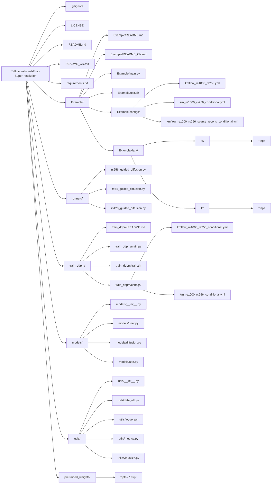

# 基于扩散的流体超分辨率（Diffusion-based Fluid Super-resolution）
<br>

PyTorch实现论文：

**基于物理信息的扩散模型实现高保真流场重建（A Physics-informed Diffusion Model for High-fidelity Flow Field Reconstruction）**

（论文链接：<a href="https://www.sciencedirect.com/science/article/pii/S0021999123000670">计算物理学杂志</a> | <a href="https://arxiv.org/abs/2211.14680">arXiv</a>）

<div style style=”line-height: 25%” align="center">
<h3>示例1</h3>

<h3>示例2</h3>

</div>

## 概述
去噪扩散概率模型（Denoising Diffusion Probabilistic Models, DDPM）是数据超分辨率和重建的强有力工具。与许多需要低分辨率-高分辨率数据配对训练的其他深度学习模型不同，DDPM仅需高分辨率数据进行训练。这一特性尤其适用于从低分辨率参考数据重建高保真CFD数据，因为它使模型更独立于低分辨率数据分布，从而能更好地适应不同重建任务中的各种数据模式。

代码结构如下：



下面给出该工作区的文件/目录结构，并逐个模块进行更为详细的说明，同时给出复现步骤的建议顺序。可对照该图理解项目整体布局。

## 1. 根目录结构概览

- .gitignore  
  忽略提交的数据或日志文件等，避免冗余文件进入版本库。  
- LICENSE  
  该项目采用的开源协议（MIT）。  
- README.md / README_CN.md  
  项目介绍、使用方法及依赖说明等，分别为英文/中文版本。  
- requirements.txt  
  给出 Python 依赖包列表，便于安装项目依赖。

> **复现指引**  
> 在正式开始前，阅读 README（中文或英文）了解项目定位与环境要求，使用 `pip install -r requirements.txt` 安装项目依赖。

## 2. 根目录

- main.py  
  • 最终执行超分辨率重建的入口脚本，解析命令行参数，加载配置（yaml），并调用 `runners/rs256_guided_diffusion.py` 的 `Diffusion.reconstruct()` 执行重建。  
- test.sh  
  • 调用 main.py 进行采样测试的脚本示例，封装常用参数。  
- configs  
  • 存放超分/重建所需的基础配置文件（`.yml`），如并行数、网络大小、采样步数等。  
- data  
  - Example/data/hr/：高分辨率流场数据（真值）  
  - Example/data/lr/：与高分辨率对应的低分辨率输入  
- train.sh  
  • 示例脚本，用于一键调用 main.py 进行训练（指定配置、输出路径等）。

> **复现指引**  
> 1) 准备数据。保证 `hr/` 与 `lr/` 文件夹中有对应的流场数据。  
> 2) 想要快速上手，可以先使用预训练模型并运行 `test.sh`，查看重建结果。

## 3. runners/ （超分辨率核心算法）

- runners/rs256_guided_diffusion.py  
  • Guided Diffusion 主实现，`Diffusion` 类包含从低分到高分的生成/迭代推断逻辑。  
- runners/rs128_guided_diffusion.py / runners/rs64_guided_diffusion.py  
  • 与上面类似，只是对应不同分辨率或不同超分任务的处理脚本。  

> **复现指引**  
> 如果主要针对于 `256×256` 分辨率扩散超分，可聚焦在 `rs256_guided_diffusion.py` 并查看其 `reconstruct()` 函数。

## 4. train_ddpm/ （DDPM 训练相关）

- main.py  
  • 训练入口脚本，读取对应配置（`.yml`），执行扩散模型（DDPM）训练过程。  
- train.sh  
  • 一键启动训练脚本（可自定义 `CUDA_VISIBLE_DEVICES`、日志路径等）。  
- train_ddpm/configs/  
  - kmflow_re1000_rs256_conditional.yml / km_re1000_rs256_conditional.yml  
  • 用于训练的超参配置，如网络宽度、迭代轮数、学习率、噪声 schedule 等。  
- README.md  
  • 训练说明（训练脚本介绍、包含示例命令）。

> **复现指引**  
> 1) 如需从头开始训练模型，先进入 `train_ddpm/` 文件夹，参考 train.sh 或 main.py 启动训练。  
> 2) 训练完成后，将得到的权重文件（`.pth` 或 `.ckpt`）保存到 `pretrained_weights/` 里，以便下一步的采样或继续调试。

## 5. models/ （网络与扩散算法实现）

- models/unet.py  
  • 定义了 U-Net 的深度结构，用于扩散模型中的去噪过程。  
- models/diffusion.py  
  • DDPM 正向/逆向扩散过程的核心逻辑，含噪声生成、损失函数等。  
- models/sde.py  
  • 一些随机微分方程工具分析与扩散过程相关的公式实现。  
- models/__init__.py  
  • 用于模块初始化或导入路径配置。

> **复现指引**  
> 这些文件是核心算法的底层结构，训练脚本与 `[runners/…]` 会调用其中的函数；一般无需改动，除非需要自定义网络结构或改进扩散处理方式。

## 6. utils/ （工具函数与辅助模块）

- utils/data_util.py  
  • 用于数据预处理、读取 `.*npz` 文件、切分 dataset 等。  
- utils/logger.py  
  • 日志系统，记录训练/推断实时信息。  
- utils/metrics.py  
  • 实现常用图像质量或流场评估指标（PSNR、SSIM 等）。  
- utils/visualize.py  
  • 绘制/可视化重建结果（如 `.npy` 转为图像）或对比图。

> **复现指引**  
> 如果需要定制数据加载流程，或实现额外评估指标，可直接修改 utils/data_util.py 和 utils/metrics.py。

## 7. pretrained_weights/ （预训练模型权重）

- `[*.pth / *.ckpt]`  
  • 训练完成后生成或官方提供的预训练模型文件。  
  • 供 `Example/main.py` 或 `train_ddpm/main.py` 加载并执行超分推断。

> **复现指引**  
> 不想自己训练模型时，可将官方给出的权重放入该文件夹后，再运行 main.py 进行采样与重建。

# 从零开始的完整复现流程（结合以上模块说明）

1. **安装依赖**  
   ```bash
   pip install -r requirements.txt
   ```

2. **准备数据**  
   - 下载高分辨率/低分辨率数据，放到 Example/data/hr/ 与 Example/data/lr/  
   - 确保数据格式与配置文件中描述的尺寸/变量一致。

3. **可选：直接使用预训练模型**  
   - 将官方或已训练好的 `.pth` 文件放至 pretrained_weights/  
   - 进入 Example 目录并执行 `test.sh` 或手动执行：  
     ```bash
     python main.py --config kmflow_re1000_rs256_sparse_recons_conditional.yml --seed 1234 --sample_step 1 --t 240 --r 30
     ```

4. **完整流程：从头训练 + 重建**  
   - 进入 train_ddpm/ 文件夹，运行 `train.sh` 或  
     ```bash
     python main.py --config ./kmflow_re1000_rs256_conditional.yml --exp ./experiments/km256/ --doc ./weights/km256/ --ni
     ```  
   - 训练完成后，复制生成的权重文件至 `pretrained_weights/`  
   - 回到 Example 目录执行 `test.sh`，验证重建效果

5. **查看日志 / 可视化**  
   - 日志：训练过程与采样过程会在指定 `log_dir` 中生成文本记录，可以结合 utils/logger.py 调整格式。  
   - 评估：如需评估 PSNR/SSIM，可在 utils/metrics.py 中查看函数或自行改动。  
   - 可视化：若要把重建结果 `.npy`、`.npz` 绘图，可使用 utils/visualize.py 编写自己的显示脚本。

通过以上解析，结合上面的 Mermaid 图查看每个目录与文件的上下游逻辑，便于理解、修改或扩展此仓库。若对扩散过程或流场重建原理有更深入需求，可进一步阅读 models/diffusion.py 与 runners。

而如果想重写代码，先写底层网络和扩散算法，再实现调度逻辑和训练入口，最后编写推断主函数。可按如下顺序进行：

1. **models/unet.py**  
   先搭建 U-Net 主体，确保核心网络结构能正常前向/反向传播。  
2. **models/diffusion.py**  
   实现扩散过程（DDPM）的正向/逆向公式及损失函数。  
3. **models/sde.py**  
   如需要 SDE，补充随机微分方程部分。  
4. **runners/rs256_guided_diffusion.py**  
   编写推断逻辑（从低分到高分的迭代重建），使用前面定义的网络和扩散算法。  
5. **utils/data_util.py** / **utils/metrics.py** 等  
   实现数据加载、预处理和评估指标。  
6. **train_ddpm/main.py**  
   封装训练过程，生成或加载模型权重。  
7. **Example/main.py**  
   通过命令行参数读取配置，调用 `runners` 完成超分辨率推断，最后输出结果。  

## 数据集
用于模型训练和采样的数据集可通过以下链接下载：

- 高分辨率数据（超分辨率任务的基准真值）(<a href="https://figshare.com/ndownloader/files/39181919">链接</a>)

- 从随机网格位置测量的低分辨率数据（超分辨率任务的输入数据）(<a href="https://figshare.com/ndownloader/files/39214622">链接</a>)

## 运行实验
本代码已在以下环境中测试通过：

```
python 3.8
PyTorch 1.7 + CUDA 10.1 + torchvision 0.8.2
TensorBoard 2.11
Numpy 1.22
tqdm 4.59
einops 0.4.1
matplotlib 3.6.2
```

下载高分辨率和低分辨率数据，并将数据文件保存至子目录``./data/``。

<!--
更多实验运行细节即将更新。
-->

<b>步骤1 - 模型训练</b>

在子目录``./train_ddpm/``中运行：

``
bash train.sh
``

或 

``
python main.py --config ./km_re1000_rs256_conditional.yml --exp ./experiments/km256/ --doc ./weights/km256/ --ni
``

训练好的模型检查点默认保存在以下路径。您可以通过修改``--exp``和``--doc``的值来调整保存目录。

``.../Diffusion-based-Fluid-Super-resolution/train_ddpm/experiments/km256/logs/weights/km256/``

注：如果您希望跳过步骤1，我们提供以下预训练检查点可直接开始<b>步骤2</b>：
<ol type="1">
  <li>未使用物理信息条件输入的模型（model without physics-informed conditioning input）(<a href="https://figshare.com/ndownloader/files/40320733">链接</a>)</li>
  <li>使用物理信息条件输入的模型（model with physics-informed conditioning input）(<a href="https://figshare.com/ndownloader/files/39184073">链接</a>)</li>
</ol>

<b>步骤2 - 超分辨率重建</b>

将<b>步骤1</b>获得的模型检查点文件（例如``baseline_ckpt.pth``）添加至以下目录：

``.../Diffusion-based-Fluid-Super-resolution/pretrained_weights/``

在本仓库主目录中运行：

``
python main.py --config kmflow_re1000_rs256.yml --seed 1234 --sample_step 1 --t 240 --r 30
``

## 参考文献
如果您在研究中发现此代码库有用，请引用以下工作：
```
@article{shu2023physics,
  title={A Physics-informed Diffusion Model for High-fidelity Flow Field Reconstruction},
  author={Shu, Dule and Li, Zijie and Farimani, Amir Barati},
  journal={Journal of Computational Physics},
  pages={111972},
  year={2023},
  publisher={Elsevier}
}
```

本实现基于/受到以下工作的启发：

- [https://github.com/ermongroup/SDEdit](https://github.com/ermongroup/SDEdit) (SDEdit: 基于随机微分方程的引导图像合成与编辑)
- [https://github.com/ermongroup/ddim](https://github.com/ermongroup/ddim) (去噪扩散隐式模型)