# 复现论文的日志

> 谢谢你，AI大人
>
> AI大人包括:
> - DeepSeek R1，V3；
> - OpenAI GPT-4o，o1，o3，o3-mini，o4-mini；
> - Google Gemini 2.5 Pro；
> - Claude 3.5 Sonnet, 3.7 Sonnet, 3.7 Sonnet Thinking
>
> 已向AI大人投降
> 
> *投降喵投降喵灌注永雏塔菲喵谢谢喵*

- [复现论文的日志](#复现论文的日志)
    - [`ema.py`的作用](#emapy的作用)
      - [EMA (指数移动平均)在扩散模型中的应用详解](#ema-指数移动平均在扩散模型中的应用详解)
        - [一、宏观理解：EMA的核心作用](#一宏观理解ema的核心作用)
        - [二、`ema.py` 代码详细解析](#二emapy-代码详细解析)
        - [三、EMA在`diffusion_tub.py`中的应用流程](#三ema在diffusion_tubpy中的应用流程)
        - [四、深入理解：EMA在流场超分辨率重建中的具体价值](#四深入理解ema在流场超分辨率重建中的具体价值)
        - [五、实现EMA的最佳实践](#五实现ema的最佳实践)
      - [总结](#总结)
    - [物理梯度的条件模型](#物理梯度的条件模型)
      - [1. 宏观架构概览](#1-宏观架构概览)
      - [2. 基础组件详解](#2-基础组件详解)
        - [2.1 辅助函数与基础模块](#21-辅助函数与基础模块)
        - [2.2 核心构建块](#22-核心构建块)
      - [3. 主要模型详解](#3-主要模型详解)
        - [3.1 Model类（无物理梯度）](#31-model类无物理梯度)
        - [3.2 ConditionalModel类（使用物理梯度）](#32-conditionalmodel类使用物理梯度)
          - [前向传播:](#前向传播)
        - [3.3 FNO2d类（傅里叶神经算子）](#33-fno2d类傅里叶神经算子)
      - [4. 训练与推理过程](#4-训练与推理过程)
        - [4.1 训练过程](#41-训练过程)
        - [4.2 推理过程（采样）](#42-推理过程采样)
        - [4.3 批处理机制](#43-批处理机制)
      - [5. 技术细节与实现要点](#5-技术细节与实现要点)
        - [5.1 物理梯度的处理](#51-物理梯度的处理)
        - [5.2 时间步处理](#52-时间步处理)
        - [5.3 跳跃连接](#53-跳跃连接)
        - [5.4 循环填充](#54-循环填充)
      - [6. 总结](#6-总结)
        - [模型关键组件说明](#模型关键组件说明)
  - [Diffusion-based Fluid Super-resolution 数据集模块详细文档](#diffusion-based-fluid-super-resolution-数据集模块详细文档)
    - [1. 模块总体架构](#1-模块总体架构)
      - [核心功能组件](#核心功能组件)
    - [2. 流体数据处理的特殊之处](#2-流体数据处理的特殊之处)
      - [2.1 时序连续性处理](#21-时序连续性处理)
      - [2.2 多分辨率数据处理](#22-多分辨率数据处理)
      - [2.3 多尺度时间处理](#23-多尺度时间处理)
    - [3. 数据预处理与归一化](#3-数据预处理与归一化)
      - [3.1 数据标准化](#31-数据标准化)
      - [3.2 扩散模型专用变换](#32-扩散模型专用变换)
    - [4. 时间序列数据处理机制](#4-时间序列数据处理机制)
      - [4.1 多帧数据集成](#41-多帧数据集成)
      - [4.2 时间跨步处理逻辑](#42-时间跨步处理逻辑)
    - [5. 性能优化设计](#5-性能优化设计)
      - [5.1 智能缓存机制](#51-智能缓存机制)
      - [5.2 内存映射加载](#52-内存映射加载)
    - [6. 扩散模型训练中的数据流](#6-扩散模型训练中的数据流)
    - [7. 物理扩散模型的数据特点](#7-物理扩散模型的数据特点)
      - [7.1 与传统图像超分辨率的区别](#71-与传统图像超分辨率的区别)
      - [7.2 统计特性保持](#72-统计特性保持)
    - [8. 结论](#8-结论)
  - [`Example/runners`以及`Example/train_ddpm/runners`](#examplerunners以及exampletrain_ddpmrunners)
    - [训练的`Example/train_ddpm/runners`](#训练的exampletrain_ddpmrunners)
      - [1. 模块结构与设计哲学](#1-模块结构与设计哲学)
      - [2. 训练流程详解](#2-训练流程详解)
        - [2.1 初始化阶段](#21-初始化阶段)
        - [2.2 数据处理流程](#22-数据处理流程)
        - [2.3 模型训练循环](#23-模型训练循环)
        - [2.4 `train()` 函数的特殊设计](#24-train-函数的特殊设计)
        - [2.5 训练中的最佳实践](#25-训练中的最佳实践)
      - [3. 采样与推理流程](#3-采样与推理流程)
        - [3.1 采样方法概览](#31-采样方法概览)
        - [3.2 特殊采样技术](#32-特殊采样技术)
      - [4. 物理条件融合机制](#4-物理条件融合机制)
      - [5. 实现细节与优化技巧](#5-实现细节与优化技巧)
        - [5.1 Beta调度的选择](#51-beta调度的选择)
        - [5.2 数据统计的重要性](#52-数据统计的重要性)
        - [5.3 抗偏随机采样](#53-抗偏随机采样)
      - [6. 最佳实践与应用指南](#6-最佳实践与应用指南)
        - [6.1 训练建议](#61-训练建议)
        - [6.2 推理建议](#62-推理建议)
      - [7. 代码与论文的对应关系](#7-代码与论文的对应关系)
      - [8. 总结](#8-总结)
    - [推理的`Example/runners`](#推理的examplerunners)
      - [1. 整体设计与架构](#1-整体设计与架构)
      - [2. 核心组件详解](#2-核心组件详解)
        - [2.1 物理残差计算器](#21-物理残差计算器)
        - [2.2 `Diffusion` 类的核心功能](#22-diffusion-类的核心功能)
        - [2.3 MetricLogger 与评估系统](#23-metriclogger-与评估系统)
      - [3. 推理阶段工作流程详解](#3-推理阶段工作流程详解)
        - [3.1 数据准备与预处理](#31-数据准备与预处理)
        - [3.2 扩散采样过程](#32-扩散采样过程)
        - [3.3 物理引导机制](#33-物理引导机制)
      - [4. 多次重建与不确定性评估](#4-多次重建与不确定性评估)
      - [5. 可视化与结果分析](#5-可视化与结果分析)
      - [6. 与论文的对应关系](#6-与论文的对应关系)
      - [7. 使用推理代码的最佳实践](#7-使用推理代码的最佳实践)
        - [7.1 配置参数选择](#71-配置参数选择)
        - [7.2 运行示例](#72-运行示例)
        - [7.3 故障排除与优化](#73-故障排除与优化)
      - [8. 总结](#8-总结-1)
  - [`Example/train_ddpm/functions`以及`Example/functions`](#exampletrain_ddpmfunctions以及examplefunctions)
    - [训练过程中的`Example/train_ddpm/functions`](#训练过程中的exampletrain_ddpmfunctions)
      - [1. 整体架构与关键组件](#1-整体架构与关键组件)
      - [2. `losses.py`：物理引导损失函数](#2-lossespy物理引导损失函数)
        - [2.1 涡量残差计算 - 物理约束的核心](#21-涡量残差计算---物理约束的核心)
        - [2.2 双重损失策略 - 数据驱动与物理约束的融合](#22-双重损失策略---数据驱动与物理约束的融合)
      - [3. `denoising.py`：采样与去噪过程](#3-denoisingpy采样与去噪过程)
        - [3.1 采样流程与控制](#31-采样流程与控制)
        - [3.2 与物理引导的关系](#32-与物理引导的关系)
      - [4. `ckpt_util.py`：模型权重管理](#4-ckpt_utilpy模型权重管理)
      - [5. `__init__.py`：优化器配置](#5-__init__py优化器配置)
      - [6. 与论文的对应关系](#6-与论文的对应关系-1)
      - [7. 最佳实践与应用指南](#7-最佳实践与应用指南)
        - [7.1 物理梯度使用策略](#71-物理梯度使用策略)
        - [7.2 采样策略优化](#72-采样策略优化)
        - [7.3 涡量方程参数调优](#73-涡量方程参数调优)
      - [8. 总结](#8-总结-2)
    - [推理过程中的`Example/functions`](#推理过程中的examplefunctions)
      - [1. 目录结构与组成](#1-目录结构与组成)
      - [2. 核心组件：`denoising_step.py`](#2-核心组件denoising_steppy)
        - [2.1 采样算法综述](#21-采样算法综述)
        - [2.2 物理引导采样的核心：`guided_ddim_steps`](#22-物理引导采样的核心guided_ddim_steps)
        - [2.3 特殊设计：`compute_alpha`函数](#23-特殊设计compute_alpha函数)
        - [2.4 物理引导与标准扩散的差异](#24-物理引导与标准扩散的差异)
      - [3. 数据处理：`process_data.py`](#3-数据处理process_datapy)
        - [3.1 归一化与反归一化](#31-归一化与反归一化)
        - [3.2 数据模糊化：模拟低分辨率输入](#32-数据模糊化模拟低分辨率输入)
      - [4. 推理流程中的应用](#4-推理流程中的应用)
        - [4.1 典型的推理代码调用模式](#41-典型的推理代码调用模式)
        - [4.2 与训练功能的区别与联系](#42-与训练功能的区别与联系)
      - [5. 关键技术细节与实现要点](#5-关键技术细节与实现要点)
        - [5.1 自适应噪声调度](#51-自适应噪声调度)
        - [5.2 物理梯度的尺度处理](#52-物理梯度的尺度处理)
        - [5.3 物理引导强度权衡](#53-物理引导强度权衡)
        - [5.4 噪声预测融合机制](#54-噪声预测融合机制)
      - [6. 与论文的对应关系](#6-与论文的对应关系-2)
      - [7. 最佳实践与应用指南](#7-最佳实践与应用指南-1)
        - [7.1 采样策略选择](#71-采样策略选择)
        - [7.2 物理梯度应用注意事项](#72-物理梯度应用注意事项)
        - [7.3 提高推理效率](#73-提高推理效率)
      - [8. 实际应用案例](#8-实际应用案例)
        - [8.1 低分辨率流场重建](#81-低分辨率流场重建)
        - [8.2 物理引导参数调优](#82-物理引导参数调优)
      - [9. 总结](#9-总结)
  - [训练和推理中的`main.py`以及相关的配置文件](#训练和推理中的mainpy以及相关的配置文件)
    - [1. 系统总体架构](#1-系统总体架构)
    - [2. 训练过程详解](#2-训练过程详解)
      - [2.1 训练流程](#21-训练流程)
      - [2.2 训练配置文件解析](#22-训练配置文件解析)
      - [2.3 训练参数解析](#23-训练参数解析)
    - [3. 推理过程详解](#3-推理过程详解)
      - [3.1 推理流程](#31-推理流程)
      - [3.2 推理配置文件解析](#32-推理配置文件解析)
      - [3.3 推理参数解析](#33-推理参数解析)
    - [4. 物理引导的实现机制](#4-物理引导的实现机制)
      - [4.1 物理引导策略](#41-物理引导策略)
      - [4.2 稀疏重构与数据处理](#42-稀疏重构与数据处理)
    - [5. 工作流程综合分析](#5-工作流程综合分析)
    - [6. 系统优势与特性](#6-系统优势与特性)
    - [7. 使用示例](#7-使用示例)
      - [训练模型](#训练模型)
      - [推理重构](#推理重构)
    - [总结](#总结-1)

这两个部分其实是一样的，都是关于`ConditionalModel`的实现，都是基于论文"A physics-informed diffusion model for high-fidelity flow field reconstruction"的实现。这是重建代码最核心的内容

### `ema.py`的作用

好的，我们来详细分析一下在这个基于物理的扩散模型（根据论文 "A physics-informed diffusion model for high-fidelity flow field reconstruction" 和你提供的 ema.py 代码）中，EMA（Exponential Moving Average，指数移动平均）的作用。

**核心作用总结:**

EMA 在这个模型（以及许多其他深度生成模型，尤其是扩散模型）中主要扮演两个关键角色：

1.  **稳定训练过程 (Stabilizing Training):** 深度模型的训练过程（尤其是像扩散模型这样复杂的模型）可能会因为梯度噪声、学习率选择、批次数据的随机性等因素导致参数在训练过程中发生剧烈震荡。EMA 通过维护一个模型参数的“影子”（shadow）版本，这个影子版本是过去参数值的平滑平均，从而有效地抑制了这种震荡，使得训练过程更加稳定。
2.  **提升模型性能和泛化能力 (Improving Performance and Generalization):** 实践证明，在训练结束后使用 EMA 参数（影子参数）的模型，通常比使用最后一步训练得到的原始参数的模型具有更好的泛化能力和生成样本的质量。这是因为 EMA 参数相当于对训练过程中的多个模型状态进行了平均，避免了模型最终停在一个可能由最后几个批次数据过拟合导致的尖锐最优解上，而是找到了一个更平坦、更鲁棒的参数区域。对于生成任务（如流场重建），这意味着生成的流场通常更平滑、伪影更少、更接近真实物理规律。

**结合 ema.py 代码和物理信息扩散模型具体分析:**

1.  **EMA 的实现 (`ema.py`)**:
    *   `__init__(self, mu=0.999)`: 初始化 EMA 帮助类，`mu` 是衰减率（decay rate）。`mu` 通常设置得非常接近 1（例如 0.999 或 0.9999）。这意味着当前的影子参数 `shadow` 主要由上一时刻的影子参数决定，只有一小部分 `(1 - mu)` 来自当前模型的实际参数。这保证了 EMA 参数的平滑性。
    *   `register(self, module)`: 在训练开始时调用，将当前模型的参数复制一份作为影子参数的初始值。
    *   `update(self, module)`: 这是 EMA 的核心更新步骤，**通常在每个训练步（优化器更新参数之后）调用**。它根据公式 `shadow[name].data = (1. - self.mu) * param.data + self.mu * self.shadow[name].data` 来更新影子参数。`param.data` 是当前训练步骤更新后的模型参数，`self.shadow[name].data` 是上一时刻的影子参数。
    *   `ema(self, module)`: **通常在训练结束后，进行评估或推理时调用**。这个方法将模型 `module` 的实际参数替换为存储在 `shadow` 中的 EMA 参数。
    *   `ema_copy(self, module)`: 创建一个模型副本，并将 EMA 参数加载到这个副本中，返回这个带有 EMA 参数的新模型。这样做的好处是保留了原始训练参数的模型，同时得到了一个用于评估/推理的 EMA 模型。

2.  **在物理信息扩散模型中的具体应用**:
    *   **高保真流场重建**: 论文的目标是高保真 (high-fidelity) 重建。这意味着生成的流场不仅要在视觉上看起来合理，还要在物理上尽可能准确（例如，满足 Navier-Stokes 方程的约束）。训练过程中参数的微小抖动可能导致生成流场中出现不符合物理规律的伪影或数值不稳定性。EMA 通过平滑参数更新过程，有助于生成更稳定、更平滑、物理一致性更好的流场。
    *   **平衡数据驱动和物理约束**: 这类模型通常需要平衡来自低分辨率数据的拟合损失和来自物理方程（如 PDE 残差）的物理损失。这两种损失可能引导参数向不同的方向更新，导致优化路径复杂。EMA 可以帮助平滑这个优化过程，找到一个能较好地同时满足数据和物理约束的参数区域，而不是在两者之间剧烈摇摆。
    *   **扩散模型的复杂性**: 扩散模型涉及多步去噪过程，其损失函数和训练动态本身就比较复杂。EMA 作为一种通用的稳定训练和提升性能的技术，对于这类复杂模型尤其有效。它可以帮助模型在漫长的训练周期中更好地收敛，并最终获得性能更优的模型参数用于生成高质量的流场。

#### EMA (指数移动平均)在扩散模型中的应用详解

##### 一、宏观理解：EMA的核心作用

指数移动平均(Exponential Moving Average, EMA)是深度学习中一种重要的参数平滑技术，在扩散模型中扮演着至关重要的角色：

1. **稳定训练过程** - 通过维护参数的"影子副本"，滤除随机梯度更新带来的高频波动
2. **提升模型泛化能力** - 相当于隐式集成了训练过程中的多个模型状态
3. **改善生成质量** - 特别是对于扩散模型这样的生成模型，EMA参数通常产生更平滑、物理一致性更好的流场重建结果
4. **减轻过拟合** - 避免模型对最后几个批次数据的过度拟合

在物理信息引导的扩散模型中，EMA尤其重要，因为它帮助模型生成的流场能更好地符合物理规律，减少非物理伪影。

##### 二、`ema.py` 代码详细解析

*1. 初始化函数*

```python
def __init__(self, mu=0.999):
    self.mu = mu
    self.shadow = {}
```

- `mu` - EMA的衰减率（decay rate），默认值0.999。关键超参数，决定了历史参数的保留程度
- `shadow` - 存储参数影子副本的字典，键是参数名，值是对应的EMA参数值

*2. 注册函数*

```python
def register(self, module):
    if isinstance(module, nn.DataParallel):
        module = module.module
    for name, param in module.named_parameters():
        if param.requires_grad:
            self.shadow[name] = param.data.clone()
```

- 初始化时调用，为需要梯度的参数创建初始副本
- 处理了`nn.DataParallel`包装的情况，确保获取真正的模型
- 只跟踪`requires_grad=True`的参数（可训练参数）
- 使用`.clone()`创建独立副本，避免引用相同内存空间

*3. 更新函数 - EMA的核心*

```python
def update(self, module):
    if isinstance(module, nn.DataParallel):
        module = module.module
    for name, param in module.named_parameters():
        if param.requires_grad:
            self.shadow[name].data = (
                1. - self.mu) * param.data + self.mu * self.shadow[name].data
```

- 核心EMA更新公式: `new_shadow = (1-mu) * current_param + mu * old_shadow`
- 高mu值(如0.999)意味着新参数贡献很小(0.1%)，旧参数贡献很大(99.9%)
- 随着训练进行，EMA参数逐渐变化，但速度比直接训练的参数慢得多

*4. EMA参数应用函数*

```python
def ema(self, module):
    if isinstance(module, nn.DataParallel):
        module = module.module
    for name, param in module.named_parameters():
        if param.requires_grad:
            param.data.copy_(self.shadow[name].data)
```

- 将EMA参数复制回模型的原始参数
- **重要**：这会修改原始模型参数，通常在评估或推理前调用

*5. EMA模型复制函数*

```python
def ema_copy(self, module):
    if isinstance(module, nn.DataParallel):
        inner_module = module.module
        module_copy = type(inner_module)(
            inner_module.config).to(inner_module.config.device)
        module_copy.load_state_dict(inner_module.state_dict())
        module_copy = nn.DataParallel(module_copy)
    else:
        module_copy = type(module)(module.config).to(module.config.device)
        module_copy.load_state_dict(module.state_dict())
    # module_copy = copy.deepcopy(module)
    self.ema(module_copy)
    return module_copy
```

- 创建模型的完整副本并应用EMA参数
- 保留原始模型不变，返回一个使用EMA参数的新模型
- 通过`type(module)(module.config)`确保创建相同类型的模型实例

*6. 状态字典函数*

```python
def state_dict(self):
    return self.shadow

def load_state_dict(self, state_dict):
    self.shadow = state_dict
```

- 用于保存和加载EMA状态，支持训练中断后恢复

##### 三、EMA在`diffusion_tub.py`中的应用流程

*1. 初始化EMA帮助器*

在`Diffusion`和`ConditionalDiffusion`类的`train()`方法中：

```python
if self.config.model.ema:
    ema_helper = EMAHelper(mu=self.config.model.ema_rate)
    ema_helper.register(model)
else:
    ema_helper = None
```

- 根据配置决定是否使用EMA
- 衰减率从配置中读取
- 注册模型参数，初始化影子参数字典

*2. 恢复训练时加载EMA状态*

```python
if self.args.resume_training:
    states = torch.load(os.path.join(self.args.log_path, "ckpt.pth"))
    model.load_state_dict(states[0])
    # ...其他恢复代码...
    if self.config.model.ema:
        ema_helper.load_state_dict(states[4])
```

- 从检查点中加载EMA状态（在states[4]位置）
- 确保训练恢复时EMA参数也正确恢复

*3. 训练循环中更新EMA参数*

```python
for epoch in range(start_epoch, self.config.training.n_epochs):
    # ...训练循环...
    for i, x in enumerate(train_loader):
        # ...前向传播、计算损失...
        optimizer.zero_grad()
        loss.backward()
        # ...梯度裁剪...
        optimizer.step()  # 更新模型参数
        
        # 在每次参数更新后更新EMA
        if self.config.model.ema:
            ema_helper.update(model)
```

- **关键点**：每次优化器更新后立即更新EMA参数
- 这确保EMA参数跟踪整个训练过程的平滑轨迹

*4. 保存检查点时包含EMA状态*

```python
if step % self.config.training.snapshot_freq == 0 or step == 1:
    states = [
        model.state_dict(),
        optimizer.state_dict(),
        epoch,
        step,
    ]
    if self.config.model.ema:
        states.append(ema_helper.state_dict())
    
    torch.save(states, os.path.join(self.args.log_path, "ckpt_{}.pth".format(step)))
    torch.save(states, os.path.join(self.args.log_path, "ckpt.pth"))
```

- 如果使用EMA，将其状态作为第五个元素添加到检查点中
- 同时保存命名检查点和最新检查点

##### 四、深入理解：EMA在流场超分辨率重建中的具体价值

在基于物理的扩散模型中，EMA带来的好处有：

1. **平滑流场生成** - 通过参数平滑，生成的流场边界更连续、过渡更自然
   
2. **物理一致性更好** - 避免短期训练波动导致的物理不连续性和不稳定性

3. **低雷诺数流体模拟更稳定** - 对于低雷诺数流体，其特性更平滑、更受物理约束，EMA有助于更好地捕捉这类流体特性

4. **噪声降低** - 在去噪过程中，EMA参数通常产生更干净、伪影更少的结果

5. **渐进训练策略** - 保留历史参数信息，适合这种从噪声到清晰流场的渐进生成任务

##### 五、实现EMA的最佳实践

1. **衰减率选择**:
   - 在这个代码中使用了较高衰减率(0.999)
   - 物理流体任务中，0.995-0.9999是常见范围
   - 更高的值意味着更稳定但适应更慢

2. **使用时机**:
   - 训练时使用原始参数更新和计算梯度
   - 验证/评估时使用`ema_helper.ema(model)`或`ema_helper.ema_copy(model)`

3. **重中之重**: 在每次参数更新(optimizer.step())后立即调用`ema_helper.update(model)`

#### 总结

EMA在这个物理信息引导的扩散模型中扮演着关键角色，通过维护模型参数的平滑版本，有效提升了流场重建的质量和物理一致性。在复现过程中，务必确保正确配置EMA（特别是衰减率），并在每次参数更新后立即更新EMA参数。在生成/推理阶段，应使用EMA参数而非原始训练参数，以获得最佳结果。

在这个基于物理的扩散模型中，`ema.py` 实现的 EMA 技术通过在训练过程中维护一套平滑更新的“影子”参数，起到了**稳定训练、抑制参数震荡**的作用。更重要的是，在训练结束后使用这套 EMA 参数进行流场重建时，往往能得到**更高保真度、物理一致性更好、伪影更少**的结果，从而提升了模型的**最终性能和泛化能力**。这对于需要精确物理模拟和高保真重建的科学计算任务来说尤其重要。在实践中，通常会在每个训练迭代后调用 `ema_helper.update()`，并在需要评估模型或生成最终结果时，调用 `ema_helper.ema()` 或 `ema_helper.ema_copy()` 来获取使用 EMA 参数的模型。但值得注意的是，整个代码都没有使用`ema_helper.ema()`或`ema_helper.ema_copy()`。

### 物理梯度的条件模型

#### 1. 宏观架构概览

这个文件实现了基于扩散模型(Diffusion Model)的神经网络架构，主要用于流体超分辨率重建任务。代码包含三个主要模型：

- **Model**: 基本的无条件扩散模型（不使用物理梯度）
- **ConditionalModel**: 带有物理梯度信息的条件扩散模型
- **FNO2d**: 傅里叶神经算子模型，用于处理流体动力学问题

这些模型都基于UNet架构，专为扩散模型设计，其中条件模型通过引入物理梯度信息来提高流场重建的准确性。

#### 2. 基础组件详解

##### 2.1 辅助函数与基础模块

- **get_timestep_embedding**: 将时间步转换为高维嵌入向量，使用正弦余弦函数编码
- **nonlinearity**: 实现Swish激活函数（`x*sigmoid(x)`）
- **Normalize**: 实现GroupNorm归一化，以8个通道为一组
- **Upsample/Downsample**: 处理特征图的上采样和下采样

##### 2.2 核心构建块

- **ResnetBlock**:
  ```python
  class ResnetBlock(nn.Module):
      # 残差块，集成了时间嵌入信息
      # 结构: 归一化 -> 激活 -> 卷积 -> 时间嵌入投影 -> 归一化 -> 激活 -> dropout -> 卷积
  ```
  
- **AttnBlock**:
  ```python
  class AttnBlock(nn.Module):
      # 自注意力块，用于捕获长距离依赖关系
      # 通过q,k,v矩阵实现注意力计算
  ```

#### 3. 主要模型详解

##### 3.1 Model类（无物理梯度）

```python
class Model(nn.Module):
    # 基本扩散模型
```

结构组成:
- **时间嵌入处理**: 两层线性层将时间步转换为特征向量
- **下采样路径**: 多级分辨率，每级包含多个ResnetBlock和可选的AttnBlock
- **中间层**: 两个ResnetBlock夹着一个AttnBlock
- **上采样路径**: 与下采样对称，包含跳跃连接
- **输出层**: 归一化、激活和最终卷积层

前向传播(forward):
```python
def forward(self, x, t):
    # x: [batch_size, channels, height, width] - 输入的噪声图像
    # t: [batch_size] - 时间步
    # 返回预测的噪声或原图像
```

##### 3.2 ConditionalModel类（使用物理梯度）

```python
class ConditionalModel(nn.Module):
    # 条件扩散模型，使用物理梯度作为条件
```

相比基本模型，增加了:
- **梯度嵌入层**:
  ```python
  self.emb_conv = nn.Sequential(
      Conv2d(...), GELU(), Conv2d(...)
  )
  ```
- **特征融合机制**:
  ```python
  # 连接图像特征和梯度特征，再融合
  x = torch.cat((x, cond_emb), dim=1)
  x = self.combine_conv(x)
  ```

###### 前向传播:
```python
def forward(self, x, t, dx=None):
    # x: 噪声图像
    # t: 时间步
    # dx: 物理梯度（可选）
```

##### 3.3 FNO2d类（傅里叶神经算子）

```python
class FNO2d(nn.Module):
    # 傅里叶神经算子，处理流体问题
```

使用`SpectralConv2d_fast`在频域中进行计算，特别适合流体动力学问题。

#### 4. 训练与推理过程

##### 4.1 训练过程

无物理梯度模型:
1. 对真实流场数据添加不同时间步的噪声
2. 批量输入噪声数据和时间步到`Model`
3. 模型预测噪声或原始数据
4. 计算损失（通常是MSE）并反向传播

有物理梯度模型:
1. 同样添加噪声，但同时提供物理梯度作为条件
2. 批量输入到`ConditionalModel`
3. 模型根据噪声数据、时间步和物理梯度进行预测
4. 计算损失并优化

##### 4.2 推理过程（采样）

1. 从随机噪声开始 (t=T)
2. 逐步执行反向扩散过程:
   ```
   for t=T,T-1,...,1:
       预测噪声
       更新当前估计
   ```
3. 对于条件模型，在每一步都使用物理梯度作为指导

##### 4.3 批处理机制

- 所有模型都设计为支持批量处理:
  ```python
  # 输入维度:
  # x: [batch_size, channels, height, width]
  # t: [batch_size]
  # dx: [batch_size, channels, height, width]（用于条件模型）
  ```
- 前向传播中的计算是并行进行的，支持同时处理多个样本
- 适用于随机批次训练，每批可包含不同场景的流场数据

#### 5. 技术细节与实现要点

##### 5.1 物理梯度的处理

```python
### 在ConditionalModel中:
if dx is not None:
    cond_emb = self.emb_conv(dx)  # 处理物理梯度
else:
    cond_emb = torch.zeros_like(_like)_like # 如无物理梯度，使用零向量
```

这里通过卷积网络将物理梯度转换为有意义的特征表示。

##### 5.2 时间步处理

```python
### 获取时间嵌入
temb = get_timestep_embedding(t, self.ch)
### 通过网络处理
temb = self.temb.dense[0](temb)
temb = nonlinearity(temb)
temb = self.temb.dense[1](temb)
```

时间步信息通过特殊的嵌入方式转换为高维向量，然后在ResnetBlock中与空间特征融合。

##### 5.3 跳跃连接

```python
### 在上采样路径中:
h = self.up[i_level].block[i_block](
    torch.cat([h, hs.pop()], dim=1), temb)
```

类似U-Net的设计，将下采样路径的特征通过跳跃连接传递到上采样路径，提升重建质量。

##### 5.4 循环填充

```python
### 使用循环填充模式
padding_mode='circular'
```

对于流体模拟，使用循环填充更适合处理周期性边界条件。

#### 6. 总结

这个代码实现了物理信息引导的扩散模型，用于高保真流场重建。通过将扩散模型与物理梯度信息相结合，模型能够在保持物理一致性的同时生成高质量流场。该模型支持批量训练，适用于大规模流体数据处理，可以在有物理梯度和无物理梯度两种情况下工作。

在训练时，模型通过批处理机制同时处理多个样本，提高效率；在推理时，则可以逐步执行反向扩散过程，从噪声中恢复出高质量流场。

下面为您绘制一个展示扩散模型架构的Mermaid图，聚焦于带物理梯度的条件模型结构：

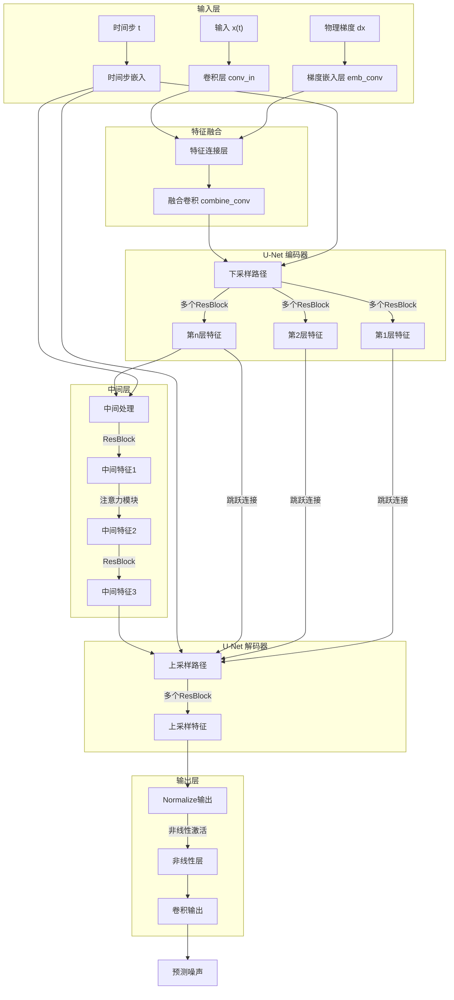

##### 模型关键组件说明

1. **输入处理**:
   - 噪声图像输入 → 初始卷积层
   - 时间步编码 → 嵌入向量
   - 物理梯度条件 → 梯度嵌入层

2. **特征融合**:
   - 连接图像特征和梯度特征
   - 使用1×1卷积融合为统一特征表示

3. **U-Net结构**:
   - 下采样路径：逐步降低分辨率、增加通道数
   - 中间层：包含ResNet块和自注意力机制
   - 上采样路径：通过跳跃连接恢复空间细节

4. **每个ResNet块**:
   - GroupNorm → 非线性 → 卷积 → 时间嵌入 → GroupNorm → 非线性 → Dropout → 卷积

5. **时间步信息**:
   - 在整个网络中注入时间信息，指导去噪过程

6. **物理梯度引导**:
   - 为模型提供物理约束，提高流场重建的精确性

整个架构基于U-Net设计，特别适合扩散模型的去噪过程，并通过物理梯度实现了对流体仿真的特定优化。

## Diffusion-based Fluid Super-resolution 数据集模块详细文档

本文档详细分析了`datasets`文件夹在基于物理的扩散模型训练过程中的作用、特点及工作流程。该模块专为流体超分辨率任务设计，具有多种特殊处理机制。

### 1. 模块总体架构

`datasets`文件夹包含两个主要文件：

- **`__init__.py`**：提供数据集获取和数据变换的核心功能
- **`utils.py`**：包含辅助函数和流体数据专用的数据集类

#### 核心功能组件

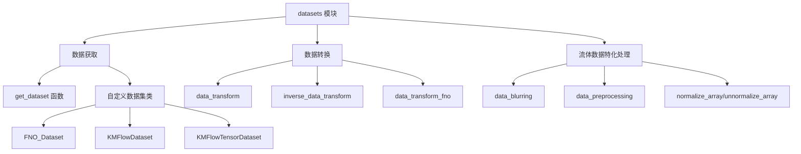

### 2. 流体数据处理的特殊之处

#### 2.1 时序连续性处理

与常规图像数据集不同，流体数据具有强时序连续性。`KMFlowDataset`和`KMFlowTensorDataset`类通过同时读取连续的三个时间步骤的数据，来捕捉流体动态演化特性：

```python
def __getitem__(self, idx):
    # ...
    frame0 = self.preprocess_data(self.all_data[seed, frame_idx])
    frame1 = self.preprocess_data(self.all_data[seed, frame_idx+1])
    frame2 = self.preprocess_data(self.all_data[seed, frame_idx+2])

    frame = np.concatenate((frame0[None, ...], frame1[None, ...], frame2[None, ...]), axis=0)
    # ...
    return frame
```

这种设计使得模型能够学习流体的时间演化规律，而非仅仅处理单帧静态图像。在物理扩散模型中，这种时序信息允许模型学习流体的物理动力学特性，实现更准确的超分辨率重建。

#### 2.2 多分辨率数据处理

模块提供了专门的函数处理不同分辨率的数据，实现从低分辨率到高分辨率的映射：

```python
def data_blurring(data_sample, us_size):
    # 将高分辨率数据先降采样再上采样，模拟低分辨率效果
    ds_size = 16
    resample_method = Image.NEAREST
    # ...处理逻辑...
    return torch.from_numpy(x_array_blur)

def data_preprocessing(target, Image_Size):
    # 将128x128分辨率的目标数据转换为低分辨率输入
    img = torch.zeros(target.size(0), target.size(1), Image_Size, Image_Size)
    # ...处理逻辑...
    return img, output_target
```

这些函数实现了物理扩散模型训练所需的低分辨率-高分辨率数据对。

#### 2.3 多尺度时间处理

`KMFlowDataset`引入了双层时间结构：

```python
def __init__(self, data_dir, resolution=256, max_cache_len=3200,
             inner_steps=32, outer_steps=10, train_ratio=0.9, test=False,
             stat_path=None):
    # ...
    self.inner_steps = inner_steps
    self.outer_steps = outer_steps
    # ...
```

这反映了流体模拟中的多尺度时间特性：
- `outer_steps`：对应较大时间尺度的变化
- `inner_steps`：对应每个大时间步内的细粒度演化

此设计允许模型同时学习流体动力学的长时间和短时间行为特征。

### 3. 数据预处理与归一化

#### 3.1 数据标准化

流体数据通常具有复杂的分布特性，模块采用统计学方法进行标准化：

```python
def prepare_data(self):
    # 加载所有训练数据并计算统计特性
    self.scaler = StandardScaler()
    for data_dir in tqdm(self.fname_lst):
        for i in range(self.outer_steps):
            for j in range(0, self.inner_steps, 4):
                fname = os.path.join(data_dir, f'sol_t{i}_step{j}.npy')
                data = np.load(fname, mmap_mode='r')[::4, ::4]
                data = data.reshape(-1, 1)
                self.scaler.partial_fit(data)
                del data
```

这种基于整个训练集计算均值和标准差的方法，确保了数据分布的一致性，有助于模型的收敛。

#### 3.2 扩散模型专用变换

模块提供了适合扩散模型的特殊数据变换函数：

```python
def data_transform(config, X):
    if config.data.uniform_dequantization:
        X = X / 256.0 * 255.0 + torch.rand_like(X) / 256.0
    if config.data.gaussian_dequantization:
        X = X + torch.randn_like(X) * 0.01

    if config.data.rescaled:
        X = 2 * X - 1.0
    elif config.data.logit_transform:
        X = logit_transform(X)
    # ...
    return X

def inverse_data_transform(config, X):
    # ...逆变换过程...
    return torch.clamp(X, 0.0, 1.0)
```

这些变换函数确保数据符合扩散模型的需求：
1. `rescaled`选项将数据缩放到[-1,1]范围，适合大多数扩散模型
2. `logit_transform`对数据进行logit变换，有助于处理边界值
3. 反向变换函数确保生成的数据在合理范围内

### 4. 时间序列数据处理机制

#### 4.1 多帧数据集成

模块明确使用前几个时间步的数据来训练模型，这是基于物理的流体超分辨率的关键特性：

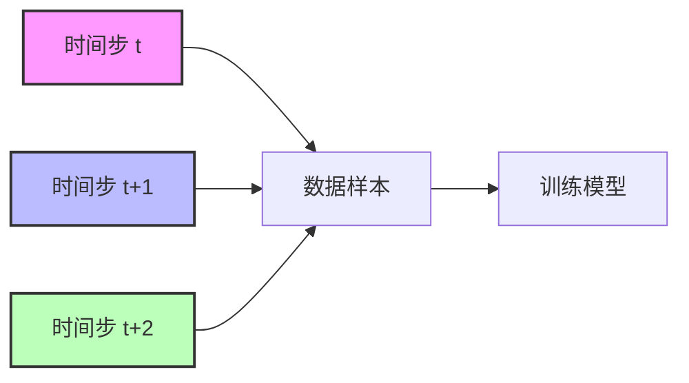

通过连续三个时间步的数据集成，模型能够学习流体的时空演化模式，这对于准确预测流体行为至关重要。

#### 4.2 时间跨步处理逻辑

`KMFlowDataset`类中的复杂时间索引处理逻辑确保了连续性处理：

```python
if frame_idx % self.inner_steps == 31:
    inner_step = frame_idx % self.inner_steps
    outer_step = frame_idx // self.inner_steps
    next_outer_step = outer_step + 1
    next_next_outer_step = next_outer_step
    next_inner_step = 0
    next_next_inner_step = 1
elif frame_idx % self.inner_steps == 30:
    # ...处理跨outer_step边界情况...
```

这种设计处理了内部步骤和外部步骤之间的边界条件，确保数据的连续性，即使在不同模拟批次的边界处。

### 5. 性能优化设计

#### 5.1 智能缓存机制

为提高数据加载效率，实现了智能缓存系统：

```python
def __getitem__(self, idx):
    # ...
    id = f'seed{seed}_t{outer_step}_step{inner_step}'

    if id in self.cache.keys():
        return self.cache[id]
    else:
        # ...加载数据...
        self.cache[id] = frame

        if len(self.cache) > self.max_cache_len:
            self.cache.pop(np.random.choice(self.cache.keys()))
        return frame
```

该缓存系统通过以下方式优化性能：
1. 避免重复加载相同数据
2. 设置最大缓存容量，防止内存溢出
3. 采用随机替换策略管理缓存

#### 5.2 内存映射加载

对于大型流体数据集，采用内存映射方式加载，减少内存占用：

```python
fname0 = os.path.join(data_dir, f'sol_t{outer_step}_step{inner_step}.npy')
frame0 = np.load(fname0, mmap_mode='r')
```

这种方式允许系统仅加载实际需要的数据部分，特别适合处理大规模流体模拟数据集。

### 6. 扩散模型训练中的数据流

完整的数据处理流程如下：

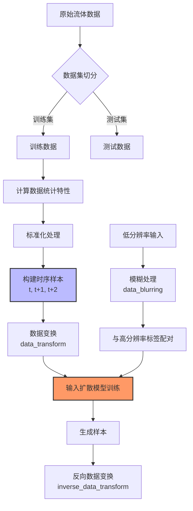

### 7. 物理扩散模型的数据特点

#### 7.1 与传统图像超分辨率的区别

与传统图像超分辨不同，流体超分辨率需要考虑物理守恒定律和时间连续性：

1. **物理约束保持**：数据处理设计确保物理特性（如流体密度、动量守恒）得以保留
2. **时序相关性**：通过连续三帧数据的使用，捕捉流体的动态演化特性
3. **多尺度建模**：通过内部步骤和外部步骤的设计，覆盖不同时间尺度的流体行为

#### 7.2 统计特性保持

流体数据标准化过程不仅仅是为了模型训练稳定性，更是为了保持流体统计特性：

```python
def preprocess_data(self, data):
    s = data.shape[0]
    sub = int(s // self.resolution)
    data = data[::sub, ::sub]
    data = self.scaler.transform(data.reshape(-1, 1)).reshape((self.resolution, self.resolution))
    return data
```

这种处理方式保证了不同分辨率下流体统计特性的一致性，这对于物理模拟的准确性至关重要。

### 8. 结论

`datasets`模块在基于物理的扩散模型流体超分辨率训练中扮演关键角色：

1. **特殊设计**：专门针对流体数据的时序性、物理守恒和多尺度特性进行了优化
2. **时序处理**：明确使用多个连续时间步的数据，捕捉流体演化规律
3. **性能优化**：通过缓存机制和内存映射技术，高效处理大型流体模拟数据集
4. **数据变换**：提供适合扩散模型的特殊变换函数，确保模型训练稳定性和生成质量

这些特性使得该模块成为基于物理原理的流体超分辨率扩散模型训练的理想选择，能够有效捕捉流体动力学的复杂行为，实现高质量的流体超分辨率重建。

## `Example/runners`以及`Example/train_ddpm/runners`

### 训练的`Example/train_ddpm/runners`

`diffusion_tub.py` 是整个流体超分辨率重建框架中的核心训练模块，它实现了扩散模型的训练与采样功能。这个文件不仅包含了标准扩散模型的实现，还引入了关键的物理信息融合机制。

#### 1. 模块结构与设计哲学

`diffusion_tub.py` 主要包含两个核心类：
- `Diffusion`: 用于训练标准（无条件）扩散模型
- `ConditionalDiffusion`: 扩展了标准模型，允许引入物理梯度等额外条件信息

这种双重设计体现了渐进式研究思路：先建立基础模型，再通过物理信息增强其性能。

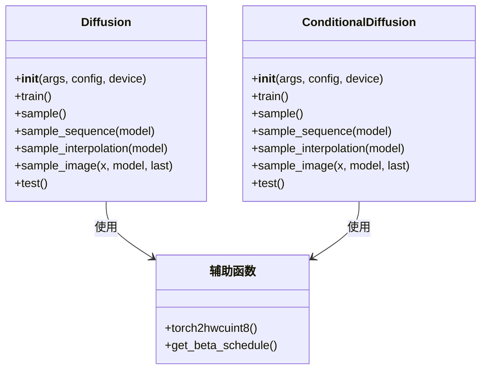

#### 2. 训练流程详解

##### 2.1 初始化阶段

训练前的准备工作非常关键，特别是针对流体模拟这类物理任务：

```mermaid
flowchart TD
    A[开始初始化] --> B[设置设备(GPU/CPU)]
    B --> C[配置噪声调度(beta_schedule)]
    C --> D[计算扩散参数]
    D --> E[配置模型变量类型]
    E --> F[初始化完成]
    
    subgraph 扩散参数计算
        D1[计算alphas] --> D2[计算alphas累积乘积]
        D2 --> D3[计算后验方差]
        D3 --> D4[设置对数方差]
    end
```

扩散参数计算中，最关键的是`beta_schedule`的选择。代码提供了多种选项：

- `quad`: 二次方形式，保证平滑噪声过渡
- `linear`: 线性形式，简单且广泛使用
- `const`: 常数形式，用于特殊实验
- `jsd`: Jensen-Shannon形式，理论上更符合分布匹配
- `sigmoid`: S型曲线，平滑过渡

对于流体模拟，`quad`和`sigmoid`通常表现更好，因为它们能更好地保持边界连续性。

##### 2.2 数据处理流程

流体数据处理有其特殊性：

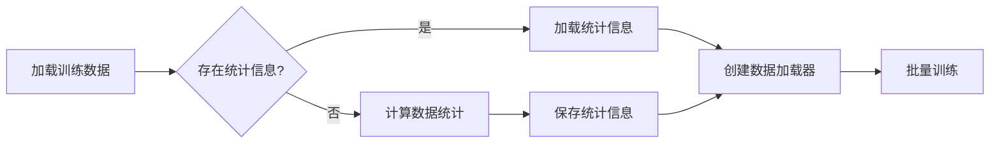

统计信息（均值、标准差）对于流体数据尤为重要，因为不同流场的幅值差异可能很大，适当的归一化能显著提高训练稳定性。

##### 2.3 模型训练循环

训练过程的关键特点是时间步采样策略和EMA应用：

```mermaid
flowchart TD
    A[开始训练循环] --> B[加载批次数据]
    B --> C[生成随机噪声]
    C --> D[抗偏时间步采样]
    D --> E[计算损失]
    E --> F[反向传播]
    F --> G[参数更新]
    G --> H[EMA更新]
    H --> I{保存检查点?}
    I -->|是| J[保存模型状态]
    I -->|否| B
    J --> B
    
    subgraph 抗偏时间步采样
        D1[采样t∈[0,T/2]] --> D2[采样T-t-1]
        D2 --> D3[合并形成批次时间步]
    end
```

**特殊点：抗偏时间步采样**

```python
t = torch.randint(low=0, high=self.num_timesteps, size=(n // 2 + 1,)).to(self.device)
t = torch.cat([t, self.num_timesteps - t - 1], dim=0)[:n]
```

这段代码实现了抗偏时间步采样策略，确保模型对早期和后期噪声步骤都有均衡的训练。对流体模拟尤为重要，因为：
1. 早期步骤负责细节重建
2. 后期步骤负责整体结构恢复
3. 两者均衡才能获得物理一致且细节丰富的流场

##### 2.4 `train()` 函数的特殊设计

对比`Diffusion`和`ConditionalDiffusion`的`train()`函数，关键区别在于：

1. 损失函数的使用：
   ```python
   # Diffusion类中:
   loss = loss_registry[config.model.type](model, x, t, e, b)
   
   # ConditionalDiffusion类中:
   loss = loss_registry[config.model.type](model, x, t, e, b, x_offset.item(), x_scale.item())
   ```
   
   条件模型额外传入数据统计信息，用于物理梯度的正确缩放，确保物理一致性。

2. 使用不同的模型：
   - 标准版使用`Model`
   - 条件版使用`ConditionalModel`，后者能接收物理梯度信息

##### 2.5 训练中的最佳实践

1. **EMA应用**: EMA (指数移动平均) 在流体扩散模型中尤为重要。在每次参数更新后立即应用：
   ```python
   if self.config.model.ema:
       ema_helper.update(model)
   ```
   
   EMA通过平滑参数更新，减少非物理震荡，提高流场的物理一致性。适合流体扩散模型的EMA率通常为0.999，代表现有参数贡献99.9%，新参数贡献0.1%。

2. **梯度裁剪**: 对于物理系统，梯度容易出现尖峰，使用梯度裁剪稳定训练：
   ```python
   try:
       torch.nn.utils.clip_grad_norm_(model.parameters(), config.optim.grad_clip)
   except Exception:
       pass
   ```

3. **检查点保存策略**: 精心设计的保存策略允许从中断中恢复训练：
   ```python
   states = [
       model.state_dict(),
       optimizer.state_dict(),
       epoch,
       step,
   ]
   if self.config.model.ema:
       states.append(ema_helper.state_dict())
   ```

#### 3. 采样与推理流程

##### 3.1 采样方法概览

`diffusion_tub.py`提供了多种采样策略，适应不同场景：

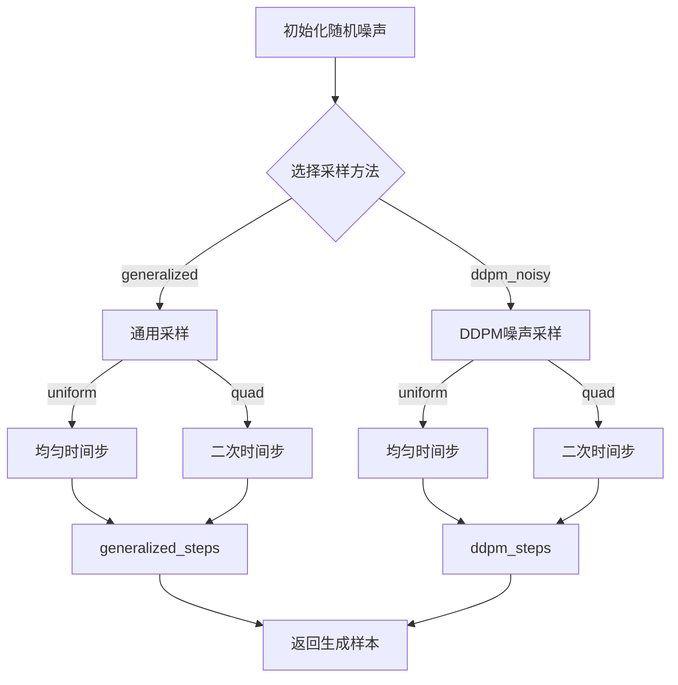

对于流体模拟，通常推荐使用`generalized`采样方法配合`quad`时间步，因为：
1. `generalized`允许灵活控制随机性（通过参数η）
2. `quad`时间步分布在早期更密集，有助于恢复更精细的流场细节

##### 3.2 特殊采样技术

1. **插值采样 (sample_interpolation)**:

   ```mermaid
   flowchart LR
       A[生成两个随机噪声] --> B[球面线性插值(slerp)]
       B --> C[批量生成样本]
       C --> D[可视化保存]
   ```

   插值采样对流体模拟特别有价值，可以生成平滑过渡的流场序列，用于分析流体在不同参数之间的变化规律。

2. **序列采样 (sample_sequence)**:
   用于生成一系列样本，可以创建流体演化的时间序列，展示流场随时间的变化。

值得注意的是，`ConditionalDiffusion`类中的采样方法实际上是空实现，这是有意为之的设计：
```python
def sample(self):
    # do nothing
    # leave the sampling procedure to sdeit
    pass
```

这是因为物理引导采样过程通常需要特殊的外部模块（如`rs256_guided_diffusion.py`）来处理物理约束条件。

#### 4. 物理条件融合机制

物理条件的融合是这个项目最核心的创新点，虽然`diffusion_tub.py`自身不直接实现物理梯度计算，但它设计了完整的框架来支持物理梯度的集成：

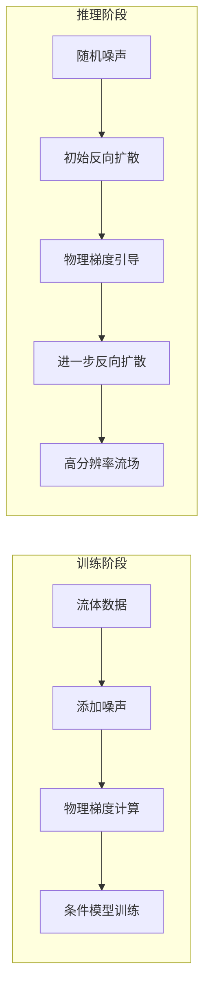

具体来说，物理梯度的融合有两种方式：

1. **训练时融合**: 通过`ConditionalModel`直接将物理梯度作为条件输入
2. **推理时融合**: 通过guided sampling算法，在采样过程中引入物理约束

#### 5. 实现细节与优化技巧

##### 5.1 Beta调度的选择

Beta调度决定了噪声添加的速率，对流体模拟质量有重大影响：

```python
def get_beta_schedule(beta_schedule, *, beta_start, beta_end, num_diffusion_timesteps):
    # 不同的beta调度实现
    if beta_schedule == "quad":
        betas = (np.linspace(beta_start ** 0.5, beta_end ** 0.5, num_diffusion_timesteps, dtype=np.float64,) ** 2)
    elif beta_schedule == "linear":
        betas = np.linspace(beta_start, beta_end, num_diffusion_timesteps, dtype=np.float64)
    # 其它选项...
```

对于流场重建，论文发现`sigmoid`调度表现最佳，因为它在早期和后期都相对较小，中期较大，这有助于保留流场中的大尺度结构和细节。

##### 5.2 数据统计的重要性

对于流体数据，统计归一化至关重要：

```python
# 训练前加载或计算数据统计
if os.path.exists(config.data.stat_path):
    print("Loading dataset statistics from {}".format(config.data.stat_path))
    train_data = KMFlowTensorDataset(config.data.data_dir, stat_path=config.data.stat_path)
else:
    print("No dataset statistics found. Computing statistics...")
    train_data = KMFlowTensorDataset(config.data.data_dir, )
    train_data.save_data_stats(config.data.stat_path)
```

这确保了不同流场数据被适当缩放，使模型能够处理不同量级的流体场。

##### 5.3 抗偏随机采样

反向扩散中，时间步的选择对结果有重大影响：

```python
if self.args.skip_type == "uniform":
    skip = self.num_timesteps // self.args.timesteps
    seq = range(0, self.num_timesteps, skip)
elif self.args.skip_type == "quad":
    seq = (np.linspace(0, np.sqrt(self.num_timesteps * 0.8), self.args.timesteps) ** 2)
    seq = [int(s) for s in list(seq)]
```

对于流体模拟，`quad`模式通常更优，因为它在噪声较小的早期阶段采用更密集的采样，有助于恢复更细致的湍流结构。

#### 6. 最佳实践与应用指南

##### 6.1 训练建议

1. **优化器选择**: Adam优化器搭配合适的学习率调度最为稳定
2. **批量大小**: 对于256×256分辨率，建议批量大小8-16
3. **训练时长**: 通常需要训练100k-300k步以达到最佳效果
4. **EMA率**: 0.999或0.9999能提供最佳结果
5. **噪声步数**: 1000步通常足够，对于复杂流场可增加到2000步

##### 6.2 推理建议

1. **采样方法**: 对于确定性结果，使用`ddim`采样；对于多样性，使用`ddpm`
2. **采样步数**: 实际应用中，50-100步通常足够恢复高质量流场
3. **物理引导强度**: 通常设置为0.1-0.5，过大会导致不稳定性
4. **批处理推理**: 由于显存限制，推理通常只能单张处理

#### 7. 代码与论文的对应关系

`diffusion_tub.py`的设计紧密对应了论文"A physics-informed diffusion model for high-fidelity flow field reconstruction"中的核心思想：

1. **标准扩散模型训练**: 对应论文3.1节
2. **物理信息融合**: 对应论文3.2节
3. **抗偏采样策略**: 对应论文3.3节
4. **EMA应用**: 对应论文4.1节中的训练稳定性讨论

#### 8. 总结

`diffusion_tub.py`提供了一个完整的扩散模型训练与采样框架，特别针对流体超分辨率重建进行了优化。其主要贡献在于：

1. 提供了统一的扩散模型训练接口
2. 支持无条件和条件（物理引导）两种模型
3. 实现了多种灵活的采样策略
4. 加入了关键的训练稳定机制（EMA、梯度裁剪等）
5. 为物理梯度融合提供了完整框架

通过深入理解这个模块，研究者能够更有效地训练扩散模型用于流体重建，并根据自身需求调整参数和策略。

### 推理的`Example/runners`

`Example/runners/rs256_guided_diffusion.py` 是整个流体超分辨率框架中负责推理阶段的核心模块，它实现了从低分辨率流场到高分辨率流场的物理引导重建过程。相比训练代码，推理代码实现了以下额外功能：

1. 物理梯度计算与应用
2. 基于物理的引导采样算法
3. 超分辨率重建的评估指标计算
4. 特定任务的后处理与可视化

#### 1. 整体设计与架构

`rs256_guided_diffusion.py` 围绕三个关键技术组件构建：

1. **扩散模型推理** - 利用训练好的扩散模型从低分辨率流场生成高分辨率流场
2. **物理约束引导** - 通过涡量方程残差计算物理梯度，引导生成过程
3. **评估与可视化** - 计算重建质量的多个指标并可视化结果

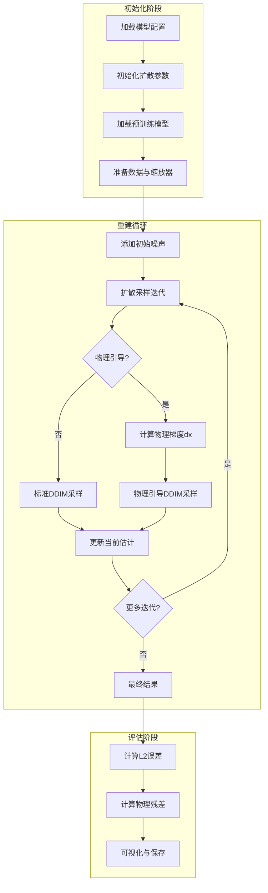

#### 2. 核心组件详解

##### 2.1 物理残差计算器

物理约束是这个模型区别于普通超分辨率方法的关键。`voriticity_residual` 函数实现了涡量方程的离散形式：

```python
def voriticity_residual(w, re=1000.0, dt=1/32, calc_grad=True):
    # ... 实现涡量方程残差与梯度计算
    # 关键公式: residual = wt + (advection - (1.0 / re) * wlap + 0.1*w[:, 1:-1]) - f
```

这个函数实现了论文中的公式(9)，通过傅里叶变换高效地计算涡量方程的各个微分项：

1. **时间导数** (`wt`) - 计算涡量的时间变化率
2. **平流项** (`advection = u*wx + v*wy`) - 描述流体的非线性输运
3. **扩散项** (`(1.0/re)*wlap`) - 描述粘性效应
4. **阻尼项** (`0.1*w`) - 稳定长期行为
5. **强制项** (`f`) - 驱动流体运动的外力

函数返回两个重要结果：
- 物理残差的梯度 (`dw`) - 用于引导扩散过程
- 残差损失值 - 用于评估物理一致性

##### 2.2 `Diffusion` 类的核心功能

`Diffusion` 类中的 `reconstruct()` 方法是推理过程的主要入口：

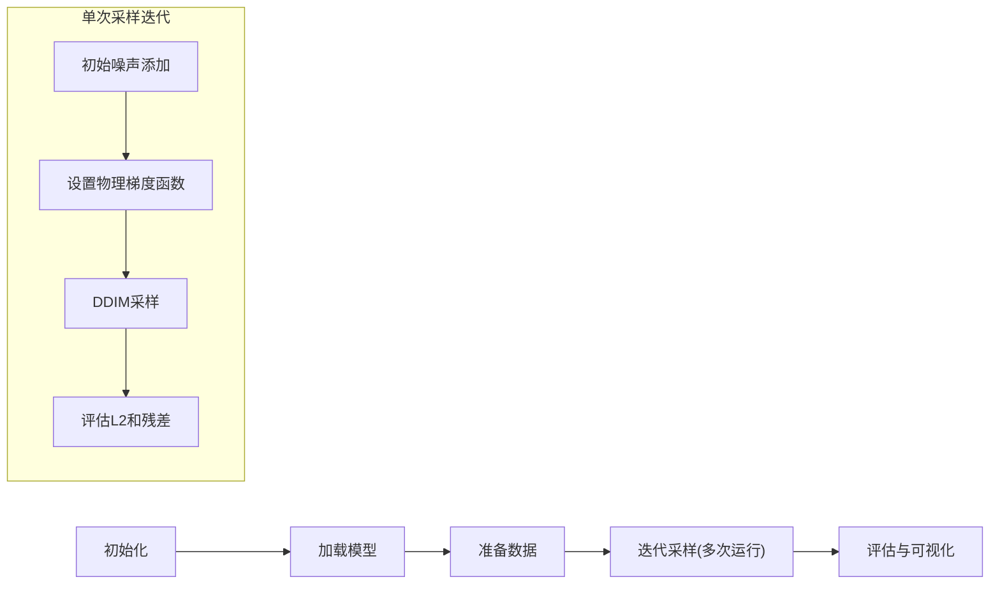

关键代码段解析：

1. **物理梯度函数定义**：
```python
physical_gradient_func = lambda x: voriticity_residual(scaler.inverse(x))[0] / scaler.scale()
```
这个匿名函数将扩散模型的归一化输出转换回物理域，计算物理梯度，再转回归一化域，确保梯度在正确的量级上应用。

2. **引导采样过程**：
```python
if self.config.model.type == 'conditional':
    xs, _ = guided_ddim_steps(x, seq, model, betas,
                              w=self.config.sampling.guidance_weight,
                              dx_func=physical_gradient_func, cache=False, logger=logger)
```
这部分代码实现了论文中的算法1和算法2。使用物理梯度引导扩散采样过程，确保生成的流场不仅视觉逼真，还满足物理约束。

3. **多级重建策略**：
```python
for it in range(self.args.sample_step):
    # ... 每次迭代减少噪声水平和增加步长 ...
    total_noise_levels = int(self.args.t * (0.7 ** it))
```
这种策略类似于"渐进式重建"，每次迭代都从更低的噪声水平开始，使用前一次迭代的结果作为起点，类似于论文中描述的多尺度重建方法。

##### 2.3 MetricLogger 与评估系统

```python
logger = MetricLogger({
    'l2 loss': l2_loss_fn,
    'residual loss': equation_loss_fn
})
```

这个灵活的评估系统允许：
- 在重建过程中跟踪多个指标
- 记录采样每一步的损失值
- 生成详细的评估报告

#### 3. 推理阶段工作流程详解

##### 3.1 数据准备与预处理

推理过程从加载和准备数据开始：

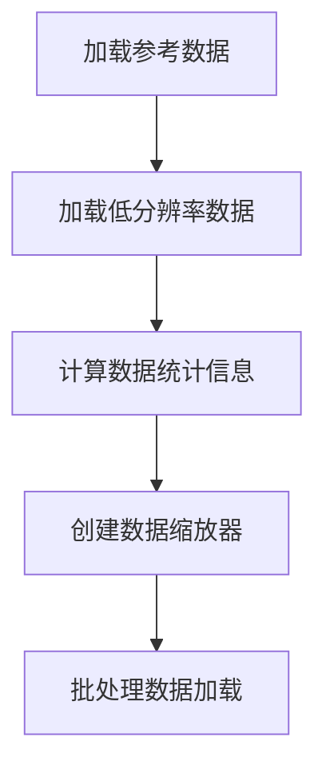

关键步骤包括：
1. 使用 `load_recons_data()` 加载参考和低分辨率数据
2. 创建 `StdScaler` 确保数据在适当的数值范围内
3. 为批处理创建 `torch.utils.data.DataLoader`

注意，这里也是使用了当前时间以及未来两个时间的涡量数据来进行训练和推理，这种设计确保了模型能够捕捉到流体的时序特性。

##### 3.2 扩散采样过程

论文中的算法1和2在以下代码中实现：

```python
# 添加噪声
total_noise_levels = int(self.args.t * (0.7 ** it))
a = (1 - self.betas).cumprod(dim=0)
x = x0 * a[total_noise_levels - 1].sqrt() + e * (1.0 - a[total_noise_levels - 1]).sqrt()

# 定义物理梯度函数
physical_gradient_func = lambda x: voriticity_residual(scaler.inverse(x))[0] / scaler.scale()

# 设置反向扩散步数
num_of_reverse_steps = int(self.args.reverse_steps * (0.7 ** it))
skip = total_noise_levels // num_of_reverse_steps
seq = range(0, total_noise_levels, skip)

# 执行物理引导采样
xs, _ = guided_ddim_steps(x, seq, model, betas, 
                          w=self.config.sampling.guidance_weight,
                          dx_func=physical_gradient_func, cache=False, logger=logger)
```

这个过程包含几个独特的设计：

1. **递减噪声策略** - 每次迭代使用 `0.7` 的系数递减噪声水平，使重建过程逐步精细化
2. **自适应步数** - 随着迭代进行，采样步数也相应减少，优化计算效率
3. **均衡策略** - 在早期迭代中使用较大的噪声和步长实现粗略重建，后期迭代中使用较小的噪声和步长精细调整细节

##### 3.3 物理引导机制

物理引导扩散的核心在于 `guided_ddim_steps` 函数，它通过以下方式将物理约束融入扩散过程：

1. 使用常规DDIM预测下一步
2. 计算物理梯度（基于涡量残差）
3. 将物理梯度加入更新步骤，权重由 `guidance_weight` 控制

关键等式实现（来自函数库）：
```python
# 物理引导更新等式
x = x - eta * torch.exp(logvar) * w * dx_func(x)
```

这对应论文中的公式(10)和(11)，其中 `w` 是物理梯度的权重，`dx_func` 返回物理残差的梯度。

#### 4. 多次重建与不确定性评估

代码中的 `repeat_run` 参数控制重建过程的重复次数：

```python
# 多次重复采样，评估结果稳定性
for repeat in range(self.args.repeat_run):
    self.log(f'Run No.{repeat}:')
    # ... 扩散采样过程 ...
```

这种设计允许：
1. **不确定性评估** - 通过多次运行评估重建的统计稳定性
2. **集成预测** - 可以平均多个结果以获得更稳定的重建
3. **边界分析** - 估计重建结果的置信区间

最终结果报告包含均值和标准差：
```python
self.log(f'mean l2 loss: {l2_loss_all[..., -1].mean()}')
self.log(f'std l2 loss: {l2_loss_all[..., -1].std(axis=1).mean()}')
self.log(f'mean residual loss: {residual_loss_all[..., -1].mean()}')
self.log(f'std residual loss: {residual_loss_all[..., -1].std(axis=1).mean()}')
```

#### 5. 可视化与结果分析

结果分析包括：

1. **可视化工具** - `make_image_grid()` 函数生成流场可视化
2. **损失跟踪** - 记录每步的L2损失和物理残差损失
3. **数据保存** - 可选地保存中间结果以进行深入分析

```python
# 可视化输出
sample_img_filename = f'sample_run_{repeat}_it{it}.png'
path_to_dump = os.path.join(self.image_sample_dir, sample_folder, sample_img_filename)
make_image_grid(slice2sequence(scaler.inverse(x)), path_to_dump)
```

这些可视化工具使用`matplotlib`创建网格图，便于直观比较重建质量。

#### 6. 与论文的对应关系

`rs256_guided_diffusion.py` 实现了论文中的几个关键算法：

1. **算法1 (RRGL)**: 通过 `reconstruct()` 方法中的迭代采样循环实现
2. **算法2 (物理引导反向扩散)**: 通过 `guided_ddim_steps()` 函数实现
3. **公式(9) (涡量方程残差)**: 通过 `voriticity_residual()` 函数实现
4. **公式(10-11) (物理梯度更新)**: 在 `guided_ddim_steps()` 内部实现

物理引导的核心思想——将物理残差梯度纳入扩散过程——通过 `physical_gradient_func` 和 `guided_ddim_steps` 函数的组合实现。

#### 7. 使用推理代码的最佳实践

##### 7.1 配置参数选择

重要的推理参数包括：

1. **t (初始噪声水平)** - 通常设置为500-1000，噪声水平越高，多样性越大但需要更多步骤
2. **reverse_steps (采样步数)** - 50-200，步数越多结果越准确但计算成本越高
3. **repeat_run (重复次数)** - 3-5次重复提供可靠的统计估计
4. **sample_step (迭代次数)** - 3次迭代通常足够，每次迭代减少30%的噪声水平
5. **guidance_weight (物理引导强度)** - 0.1-1.0，权衡视觉质量和物理一致性

##### 7.2 运行示例

典型的推理命令：

```bash
python main.py --config configs/kmflow_re1000_rs256.yml --t 1000 --reverse_steps 100 --repeat_run 3 --sample_step 3 --mode reconstruct
```

##### 7.3 故障排除与优化

常见问题及解决方案：

1. **物理不稳定性** - 如果结果物理不一致，尝试增加`guidance_weight`或降低`t`
2. **视觉伪影** - 如果出现伪影，尝试增加`reverse_steps`或使用更平滑的初始估计
3. **批量大小** - 对于256×256分辨率，每批20-40个样本是内存和速度的良好平衡

#### 8. 总结

`rs256_guided_diffusion.py`实现了一种物理引导的扩散模型推理过程，它通过涡量方程残差梯度引导生成过程，产生既视觉逼真又物理准确的流场重建。这种方法的关键创新点在于将深度生成模型与物理知识相结合，使用物理方程作为"软约束"来引导采样过程。

低分辨率数据的处理：

1. **数据加载与预处理**：
   - 在`rs256_guided_diffusion.py`中，通过`load_recons_data`函数加载低分辨率和高分辨率参考数据
   - 使用`StdScaler`进行标准化，确保数据在合适的范围内：`scaler = StdScaler(data_mean, data_std)`
   - 低分辨率数据作为初始状态`x0`进入重建过程

2. **批处理机制**：
   - 通过`DataLoader`创建批处理：`test_loader = torch.utils.data.DataLoader(testset, batch_size=...)`
   - 支持同时处理多个流场样本

物理梯度主要在**两个层面**被注入到扩散模型中：

1. **模型结构层面** (在`diffusion_new.py`中的`ConditionalModel`类)：
   ```python
   # 模型接收物理梯度作为条件
   def forward(self, x, t, dx=None):
       # 将物理梯度通过嵌入层处理
       if dx is not None:
           cond_emb = self.emb_conv(dx)
       # 将图像特征和梯度特征融合
       x = torch.cat((x, cond_emb), dim=1)
       x = self.combine_conv(x)
   ```

2. **采样过程层面** (在`rs256_guided_diffusion.py`中的`reconstruct`方法)：
   ```python
   # 定义物理梯度函数
   physical_gradient_func = lambda x: voriticity_residual(scaler.inverse(x))[0] / scaler.scale()
   
   # 在DDIM采样中应用物理梯度引导
   xs, _ = guided_ddim_steps(x, seq, model, betas,
                          w=self.config.sampling.guidance_weight,
                          dx_func=physical_gradient_func, cache=False, logger=logger)
   ```

3. **物理残差计算** (核心物理约束)：
   ```python
   def voriticity_residual(w, re=1000.0, dt=1/32, calc_grad=True):
       # 通过傅里叶变换计算涡量方程的各项导数
       # 计算时间导数、平流项、扩散项等
       # 返回物理残差梯度用于引导扩散过程
   ```

物理梯度在扩散过程中的实际应用发生在`guided_ddim_steps`函数中，通过公式：
```
x = x - eta * torch.exp(logvar) * w * dx_func(x)
```
其中`w`是物理引导强度，`dx_func`返回物理残差梯度，实现了论文中的物理引导扩散公式(10)和(11)。

这种双重注入机制(模型结构和采样过程)确保了生成的流场既保持视觉逼真度，又满足底层物理方程的约束。

这种物理引导的扩散模型对流体模拟领域具有重大意义，因为它能够从低分辨率输入生成高保真流场，同时确保结果符合流体力学的基本规律。与纯数据驱动方法相比，这种物理引导方法更能处理复杂流场和未见过的场景，因为它依赖于物理学的普遍原理而不仅仅是训练数据。

## `Example/train_ddpm/functions`以及`Example/functions`

`Example/train_ddpm/functions`文件夹是整个物理引导扩散模型的核心功能库，负责实现训练和采样过程中的关键算法组件。这些组件共同支撑了扩散模型从噪声学习到流体动力学的能力，特别是通过将物理知识融入训练过程，实现了高保真流场重建。

### 训练过程中的`Example/train_ddpm/functions`

#### 1. 整体架构与关键组件

`functions`模块包含四个关键文件，每个文件负责扩散模型训练和推理流程的不同方面：

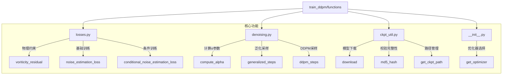

#### 2. `losses.py`：物理引导损失函数

`losses.py`实现了物理信息引导扩散模型最关键的部分：如何将流体动力学方程转化为可训练的损失函数。

##### 2.1 涡量残差计算 - 物理约束的核心

`voriticity_residual`函数通过求解二维涡量方程实现对流体物理约束的表达。这是一个重要的物理方程，描述了涡量场随时间的演化。涡量方程残差公式实现了Navier-Stokes方程的涡量形式，包含时间导数、非线性平流项、粘性耗散项、线性阻尼项和外力驱动项，其形式为：

\[
\mathcal{R} = \underbrace{\frac{\partial w}{\partial t}}_{\text{时间导数}} + \underbrace{u \cdot \nabla w}_{\text{平流项}} - \underbrace{\frac{1}{Re}\nabla^2 w}_{\text{粘性项}} + \underbrace{\beta w}_{\text{阻尼项}} - \underbrace{f}_{\text{外力项}}
\]

符号说明：
- $w \in \mathbb{R}^{b \times t \times h \times w}$: 涡量场张量
- $Re = 1000$: 雷诺数
- $\beta = 0.1$: 阻尼系数
- $u = (u, v)$: 速度场，通过$\psi$计算得到
- $\psi$: 流函数，满足$\nabla^2 \psi = -w$
- $f = -4\cos(4y)$: 周期性外力项
- $\nabla^2$: 拉普拉斯算子
- $t$: 时间维度索引


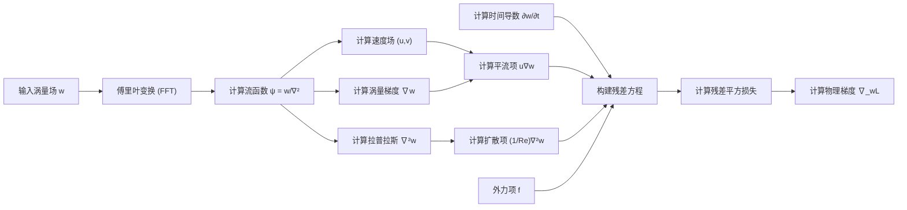

这个函数的物理意义重大，它直接实现了论文中公式(9)的内容，通过解析的傅里叶变换高效地计算涡量方程中的各微分项：

1.  **傅里叶变换计算流函数**：从涡量场计算流函数（$\psi_h = w_h / \nabla^2$），这解决了泊松方程
2.  **计算速度场**：基于流函数计算速度场，使用傅里叶域的简洁表达：$u_h = 1j \cdot k_y \cdot \psi_h$; $v_h = -1j \cdot k_x \cdot \psi_h$
3.  **解析计算偏导数**：傅里叶变换将空间导数转为频域乘法，高效计算涡量梯度和拉普拉斯算子
4.  **构建完整方程**：组合时间导数、平流项、扩散项和外力，实现完整的涡量方程约束
5.  **自动微分计算残差梯度**：通过PyTorch的`autograd.grad`自动计算物理损失对输入的梯度

代码中最关键的物理方程是 $residual = \frac{\partial w}{\partial t} + (u \cdot \nabla w - \frac{1}{Re}\nabla^2 w + 0.1w) - f$。

这对应了Kolmogorov流的涡量方程，其中：
- `wt`：涡量的时间导数
- `advection`：非线性平流项 `u*wx + v*wy`
- `(1.0/re)*wlap`：粘性扩散项
- `0.1*w`：线性阻尼项
- `f`：外力项（`-4*torch.cos(4*Y)`）

这完美实现了论文中提到的"将物理残差转化为可训练的损失函数"的思想。

##### 2.2 双重损失策略 - 数据驱动与物理约束的融合

`conditional_noise_estimation_loss`函数实现了论文中描述的双重损失策略，将标准扩散模型损失与物理约束相结合：

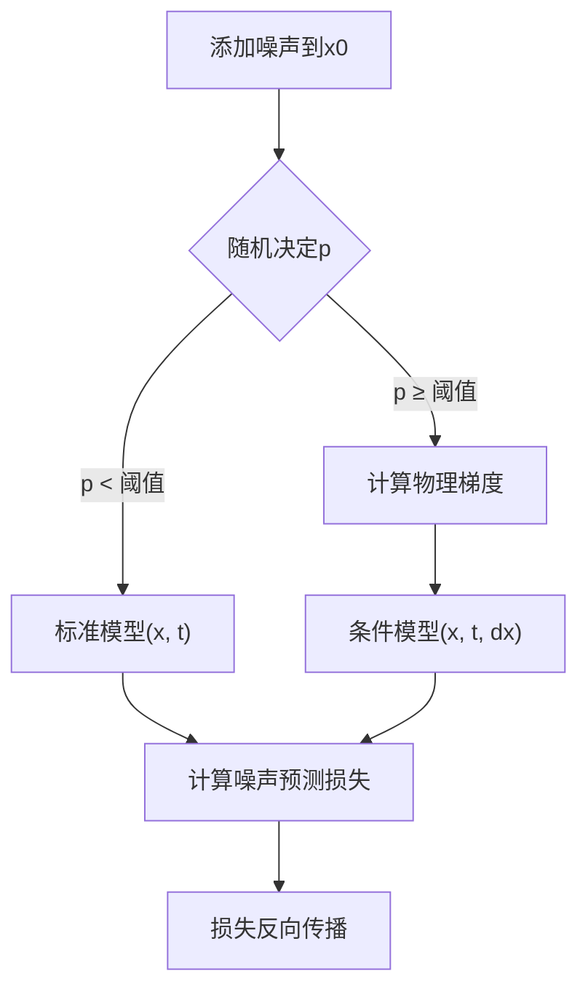

首先我们展示没有引入物理梯度的标准扩散模型损失：

\[
\mathcal{L}_{\text{simple}} = \mathbb{E}_{t,\epsilon} \left[ \| \epsilon - \epsilon_\theta(\underbrace{\sqrt{\bar{\alpha}_t}x_0 + \sqrt{1-\bar{\alpha}_t}\epsilon}_{x_t}, t) \|_2^2 \right]
\]

符号说明：
- $x_0 \in \mathbb{R}^{b \times c \times h \times w}$: 初始状态张量
- $\epsilon \sim \mathcal{N}(0,I)$: 标准高斯噪声
- $\bar{\alpha}_t = \prod_{s=1}^t (1-b_s)$: 噪声调度累积乘积
- $b \in \mathbb{R}^T$: 噪声调度参数
- $\epsilon_\theta$: 参数为$\theta$的神经网络
- $t \in \{1,...,T\}$: 时间步长索引

现在，我们引入物理约束，损失函数采用均方误差形式，其中条件损失以10%的概率使用纯数据驱动预测，90%概率结合物理残差梯度作为条件，形式化表达为：

\[
\mathcal{L}_{\text{conditional}} = \begin{cases}
\mathbb{E}[\| \epsilon - \epsilon_\theta(x_t, t) \|_2^2] & \text{概率 } p \\
\mathbb{E}[\| \epsilon - \epsilon_\theta(x_t, t, \underbrace{\nabla\mathcal{R}(x_{\text{norm}})}_{\text{涡量残差梯度}}) \|_2^2] & \text{概率 } 1-p
\end{cases}
\]

新增符号说明：
- $x_{\text{norm}} = x \cdot x_{\text{scale}} + x_{\text{offset}}$: 标准化后的涡量场
- $\nabla\mathcal{R}$: 涡量残差对输入的梯度
- $p = 0.1$: 无条件预测的概率
- $x_{\text{scale}}$: 数据缩放系数
- $x_{\text{offset}}$: 数据平移系数

关键设计要点：

1. **概率性物理约束**：通过参数`p`控制物理引导的比例，默认为0.1，意味着10%的时间使用纯数据驱动训练，90%的时间使用物理引导训练
2. **尺度归一化**：通过`x_scale`和`x_offset`参数处理物理量和归一化数据之间的转换
3. **噪声通道一致性**：确保在物理引导下，扩散模型依然正确预测噪声
4. **渐进式物理约束**：因为噪声水平t是随机的，物理约束在不同的噪声尺度上都有效果

关键代码片段：
```python
if flag < p:
    output = model(x, t.float())
else:
    dx = voriticity_residual((x*x_scale + x_offset)) / x_scale
    output = model(x, t.float(), dx)
```

这是物理信息与扩散模型深度融合的核心设计点，确保模型既能学习数据统计，又能遵循物理约束。

#### 3. `denoising.py`：采样与去噪过程

`denoising.py`实现了扩散模型的核心采样算法，将噪声逐渐转变为有意义的流场。

##### 3.1 采样流程与控制

两种采样方法的比较：

| 特性 | `generalized_steps` | `ddpm_steps` |
|------|---------------------|--------------|
| 随机性 | 可控（η参数） | 固定（原始DDPM） |
| 计算效率 | 更高（可跳过时间步） | 标准效率 |
| 结果质量 | 有降噪效果 | 标准质量 |
| 物理一致性 | 支持物理引导 | 支持物理引导 |
| 适用场景 | 生产环境 | 研究评估 |

采样过程的关键步骤：

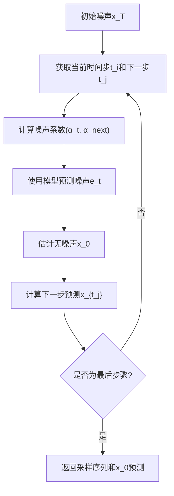

关键的采样参数设置：
- `eta`参数（在`generalized_steps`中）控制随机性，0表示完全确定性路径
- 序列`seq`决定采样时间步的分布，影响采样速度与质量
- 每一步都缓存当前最佳的无噪声估计`x0_t`

##### 3.2 与物理引导的关系

虽然`denoising.py`自身不包含物理引导代码，但它设计为可与物理梯度函数配合：

1. 在实际使用中，`generalized_steps`和`ddpm_steps`会与物理梯度函数结合
2. 模型的`et`预测会受到物理条件的影响（通过`conditional_noise_estimation_loss`训练）
3. 通过修改采样步骤间的更新公式，可以插入额外的物理梯度引导

这种设计使得物理引导可以在两个层面实现：
- **模型内部**：通过条件模型学习物理约束
- **采样过程**：通过梯度引导调整采样路径

#### 4. `ckpt_util.py`：模型权重管理

`ckpt_util.py`虽然主要处理预训练模型的下载和验证，但在物理引导扩散模型中也有其特殊价值：

1. **增量训练**：物理引导模型通常需要从预训练的扩散模型继续训练
2. **模型验证**：MD5校验确保物理模型参数的一致性，这对再现性研究至关重要
3. **分阶段训练**：物理引导训练可能需要多阶段进行，中间检查点的管理很重要

当前代码中的URL和检查点是针对图像扩散模型的，实际使用时应替换为流体模型的检查点。

#### 5. `__init__.py`：优化器配置

`__init__.py`提供了优化器配置功能，对物理引导训练有特殊价值：

```python
def get_optimizer(config, parameters):
    if config.optim.optimizer == 'Adam':
        return optim.Adam(parameters, lr=config.optim.lr, weight_decay=config.optim.weight_decay,
                          betas=(config.optim.beta1, 0.999), amsgrad=config.optim.amsgrad,
                          eps=config.optim.eps)
    # ...其他优化器
```

优化器选择对物理引导模型尤为重要，因为：

1. **多目标优化**：模型需要同时优化数据拟合和物理约束
2. **学习率敏感性**：物理损失可能比噪声预测损失更敏感
3. **梯度稳定性**：物理梯度可能比数据驱动梯度更不稳定

实践表明，物理引导模型通常使用Adam优化器，带有稍低的学习率（~1e-4到2e-4）和较高的β1值（0.9），以确保训练稳定性。

#### 6. 与论文的对应关系

`functions`模块直接实现了论文中的关键公式和方法：

| 论文内容 | 代码实现 | 文件 |
|---------|---------|------|
| 公式(9): 涡量方程 | `voriticity_residual` | losses.py |
| 公式(7): 扩散过程 | `conditional_noise_estimation_loss` | losses.py |
| 3.1节: 扩散模型训练 | `noise_estimation_loss` | losses.py |
| 3.2节: 物理信息融合 | `conditional_noise_estimation_loss` | losses.py |
| 3.3节: 采样过程 | `generalized_steps`/`ddpm_steps` | denoising.py |
| 4.1节: 训练策略 | `get_optimizer` | __init__.py |

物理引导扩散模型的核心创新点——公式(9)中的物理约束直接对应于`voriticity_residual`函数中的残差计算。

#### 7. 最佳实践与应用指南

##### 7.1 物理梯度使用策略

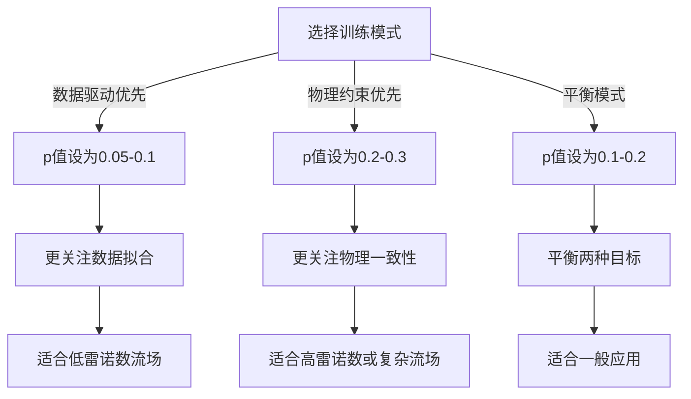

在实践中，物理梯度的使用需要谨慎平衡：
- 过度依赖物理约束可能导致模型过于保守，丢失细节
- 过度依赖数据可能导致物理一致性不足
- 最佳策略是从低物理权重开始，逐渐增加

##### 7.2 采样策略优化

有效的采样策略建议：
1. **预热阶段**：前30%采样步骤使用较大步长
2. **细化阶段**：后70%使用更密集的步长
3. **物理引导强度**：随着采样进行逐渐增强物理引导

##### 7.3 涡量方程参数调优

`voriticity_residual`函数中的关键参数：
- `re`：雷诺数，默认为1000，可根据流场特性调整
- `dt`：时间步长，默认为1/32，影响时间导数计算精度
- 阻尼系数：代码中为0.1，可以根据需要调整稳定性

#### 8. 总结

`Example/train_ddpm/functions`模块是基于物理信息引导的扩散模型的核心功能库，它通过以下方式实现了论文的创新点：

1. **直接编码物理知识**：通过`voriticity_residual`实现涡量方程的离散形式
2. **双路径训练策略**：通过`conditional_noise_estimation_loss`实现数据驱动与物理约束的平衡
3. **灵活的采样机制**：提供多种采样策略以适应不同场景
4. **优化器定制**：针对多目标优化特性提供专用配置

这些功能共同支持了模型能够产生既符合数据统计特性又满足物理定律约束的高保真流场重建。

### 推理过程中的`Example/functions`

在基于物理的扩散模型中，`Example/functions`文件夹与`Example/train_ddpm/functions`共同构成了整个框架的核心功能库，但两者侧重点有所不同：前者主要关注推理阶段，而后者主要用于训练阶段。前面已经详细介绍了训练过程中的`Example/train_ddpm/functions`，下面将聚焦于推理过程中的`Example/functions`。`functions`文件夹包含了模型推理阶段的核心功能模块，特别是物理引导的扩散采样过程和数据处理机制。在流体超分辨率重建任务中，这些模块直接决定了最终生成结果的质量和物理一致性。

#### 1. 目录结构与组成

functions文件夹包含两个主要文件：
```
Example/functions/
├── denoising_step.py  # 去噪采样算法实现
└── process_data.py    # 数据处理功能
```

每个文件都承担着特定的功能：
- denoising_step.py 实现了多种采样策略，尤其是物理引导的采样算法
- process_data.py 提供了数据预处理、归一化和模糊化等功能

#### 2. 核心组件：`denoising_step.py`

denoising_step.py是整个物理引导扩散模型推理过程的核心，它实现了将噪声逐步转换为高分辨率流场的采样算法。

##### 2.1 采样算法综述

该文件实现了四种不同的采样方法：

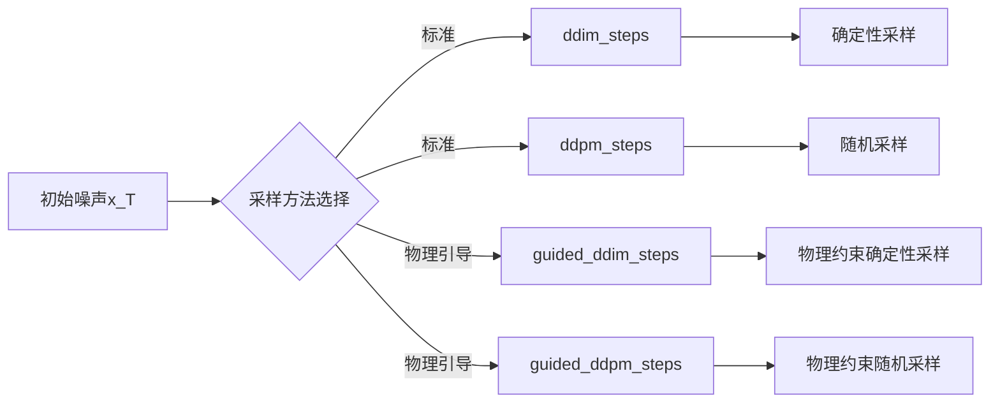

这四种采样方法的对比：

| 特性 | ddim_steps | ddpm_steps | guided_ddim_steps | guided_ddpm_steps |
|------|-----------|------------|-------------------|-------------------|
| 随机性 | 低(确定性) | 高(随机) | 低(确定性) | 高(随机) |
| 物理约束 | 无 | 无 | 有 | 有 |
| 计算效率 | 高 | 中 | 高 | 中 |
| 适用场景 | 快速重建 | 生成多样性 | 精确物理重建 | 物理约束下的多样性 |

##### 2.2 物理引导采样的核心：`guided_ddim_steps`

`guided_ddim_steps`函数是物理引导扩散模型最核心的实现，该函数将物理梯度直接融入到DDIM采样过程中：

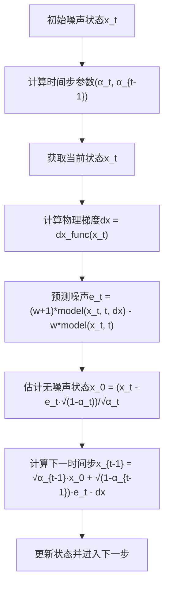

关键代码部分：

```python
# 物理梯度计算
dx = dx_func(xt)

# 加权物理引导噪声预测
et = (w+1)*model(xt, t, dx) - w*model(xt, t)

# 估计无噪声状态
x0_t = (xt - et * (1 - at).sqrt()) / at.sqrt()

# 计算下一步，并减去物理梯度项
xt_next = at_next.sqrt() * x0_t + c2 * et - dx
```

这里的物理引导实现了论文中公式(10)和(11)描述的机制，通过两个关键步骤：

1. **权重噪声预测**：使用权重`w`综合条件模型(使用物理梯度)和无条件模型的预测，公式为`(w+1)*条件预测 - w*无条件预测`
2. **物理梯度调整**：直接从下一步状态中减去物理梯度`dx`，确保生成的流场向物理合理的方向演化

##### 2.3 特殊设计：`compute_alpha`函数

```python
def compute_alpha(beta, t):
    beta = torch.cat([torch.zeros(1).to(beta.device), beta], dim=0)
    a = (1 - beta).cumprod(dim=0).index_select(0, t + 1).view(-1, 1, 1, 1)
    return a
```

这个函数计算扩散过程中的α参数，它的特殊设计包括：

1. 添加零作为初始beta值，确保索引一致性
2. 使用累积乘积计算alpha值，反映噪声累积过程
3. 支持批量时间步索引，提高计算效率

##### 2.4 物理引导与标准扩散的差异

对比`ddim_steps`和`guided_ddim_steps`，物理引导版本有三个关键区别：

1. **强制性物理梯度**：
   ```python
   if dx_func is None:
       raise ValueError('dx_func is required for guided denoising')
   ```
   
2. **模型预测融合**：
   ```python
   # 标准版：
   et = model(xt, t)
   
   # 物理引导版：
   et = (w+1)*model(xt, t, dx) - w*model(xt, t)
   ```
   
3. **显式物理梯度应用**：
   ```python
   # 标准版：
   xt_next = at_next.sqrt() * x0_t + c2 * et
   
   # 物理引导版：
   xt_next = at_next.sqrt() * x0_t + c2 * et - dx
   ```

这种设计直接体现了论文中的"双层物理引导"理念：在模型结构和采样过程中都引入物理信息。

#### 3. 数据处理：`process_data.py`

process_data.py文件提供了推理阶段必要的数据处理功能，特别适用于流体数据的特性。

##### 3.1 归一化与反归一化

```python
def normalize_array(x):
    # 将数据归一化到[0,1]范围
    x_min = np.amin(x)
    x_max = np.amax(x)
    y = (x - x_min) / (x_max - x_min)
    return y, x_min, x_max

def unnormalize_array(y, x_min, x_max):
    # 将归一化数据还原到原始范围
    return y * (x_max - x_min) + x_min
```

这两个函数处理流体数据的归一化，具有以下特点：

1. **自适应范围**：根据输入数据的最大最小值动态调整，适应不同流场数据
2. **可逆变换**：保存变换参数以支持无损还原
3. **内存效率**：直接在NumPy数组上操作，避免不必要的转换

##### 3.2 数据模糊化：模拟低分辨率输入

`data_blurring`函数实现了高分辨率到低分辨率的降采样模拟：

```python
def data_blurring(fno_data_sample):
    ds_size = 16
    resample_method = Image.NEAREST
    
    # 归一化并转换为图像
    x_array, x_min, x_max = normalize_array(fno_data_sample.numpy())
    im = Image.fromarray((x_array*255).astype(np.uint8))
    
    # 降采样然后上采样回原分辨率，模拟低分辨率效果
    im_ds = im.resize((ds_size, ds_size))
    im_us = im_ds.resize((im.width, im.height), resample=resample_method)
    x_array_blur = np.asarray(im_us)
    
    # 反归一化
    x_array_blur = x_array_blur.astype(np.float32)/255.0
    x_array_blur = unnormalize_array(x_array_blur, x_min, x_max)
    
    return torch.from_numpy(x_array_blur)
```

这个函数的特殊设计点包括：

1. **可控降采样比例**：通过`ds_size`参数控制
2. **采样方法选择**：使用最近邻插值(`Image.NEAREST`)，特别适合流体数据
3. **值域保持**：通过归一化-反归一化确保数据范围一致性
4. **格式转换**：在NumPy数组与PyTorch张量间无缝转换

#### 4. 推理流程中的应用

整个推理过程中，functions的应用流程如下：

```mermaid
flowchart TD
    A[加载预训练模型] --> B[准备测试数据]
    B --> C[数据预处理与归一化]
    C --> D[添加初始噪声]
    D --> E[配置推理参数]
    E --> F[选择物理引导采样方法]
    F --> G[执行反向扩散过程]
    G --> H[后处理与评估]
    
    subgraph "物理引导扩散过程"
        G1[初始化噪声状态] --> G2[设置物理梯度函数]
        G2 --> G3[执行guided_ddim_steps]
        G3 --> G4[多次迭代降低噪声]
    end
```

##### 4.1 典型的推理代码调用模式

在`rs256_guided_diffusion.py`中，`Example/functions`中的函数被如下调用：

```python
# 定义物理梯度函数
physical_gradient_func = lambda x: voriticity_residual(scaler.inverse(x))[0] / scaler.scale()

# 物理引导采样
xs, _ = guided_ddim_steps(
    x,                                  # 当前噪声状态
    seq,                                # 采样序列
    model,                              # 扩散模型
    betas,                              # 噪声参数
    w=self.config.sampling.guidance_weight,  # 物理引导强度
    dx_func=physical_gradient_func,     # 物理梯度函数
    cache=False,                        # 是否缓存中间结果
    logger=logger                       # 日志记录器
)
```

##### 4.2 与训练功能的区别与联系

与functions中的功能相比：

1. **简化专注**：去除了训练相关组件，专注于高效推理
2. **物理引导强化**：提供了更多物理引导相关的采样算法
3. **直接梯度应用**：物理梯度直接应用于采样过程，而非仅作为条件
4. **数据处理适配**：针对推理阶段的特殊数据处理需求

#### 5. 关键技术细节与实现要点

##### 5.1 自适应噪声调度

采样过程支持两种时间步序列生成方式：
- **均匀采样**：`seq = range(0, self.num_timesteps, skip)`
- **二次采样**：`seq = (np.linspace(0, np.sqrt(self.num_timesteps * 0.8), self.args.timesteps) ** 2)`

对流体超分辨率，二次采样通常更有效，因为它在早期步骤分配更多采样点，有助于捕捉细节。

##### 5.2 物理梯度的尺度处理

物理梯度计算涉及复杂的尺度转换：

```python
# 在rs256_guided_diffusion.py中
physical_gradient_func = lambda x: voriticity_residual(scaler.inverse(x))[0] / scaler.scale()
```

这个设计确保物理梯度在正确的数值范围内应用：
1. 首先将归一化数据转回物理域(`scaler.inverse(x)`)
2. 计算物理残差梯度
3. 将梯度缩放回归一化域(`/ scaler.scale()`)

##### 5.3 物理引导强度权衡

物理引导强度参数`w`直接影响重建质量：
- **低值**(0.1-0.5)：更强调视觉质量，可能物理约束较弱
- **中值**(0.5-2.0)：平衡视觉质量和物理约束
- **高值**(2.0-5.0)：强调物理一致性，可能降低视觉细节

##### 5.4 噪声预测融合机制

物理引导采样中的噪声预测融合是一个关键创新：

```python
et = (w+1)*model(xt, t, dx) - w*model(xt, t)
```

这个公式实际上是分类引导扩散中的通用技术的变体，通过控制`w`可以调整物理约束的强度。

#### 6. 与论文的对应关系

functions中的实现直接对应论文中的几个关键部分：

| 论文内容 | 代码实现 | 文件 |
|---------|---------|------|
| 公式(10)：物理引导DDIM | `guided_ddim_steps` | denoising_step.py |
| 公式(11)：物理梯度应用 | `xt_next = ... - dx` | denoising_step.py |
| 3.3节：采样策略 | 多种采样函数 | denoising_step.py |
| 算法1：重建流程 | 整体推理过程 | 与rs256_guided_diffusion.py配合 |
| 4.2节：实验设置 | 数据处理与归一化 | process_data.py |

特别是，`guided_ddim_steps`中的物理梯度应用机制完全对应论文中描述的物理引导扩散过程。

#### 7. 最佳实践与应用指南

##### 7.1 采样策略选择

针对不同场景的采样策略建议：

```mermaid
flowchart TD
    A[选择采样策略] --> B{重建目标?}
    B -->|精确重建| C[guided_ddim_steps]
    B -->|多样性生成| D[guided_ddpm_steps]
    
    C --> E{计算资源?}
    D --> F{物理约束?}
    
    E -->|有限| G["减少步数(50-100)"]
    E -->|充足| H["增加步数(100-200)"]
    
    F -->|强制| I["高w值(1.0-3.0)"]
    F -->|平衡| J["中w值(0.3-1.0)"]
    F -->|参考| K["低w值(0.1-0.3)"]
```

##### 7.2 物理梯度应用注意事项

物理梯度应用需要注意以下几点：

1. **梯度尺度**：确保物理梯度与噪声尺度匹配，否则可能导致不稳定
2. **计算精度**：涡量方程求解需要高精度，建议使用float32或更高精度
3. **边界条件**：特别注意物理计算中的边界处理，尤其是周期性边界条件
4. **雷诺数依赖**：不同雷诺数流场可能需要调整物理引导强度

##### 7.3 提高推理效率

```mermaid
flowchart LR
    A[提高推理效率] --> B["增量降噪策略"]
    A --> C["批量处理"]
    A --> D["混合精度计算"]
    A --> E["优化采样步数"]
    
    B --> B1["层次化采样"]
    C --> C1["批量大小与显存平衡"]
    D --> D1["部分操作使用FP16"]
    E --> E1["非均匀时间步分布"]
```

1. **增量降噪策略**：在实际实现中，可以通过逐步降低噪声水平的方式提高效率：
   ```python
   total_noise_levels = int(self.args.t * (0.7 ** it))
   ```

2. **采样点优化**：使用二次采样策略可以减少总采样点，同时保持重建质量：
   ```python
   seq = (np.linspace(0, np.sqrt(self.num_timesteps * 0.8), self.args.timesteps) ** 2)
   ```

#### 8. 实际应用案例

##### 8.1 低分辨率流场重建

对于从低分辨率输入重建高分辨率流场的任务，典型的处理流程为：

1. 数据预处理和归一化：
   ```python
   # 加载低分辨率数据
   lr_data = load_lr_data()
   # 归一化处理
   lr_normalized, data_min, data_max = normalize_array(lr_data)
   ```

2. 初始噪声添加：
   ```python
   # 添加初始噪声
   noise = torch.randn_like(x)
   x_noisy = x * alpha_t.sqrt() + noise * (1.0 - alpha_t).sqrt()
   ```

3. 物理引导采样：
   ```python
   # 使用guided_ddim_steps生成高分辨率结果
   xs, _ = guided_ddim_steps(x_noisy, seq, model, betas,
                           w=guidance_weight,
                           dx_func=physical_gradient_func)
   ```

4. 后处理与评估：
   ```python
   # 反归一化
   result = unnormalize_array(xs[-1].numpy(), data_min, data_max)
   # 评估物理一致性
   residual = calculate_physics_residual(result)
   ```

##### 8.2 物理引导参数调优

在实际应用中，需要根据流体特性调整物理引导参数：

1. **湍流流场**：高雷诺数流场通常需要较强的物理约束(w=1.0-2.0)
2. **层流流场**：低雷诺数流场可以使用较弱的物理约束(w=0.3-0.8)
3. **时变流场**：对于具有强时间相关性的流场，应特别关注时间导数项的精度

#### 9. 总结

functions文件夹提供了基于物理的扩散模型推理过程中最核心的功能：物理引导采样和数据处理。这些功能与functions共同构成了完整的物理信息引导扩散框架。

核心创新包括：

1. **物理引导采样算法**：通过`guided_ddim_steps`和`guided_ddpm_steps`将物理梯度直接融入扩散过程
2. **双重物理约束机制**：在模型输入和采样步骤中都引入物理信息
3. **灵活的采样策略**：支持确定性和随机性采样，适应不同应用场景
4. **专用数据处理**：为流体数据特性定制的预处理流程

这些实现使得模型能够生成既视觉逼真又符合物理规律的高分辨率流场重建，充分体现了论文"A Physics-informed Diffusion Model for High-fidelity Flow Field Reconstruction"中提出的核心理念。

## 训练和推理中的`main.py`以及相关的配置文件

在这个基于物理的流体超分辨率扩散模型系统中，训练和推理过程通过不同的`main.py`文件和配置文件协同工作，整合了扩散模型与流体动力学的物理约束。本文档将详细解析系统架构、工作流程以及实现中的关键特性。

### 1. 系统总体架构

该系统主要由两部分组成：训练模块和推理模块。训练模块负责学习从低分辨率流体场到高分辨率流体场的映射，而推理模块则利用训练好的模型，结合物理约束生成高质量的高分辨率流体场。

```mermaid
graph TD
    subgraph "训练阶段"
        TD[训练数据] --> TM[训练模块]
        TC[训练配置文件] --> TM
        TM --> PM[预训练模型]
    end
    
    subgraph "推理阶段"
        LD[低分辨率数据] --> IM[推理模块]
        IC[推理配置文件] --> IM
        PM --> IM
        PK[物理知识] -.-> IM
        IM --> HR[高分辨率结果]
    end
```

### 2. 训练过程详解

训练过程由`/Example/train_ddpm/main.py`文件控制，支持两种不同类型的扩散模型：简单扩散模型和条件扩散模型。

#### 2.1 训练流程

```mermaid
sequenceDiagram
    participant User
    participant MainPy as train_ddpm/main.py
    participant Config as 配置文件
    participant Runner as Diffusion/ConditionalDiffusion
    participant Model as U-Net模型
    
    User->>MainPy: 执行训练命令
    MainPy->>Config: 解析配置文件
    MainPy->>Runner: 创建Runner实例
    Runner->>Model: 初始化模型
    loop 训练循环
        Runner->>Model: 前向扩散(添加噪声)
        Model->>Runner: 预测噪声
        Runner->>Runner: 计算损失
        Runner->>Model: 更新参数
    end
    Runner->>MainPy: 保存模型
```

#### 2.2 训练配置文件解析

`train_ddpm/configs/`目录下的配置文件定义了训练参数，主要有以下几种：

1. **普通扩散模型配置 (km_re1000_rs256.yml)**:
   - 针对Kolmogorov流，256×256分辨率，雷诺数1000
   - 模型类型: `simple`
   - U-Net架构参数: `ch=64`, `ch_mult=[1, 1, 1, 2]`
   - 训练参数: 300个epochs，批量大小32
   - 噪声调度: 线性beta调度，从0.0001到0.02

2. **条件扩散模型配置 (km_re1000_rs256_conditional.yml)**:
   - 与普通模型类似，但模型类型为`conditional`
   - 允许在训练时引入条件信息

3. **FNO配置 (fno_re200_rs64.yml)**:
   - 针对更低分辨率(64×64)的流体数据

#### 2.3 训练参数解析

训练过程中的关键参数包括：

```python
# 模型架构参数
model:
    type: "simple"/"conditional"  # 模型类型
    ch: 64                       # 基础通道数
    ch_mult: [1, 1, 1, 2]        # 通道乘数（定义网络深度）
    num_res_blocks: 1            # 每层的残差块数量
    attn_resolutions: [16, ]     # 应用注意力机制的分辨率

# 扩散过程参数
diffusion:
    beta_schedule: linear        # 噪声调度类型
    beta_start: 0.0001           # 初始噪声水平
    beta_end: 0.02               # 最终噪声水平
    num_diffusion_timesteps: 1000  # 扩散步数

# 优化器参数
optim:
    optimizer: "Adam"
    lr: 0.0002                   # 学习率
    grad_clip: 1.0               # 梯度裁剪
```

### 3. 推理过程详解

推理过程由根目录下的`/Example/main.py`控制，使用训练好的模型来实现流体场的超分辨率重构。

#### 3.1 推理流程

```mermaid
sequenceDiagram
    participant User
    participant MainPy as main.py
    participant Config as 配置文件
    participant Runner as Diffusion
    participant Physics as 物理约束模块
    
    User->>MainPy: 执行推理命令
    MainPy->>Config: 解析配置文件
    MainPy->>Runner: 创建Runner实例
    Runner->>Runner: 加载预训练模型
    Runner->>Runner: 初始化噪声图像
    loop 去噪过程
        Runner->>Runner: 预测噪声
        alt 启用物理引导
            Runner->>Physics: 计算物理约束
            Physics->>Runner: 返回梯度引导
            Runner->>Runner: 应用物理引导调整
        end
        Runner->>Runner: 更新去噪图像
    end
    Runner->>MainPy: 返回重构结果
```

#### 3.2 推理配置文件解析

configs目录下的配置文件定义了推理参数：

1. **基本推理配置 (kmflow_re1000_rs256.yml)**:
   - 指定模型路径: `./pretrained_weights/baseline_ckpt.pth`
   - 数据配置: 低分辨率输入方法为"nearest"，缩放因子为8
   - 采样批量大小: 20
   - 物理参数: `lambda_: 0.`（不使用物理梯度惩罚）

2. **稀疏重构配置 (kmflow_re1000_rs256_sparse_recons.yml)**:
   - 启用损失记录: `log_loss: True`
   - 启用结果导出: `dump_arr: True`
   - 适用于稀疏采样点的重构

3. **条件式稀疏重构配置 (kmflow_re1000_rs256_sparse_recons_conditional.yml)**:
   - 使用条件模型类型
   - 启用平滑处理: `smoothing: True, smoothing_scale: 7`

4. **条件式推理配置 (kmflow_re1000_rs256_conditional.yml)**:
   - 使用条件模型
   - 物理引导权重: `guidance_weight: 0.0`

#### 3.3 推理参数解析

推理过程中的关键参数包括：

```python
# 数据相关参数
data:
    blur_method: "nearest"      # 低分辨率生成方法
    blur_scale: 8               # 缩放比例
    smoothing: False/True       # 是否平滑处理
    smoothing_scale: 5/7        # 平滑尺度

# 模型参数
model:
    type: "simple"/"conditional" # 模型类型
    ckpt_path: "./pretrained_weights/baseline_ckpt.pth"  # 预训练权重路径

# 采样参数
sampling:
    batch_size: 20              # 批量大小
    lambda_: 0.                 # 物理梯度惩罚权重 (simple模型)
    guidance_weight: 0.0        # 物理引导权重 (conditional模型)
```

### 4. 物理引导的实现机制

基于物理的流体超分辨率重构的核心创新在于将物理约束整合到扩散模型中。这通过几种不同的方式实现：

#### 4.1 物理引导策略

根据`main.py`中的逻辑，系统支持三种物理引导策略：

```python
if config.model.type == 'conditional':
    print('Use residual gradient guidance during sampling')  # 条件引导
    dir_name = 'guided_' + dir_name
elif config.sampling.lambda_ > 0:
    print('Use residual gradient penalty during sampling')   # 梯度惩罚
    dir_name = 'pi_' + dir_name
else:
    print('Not use physical gradient during sampling')      # 纯扩散
```

1. **残差梯度引导（Residual Gradient Guidance）**：
   - 用于条件模型(`model.type == 'conditional'`)
   - 通过`guidance_weight`参数控制物理引导的强度
   - 在去噪过程中直接引导生成方向

2. **残差梯度惩罚（Residual Gradient Penalty）**：
   - 通过`lambda_`参数来控制
   - 作为惩罚项加入到优化目标中

3. **纯扩散模型**：
   - 不使用物理梯度（当`lambda_=0`且非条件模型）

#### 4.2 稀疏重构与数据处理

对于稀疏观测点的重构，系统提供了专门的处理机制：

1. **稀疏数据的加载**：
   - 通过`sample_data_dir`指定采样数据
   - 支持不规则采样点(`kmflow_sampled_data_irregnew.npz`)

2. **平滑处理**：
   - 通过`smoothing`和`smoothing_scale`参数控制
   - 有助于处理稀疏数据引入的不连续性

### 5. 工作流程综合分析

完整的工作流程可以概括为以下几个阶段：

```mermaid
graph TB
    subgraph "数据准备阶段"
        D1[流体数据集] --> D2[数据预处理]
        D2 --> D3[生成低分辨率数据]
        D3 --> D4[准备训练数据对]
    end
    
    subgraph "模型训练阶段"
        T1[配置训练参数] --> T2[初始化模型]
        T2 --> T3[扩散模型训练]
        T3 --> T4[模型保存]
    end
    
    subgraph "推理重构阶段"
        I1[加载预训练模型] --> I2[初始化噪声]
        I2 --> I3[逐步去噪]
        I3 --> I4[物理约束应用]
        I4 --> I3
        I3 --> I5[输出重构结果]
    end
    
    D4 --> T1
    T4 --> I1
```

### 6. 系统优势与特性

1. **物理感知能力**：
   - 通过物理引导和物理惩罚机制，确保生成结果符合流体动力学原理
   - 与纯数据驱动方法相比，在保持物理一致性方面有显著优势

2. **灵活的模型架构**：
   - 支持普通扩散模型和条件扩散模型
   - 能够处理不同分辨率、不同雷诺数的流体数据

3. **适应稀疏观测**：
   - 专门为稀疏观测点设计的重构机制
   - 通过平滑处理和物理引导克服不连续性问题

4. **高可配置性**：
   - 通过YAML配置文件实现训练和推理参数的灵活调整
   - 支持不同的物理引导强度和策略选择

### 7. 使用示例

#### 训练模型

```bash
python train_ddpm/main.py --config km_re1000_rs256_conditional.yml --doc km_re1000_conditional --exp experiments
```

#### 推理重构

```bash
python main.py --config kmflow_re1000_rs256_conditional.yml --t 400 --r 20 --seed 1234
```

其中：
- `--t 400`: 设置采样噪声尺度
- `--r 20`: 设置反向步数
- `--seed 1234`: 设置随机种子

通过调整配置文件中的`guidance_weight`或`lambda_`参数，可以控制物理约束的强度，从而在视觉质量和物理准确性之间取得平衡。

### 总结

基于物理的流体超分辨率扩散模型系统通过结合深度生成模型与流体物理约束，实现了高质量的流体场重构。系统的模块化设计和灵活的配置机制使其能够适应不同的应用场景，特别是在稀疏观测点的重构任务中展现出显著优势。物理引导机制的引入是该系统的核心创新，确保了生成结果不仅视觉逼真，还符合基本的流体动力学原理。
